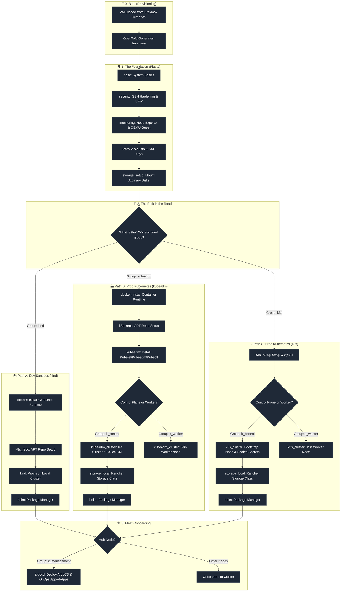

# 🚀 The Journey of a VM: From Nothing to Cluster Integration

This document maps the architectural lifecycle (the "journey") of a Virtual Machine (VM) in the platform-stack environment, tracking its progression from an unconfigured Proxmox clone to its final role in development or production.

---

## 🗺️ Visual Journey Map

---

## 📖 Chapter 1: The Birth (Stage 0 - OpenTofu Provisioning)
Before Ansible runs, the VM starts as "nothing" — a bare disk template in Proxmox.
1.  **Cloning**: OpenTofu clones the base OS image to instantiate a new VM.
2.  **Metadata Generation**: OpenTofu extracts the allocated IP addresses, system hostnames, and credentials, writing them dynamically into [proxmox_atlas.yml](file:///home/dev/platform-stack/ansible/inventory.d/proxmox_atlas.yml).
3.  **Bootstrap Access**: The VM becomes reachable via SSH, ready for Ansible's intervention.

---

## 📖 Chapter 2: The Foundation (Stage 1 - Play 1)
Every VM, regardless of its ultimate role, goes through the baseline customization phase targeted by the `vm` hosts tag:
*   [base](file:///home/dev/platform-stack/ansible/roles/base/tasks/main.yml): Configures timezones, sets language/locale environment flags, and registers the hostname. Installs basic CLI packages (`curl`, `vim`, `htop`, etc.).
*   [security](file:///home/dev/platform-stack/ansible/roles/security/tasks/main.yml): Installs Fail2ban intrusion prevention, hardens sshd config, and secures standard system ports.
*   [monitoring](file:///home/dev/platform-stack/ansible/roles/monitoring/tasks/main.yml): Starts QEMU guest services to allow clean shutdown signals, installs Node Exporter, and updates local firewall ports.
*   [users](file:///home/dev/platform-stack/ansible/roles/users/tasks/main.yml): Creates standard shell users, maps administrative SSH authorized keys, and configures passwordless sudo capabilities.
*   [storage_setup](file:///home/dev/platform-stack/ansible/roles/storage_setup/tasks/main.yml): Mounts any additional auxiliary drives (e.g. `/dev/sdb`) specified for data workloads.

---

## 📖 Chapter 3: The Fork in the Road (Stage 2 - Host Destination)
Depending on the inventory groups the VM was assigned to, its setup diverges:

### 🏝️ Path A: The Dev Sandbox (`hosts: kind`)
For lightweight developers, the VM remains a single independent unit:
1.  Installs the Docker package suite via [docker](file:///home/dev/platform-stack/ansible/roles/docker/tasks/main.yml).
2.  Deploys [kind](file:///home/dev/platform-stack/ansible/roles/kind/tasks/main.yml) (Kubernetes-in-Docker) to host ephemeral development clusters.
3.  Ensures [helm](file:///home/dev/platform-stack/ansible/roles/helm/tasks/main.yml) is ready to deploy test applications.

### 🏭 Path B: Production-Grade Kubernetes (`hosts: kubeadm`)
For standard cluster setups, the VM prepares for native execution:
1.  Configures Containerd runtimes via [docker](file:///home/dev/platform-stack/ansible/roles/docker/tasks/main.yml).
2.  Deactivates OS swap, prepares network system parameters, and installs Kubernetes base binaries (`kubelet`, `kubeadm`, `kubectl`) via [kubeadm](file:///home/dev/platform-stack/ansible/roles/kubeadm/tasks/main.yml).
3.  **Control Plane Nodes (`k_control`)**: The bootstrap control plane runs `kubeadm init`, configures Calico network drivers, and starts storage provisioners. Secondary control planes join to establish HA.
4.  **Worker Nodes (`k_worker`)**: The worker VMs execute the join tokens generated by the bootstrap node to registers their CPU/Memory resources.

### ⚡ Path C: Lightweight Clusters (`hosts: k3s`)
For resource-constrained environments:
1.  Disables swap and prepares sysctl settings via [k3s](file:///home/dev/platform-stack/ansible/roles/k3s/tasks/main.yml).
2.  **Control Plane Nodes (`k_control`)**: The bootstrap control node starts K3s, retrieves the master token, generates/configures local storage classes, and injects the Sealed Secrets master key. Secondary nodes join in HA configuration.
3.  **Worker Nodes (`k_worker`)**: Worker VMs fetch agent parameters and link directly to the K3s control plane API.

---

## 📖 Chapter 4: Fleet Onboarding (Stage 3 - ArgoCD Hub)
If the VM is assigned the `k_management` group role, it steps up as the fleet orchestrator:
1.  Executes the [argocd](file:///home/dev/platform-stack/ansible/roles/argocd/tasks/main.yml) role.
2.  Installs ArgoCD inside the management cluster.
3.  Pulls down Git repository configurations and triggers the App-of-Apps GitOps pattern.
4.  Registers target clusters (`managed fleets`) to establish centralized GitOps controls across all nodes.
