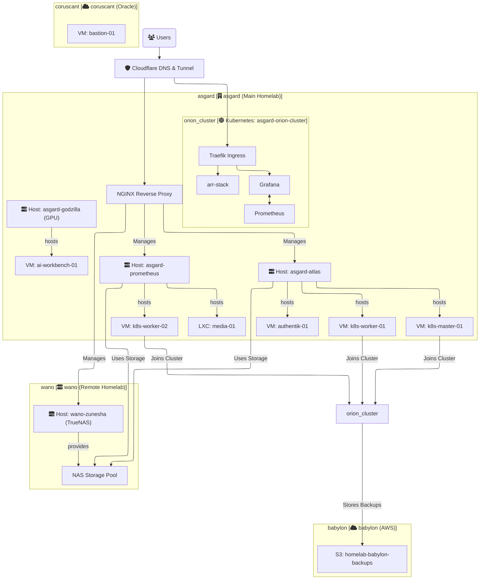

# Solution Architecture

This document provides a high-level overview of the homelab infrastructure architecture. Its purpose is to describe the core components, their interactions, and the guiding principles behind the design. For specific naming patterns of resources, please refer to the [NAMING_CONVENTION.md](./NAMING_CONVENTION.md) file.

## Guiding Principles

-   **GitOps as the Source of Truth:** This Git repository declaratively defines the desired state of the entire infrastructure. All changes are managed through Git.
-   **Infrastructure as Code (IaC):** All resources—from physical node configuration to virtual machines and Kubernetes applications—are defined as code.
-   **Separation of Concerns:** Each layer of the stack (infrastructure, configuration, orchestration) is managed by the best tool for the job (OpenTofu, Ansible, Kubernetes).
-   **Security by Design:** The architecture prioritizes security by segmenting networks, managing external access tightly, and strictly controlling secrets.

---

## High-Level Diagram

This logical diagram illustrates the main components and data flows across the different physical and cloud locations.
This is a example:

---

## 1. Physical & Virtualization Layer

This layer forms the foundation of the on-premise infrastructure.

#### 1.1. Locations
The homelab spans multiple physical and cloud sites, each with a designated codename:
-   **`asgard`**: The primary on-premise location, hosting the main compute and Kubernetes cluster.
-   **`wano`**: A future second on-premise location, primarily for centralized NAS storage.
-   **`babylon`**: The AWS cloud environment.
-   **`coruscant`**: The Oracle Cloud environment.

#### 1.2. Proxmox VE Hosts
Proxmox VE is the chosen hypervisor for managing virtual machines (VMs) and Linux Containers (LXCs).
-   **Hosts:** Bare-metal servers are given thematic names (e.g., `atlas`, `prometheus`, `godzilla`).
-   **Provisioning:** All VMs and LXCs are provisioned declaratively using **OpenTofu**. This ensures that our virtual infrastructure is reproducible and version-controlled.
-   **GPU Passthrough:** The `godzilla` node is designated for GPU-intensive workloads, with GPU passthrough configured for specific VMs.

#### 1.3. Storage Layer
-   **Initial State:** Currently, Proxmox hosts use their local SSDs for both the hypervisor OS and VM/LXC data (`atlas-bedrock`).
-   **Future State:** A dedicated **TrueNAS** server (`wano-zunesha`) will provide centralized storage via high-speed networking. It will serve storage to Proxmox for VM disks and to the Kubernetes cluster for Persistent Volumes, likely using NFS.

---

## 2. Networking Layer

Networking is designed to be secure and segmented, separating different types of traffic.

#### 2.1. Internal Networking
-   **Segmentation:** We use multiple logical networks (implemented as VLANs) to isolate traffic. These are named thematically (e.g., `styx-servers-vlan`, `bifrost-iot-vlan`).
-   **Services:** Key networks include a management network for hypervisor access, a storage network for Proxmox-to-NAS traffic, and an application network for Kubernetes and other services.
-   **IP Addressing:** The specific IP schemas and VLAN IDs are considered **secrets** and are managed within Ansible Vault, not in this public repository.

#### 2.2. External Access
Secure external access is provided by a multi-layered proxy setup:
1.  **Cloudflare:** Manages DNS and acts as the public entry point.
2.  **Cloudflare Tunnel:** A secure outbound-only connection from our internal network to Cloudflare's edge. This eliminates the need for open inbound firewall ports.
3.  **Internal Reverse Proxies:** The tunnel directs traffic to one of two internal proxies:
    -   **NGINX Proxy:** A dedicated proxy for accessing core infrastructure management interfaces (Proxmox Web UI, TrueNAS UI).
    -   **Traefik Ingress Controller:** The entry point for all services and applications running *inside* the Kubernetes cluster.

---

## 3. Application & Orchestration Layer

#### 3.1. Kubernetes Cluster (`asgard-orion-cluster`)
-   **Role:** Kubernetes is the primary platform for running containerized applications.
-   **Architecture:** The cluster is composed of multiple VMs running on Proxmox, with dedicated control-plane and worker nodes.
-   **GitOps Controller:** The cluster runs a GitOps controller (e.g., ArgoCD or FluxCD) that continuously synchronizes the state of the cluster with the manifests defined in the `/k8s` directory of this repository.
-   **Core Services:**
    -   **Traefik:** Manages all ingress traffic, handling TLS termination and routing to the correct services.
    -   **Prometheus & Grafana:** Provide a complete monitoring and observability stack.
    -   **Authentik:** A centralized identity and authentication provider for securing applications.
-   **Applications:** The cluster hosts various application stacks, including the `arr-stack` for media management and other custom websites.

---

## 4. Cloud Layer

Cloud resources are used for services that benefit from being off-site or cloud-native.

-   **AWS (`babylon`):** The primary use case is for **disaster recovery and backups**. Critical data from the on-premise Kubernetes cluster and TrueNAS is backed up to an S3 bucket (`homelab-babylon-backups-storage`).
-   **Oracle Cloud (`coruscant`):** Hosts "always-on" utility VMs, such as a bastion host for secure, out-of-band access to the infrastructure.

---

## 5. Automation & GitOps Workflow

The entire platform is managed through a layered automation workflow that directly corresponds to the repository's directory structure.

1.  **`tofu/` (Layer 1 - Provisioning):** OpenTofu code defines the desired state of all VMs and LXCs on Proxmox and in the cloud. Running `tofu apply` creates, updates, or destroys the base infrastructure.
2.  **`ansible/` (Layer 2 - Configuration):** Ansible playbooks target the raw infrastructure provisioned by Tofu. They perform tasks like OS hardening, installing dependencies (e.g., container runtimes), setting up the Kubernetes cluster, and deploying configurations from `/lxc-configs`.
3.  **`k8s/` (Layer 3 - Orchestration):** This directory contains Kubernetes manifests (YAML files, Helm charts) that define the applications. The in-cluster GitOps controller automatically applies any changes committed to this directory, ensuring the running applications always match the code in Git.
4.  **Secrets Management:** All secrets (passwords, API keys, IP addresses) are encrypted using **Ansible Vault**. The public repository contains only the encrypted files; the decryption key is managed securely and separately.