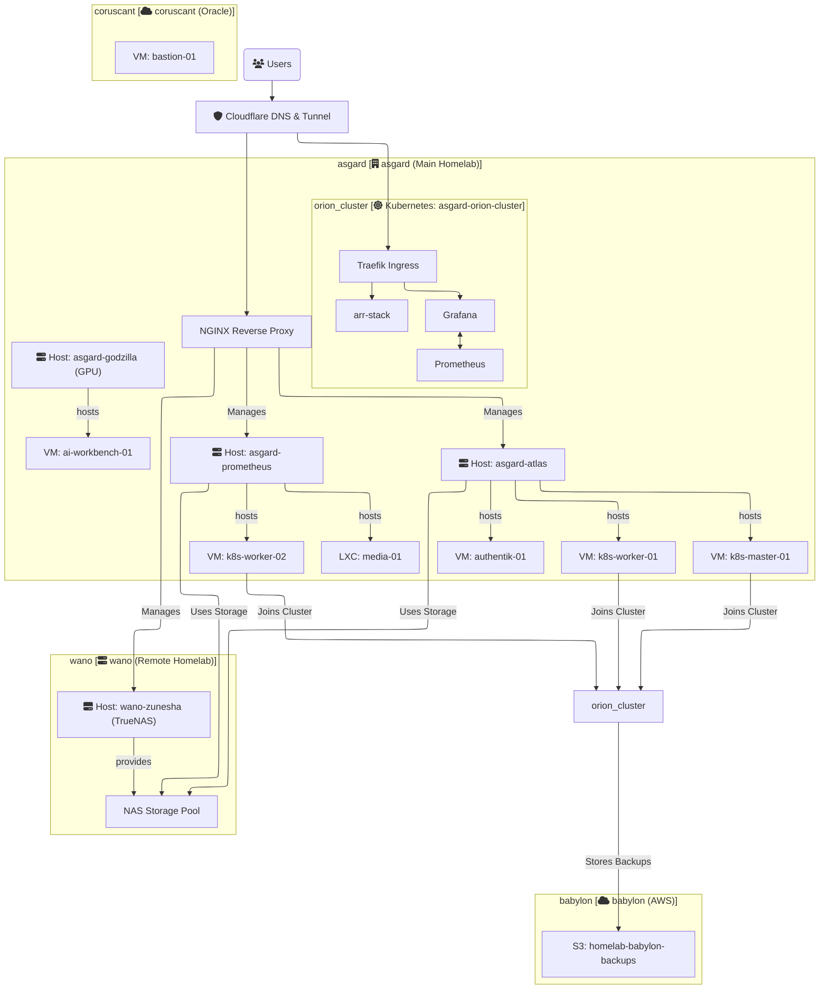
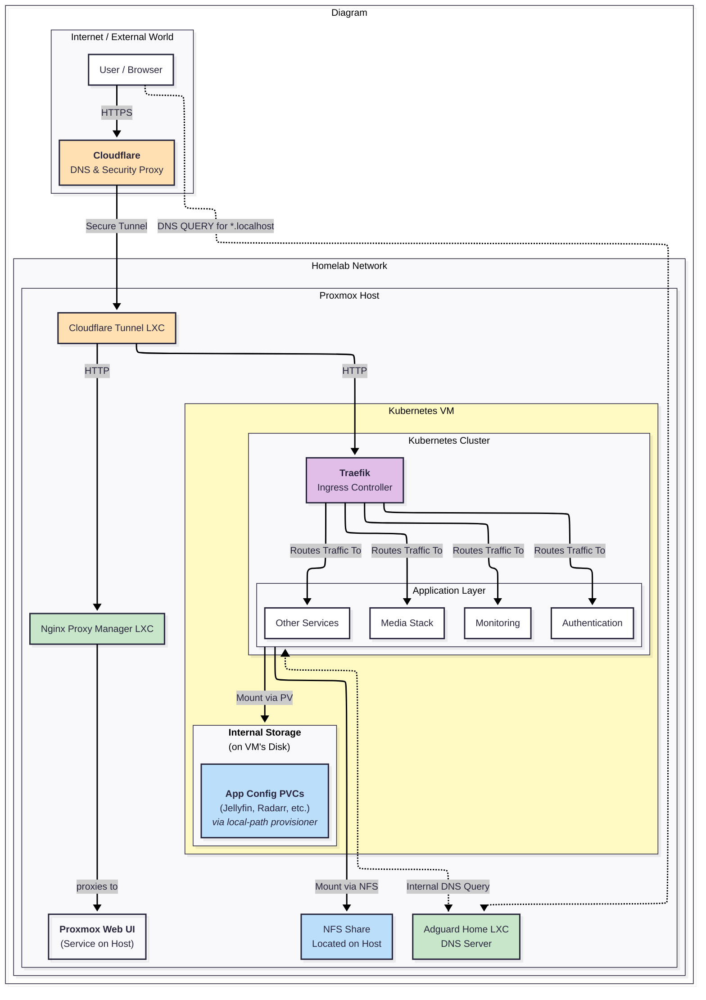
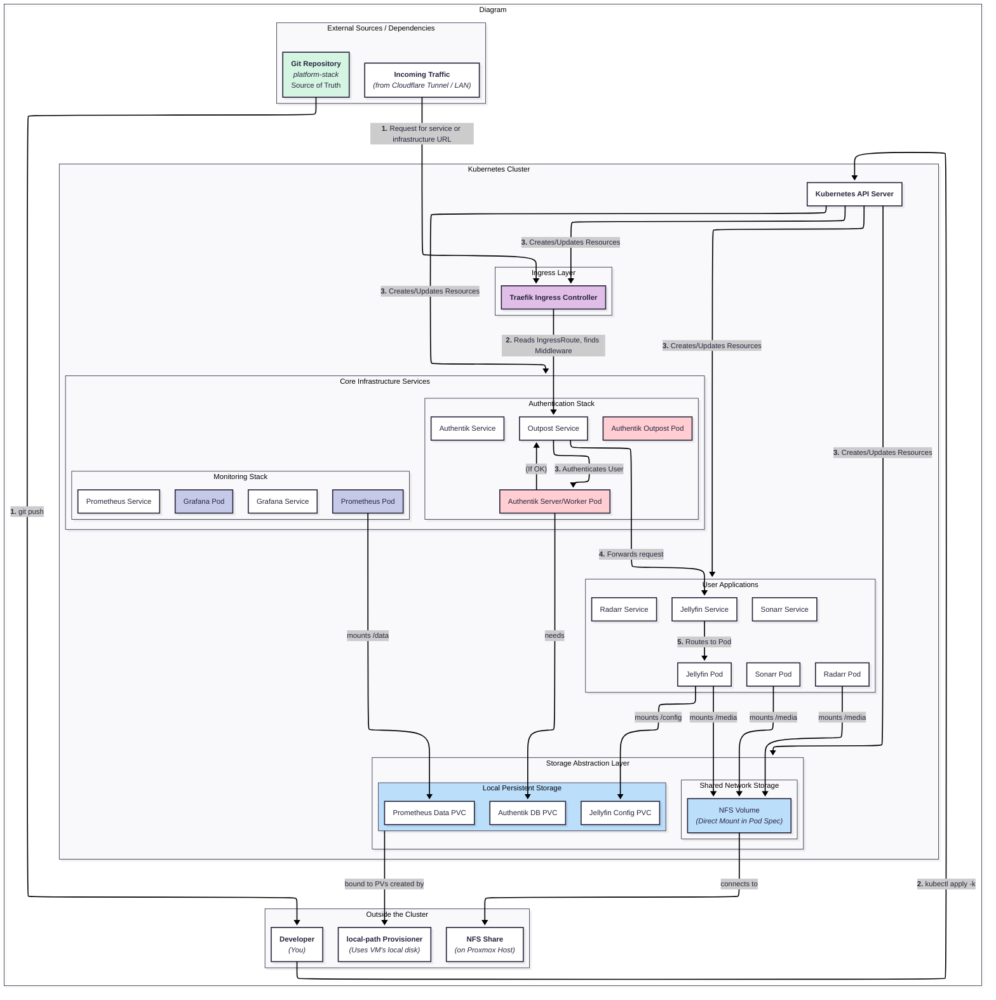
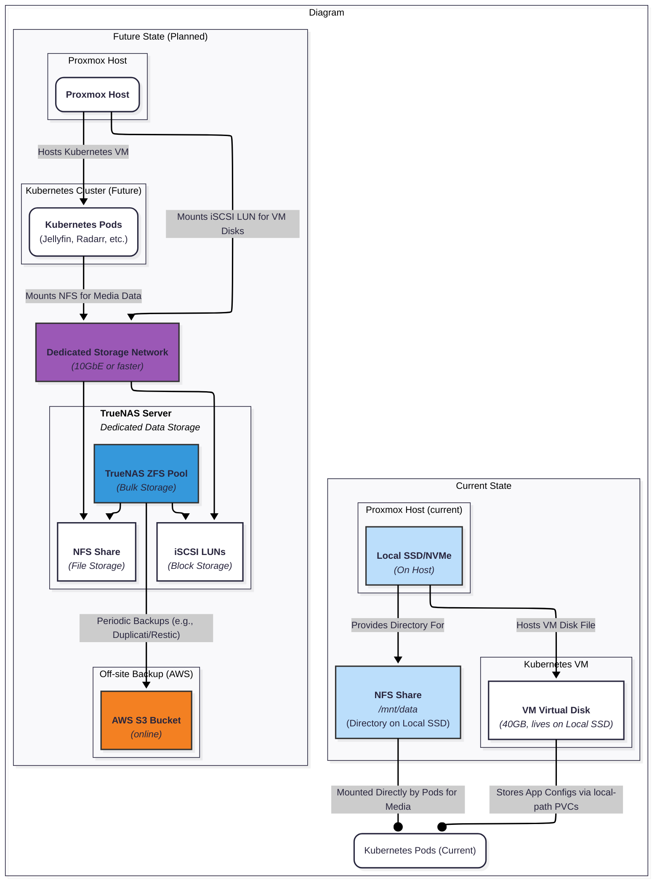

# Solution Architecture

This document provides a high-level overview of the homelab infrastructure architecture. Its purpose is to describe the core components, their interactions, and the guiding principles behind the design. For specific naming patterns of resources, please refer to the [NAMING_CONVENTION.md](./NAMING_CONVENTION.md) file.

## Guiding Principles

-   **GitOps as the Source of Truth:** This Git repository declaratively defines the desired state of the entire infrastructure. All changes are managed through Git.
-   **Infrastructure as Code (IaC):** All resources—from physical node configuration to virtual machines and Kubernetes applications—are defined as code.
-   **Separation of Concerns:** Each layer of the stack (infrastructure, configuration, orchestration) is managed by the best tool for the job (OpenTofu, Ansible, Kubernetes).
-   **Security by Design:** The architecture prioritizes security by segmenting networks, managing external access tightly, and strictly controlling secrets.

---

## High-Level Diagram

This logical diagram illustrates the main components and data flows across the different physical and cloud locations.
This is a example:


### 1. Overall Solution Architecture Diagram (The "Map of the World")

*   **Explanation:** Its purpose is to provide the broadest possible overview of the entire system. It shows all the major locations (`asgard`, `wano`, `aws`) and the most significant components within them (Proxmox hosts, Kubernetes cluster, NAS). It's the perfect starting point for anyone new to the project to understand what pieces exist and how they generally relate to each other.
*   **Audience:** Everyone, especially new contributors.





### 2. Logical Network Architecture Diagram (The "Traffic Cop View")

*   **Explanation:** This diagram focuses exclusively on the logical segmentation of your network. It abstracts away the physical hardware and instead illustrates the **VLANs** (or virtual networks) and the flow of traffic between them. It would show which services and machines connect to which network (e.g., `styx-servers-vlan`, `bifrost-iot-vlan`, "Storage Network"). Crucially, it would also show the **firewall** or router at the center, illustrating the rules that govern which networks are allowed to talk to each other. This diagram answers the question: "Who can talk to whom?"
*   **Audience:** Network administrators, security auditors, developers deploying services with specific network requirements.

```mermaid

```

### 3. External Access & Ingress Flow Diagram (The "Front Door View")

*   **Explanation:** This diagram details the complete path a user request takes from the public internet to an internal service. It would start with the user, go to Cloudflare DNS, through the Cloudflare Tunnel, and then show the critical split:
    1.  Traffic destined for infrastructure management (Proxmox UI) goes to the **NGINX Reverse Proxy**.
    2.  Traffic destined for applications (Grafana, arr-stack) goes to the **Traefik Ingress Controller** inside Kubernetes.
    This diagram is essential for understanding your security posture and for troubleshooting external connectivity issues.
*   **Audience:** Anyone managing security, DNS, or deploying a new user-facing service.

```mermaid
---
config:
  layout: elk
  theme: redux
  look: neo
---
flowchart TD
 subgraph Diagram["Diagram"]
        Internet["Internet"]
        HomelabNetwork["HomelabNetwork"]
  end
 subgraph Internet["Internet / External World"]
        UserBrowser["User"]
        Cloudflare["<b>Cloudflare</b><br>DNS &amp; Security Proxy"]
  end
 subgraph InfrastructureReverseProxy["Infrastructure Reverse Proxy"]
        NPM_LXC["<b>Nginx Proxy Manager LXC</b>"]
  end
 subgraph ApplicationLayer["Application Services (Pods)"]
        Jellyfin["Jellyfin Service"]
        Grafana["Grafana Service"]
        Arrs["*arr Stack Services"]
  end
 subgraph KubernetesVM["Kubernetes VM"]
        Traefik["<b>Traefik Ingress Controller</b><br><i>(Pod)</i>"]
        ApplicationLayer
  end
 subgraph ProxmoxHost["Proxmox Host"]
        TunnelLXC["<b>Cloudflare Tunnel LXC</b><br>(bananagator-01)<br><i>Receives all traffic from Cloudflare</i>"]
        DNSplit["DNSplit"]
        InfrastructureReverseProxy
        KubernetesVM
        PVE_Service["<b>Proxmox UI Service</b><br><i>(On Host)</i>"]
  end
 subgraph HomelabNetwork["Homelab Network"]
        ProxmoxHost
  end
 subgraph DNSplit["The Critical Split (Inside Tunnel LXC)"]
    direction LR
        Splitter{"<b>Traffic is Forwarded Based on Hostname</b>"}
  end
    UserBrowser -- "<b>1.</b> Request for service or infrastructure URL" --> Cloudflare
    Cloudflare -- "<b>2.</b> Sends request securely via Tunnel" --> TunnelLXC
    TunnelLXC --> Splitter
    Splitter -- "<b>Path A: Application Traffic</b><br><i>If Host is serice</i>" --> Traefik
    Splitter -- "<b>Path B: Infrastructure Traffic</b><br><i>If Host is infrastructure</i>" --> NPM_LXC
    NPM_LXC -- Forwards Request --> PVE_Service
    Traefik -- Uses IngressRoute to find correct service --> ApplicationLayer
    UserBrowser@{ shape: rect}
    style Cloudflare fill:#f38020
    style NPM_LXC fill:#C8E6C9
    style Traefik fill:#E1BEE7
    style TunnelLXC fill:#FFE0B2
    style Splitter fill:#FFCDD2,stroke:#333,stroke-width:2px
    style Diagram fill:transparent

```

### 4. Kubernetes Cluster Architecture Diagram (The "Application Platform View")

*   **Explanation:** This diagram zooms in on the `asgard-orion-cluster`. It treats the underlying VMs as a given and instead focuses on the internal components of the Kubernetes platform itself. It would show the relationship between the **Traefik Ingress Controller**, the **GitOps Controller** (ArgoCD/Flux), core services like **Authentik** and the **Prometheus/Grafana** monitoring stack, and how they interact with a sample user application (e.g., `arr-stack`). It would also show how Persistent Volume Claims (PVCs) get their storage.
*   **Audience:** Developers who are deploying and managing applications inside Kubernetes.



### 5. Storage Architecture Diagram (The "Data View")

*   **Explanation:** This diagram focuses on a single critical resource: data. It would illustrate where all persistent data lives and how it is accessed. It should show both the **current state** (local SSD storage on Proxmox hosts, `atlas-bedrock`) and the **future state**. The future view would detail:
    *   The TrueNAS server.
    *   The "Storage Network" connecting it to the Proxmox hosts.
    *   How Proxmox accesses storage for VM disks (e.g., via iSCSI or NFS).
    *   How Kubernetes applications access storage for Persistent Volumes (e.g., via an NFS client).
    *   The **backup flow**, showing data moving from TrueNAS and Kubernetes to the **AWS S3 bucket** (`babylon`).
*   **Audience:** Infrastructure managers, anyone concerned with data integrity, backups, and disaster recovery.




### 6. GitOps Workflow & CI/CD Diagram (The "Developer's Journey View")

*   **Explanation:** This is arguably the most important diagram for new developers. It's not a static view of the infrastructure, but a **process flow diagram**. It shows what happens after a developer runs `git push`. It would illustrate two key paths:
    1.  **Infrastructure Path (Manual/Gated):** A change to the `tofu/` or `ansible/` directories is pushed, a Pull Request is reviewed, and an administrator must manually run a `task tofu:apply` or `task ansible:playbook` command to enact the change.
    2.  **Application Path (Automated):** A change to the `k8s/` directory is merged, which is automatically detected by the **in-cluster GitOps controller**, which then pulls the change and applies it to the cluster without any manual intervention.
    This diagram explains *how to use this repository* to make changes happen.
*   **Audience:** All developers and contributors.

```mermaid
---
config:
  theme: redux
  look: neo
  layout: dagre
---
flowchart TD
 subgraph Diagram["Diagram"]
        Developer["Developer"]
        GitPlatform["GitPlatform"]
        Production["Production"]
        ManualProcess["ManualProcess"]
        Decision{{"<b>Check Changed Files</b>"}}
  end
 subgraph Developer["Developer's Local Machine"]
        DevPC["<b>Developer</b><br><i>Writes code in<br>VS Code</i>"]
  end
 subgraph GitPlatform["Git Platform (e.g., GitHub)"]
    direction LR
        GitRepo["<b>Git Repository</b><br><i>platform-stack</i>"]
        PR["<b>Pull Request</b><br><i>Code Review &amp; Approval</i>"]
        Merge@{ label: "<b>Merge to <b>main</b> branch</b>" }
  end
 subgraph ProxmoxInfra["Proxmox Infrastructure"]
        Proxmox["<b>Proxmox Hosts</b>"]
  end
 subgraph K8sInfra["Kubernetes Cluster"]
        GitOpsController["<b>GitOps Controller</b><br><i>(ArgoCD / Flux)</i><br>Watches Git Repo"]
        K8sCluster["<b>Kubernetes API</b>"]
  end
 subgraph Production["Production Environments"]
    direction TB
        ProxmoxInfra
        K8sInfra
  end
 subgraph ManualProcess["Manual/Gated Process"]
        Admin["<b>Administrator</b><br><i>(You)</i>"]
  end
    DevPC -- "<b>1.</b> git push" --> GitRepo
    GitRepo -- "<b>2.</b> Open Pull Request" --> PR
    PR -- "<b>3.</b> Code is Reviewed &amp; Approved" --> Merge
    Merge -- "<b>4.</b> TRIGGER" --> Decision
    Decision -- <b>Path A: Infrastructure Change</b><br><i>(files in <b>tofu/</b> or <b>ansible/</b>)</i> --> ManualProcess
    Admin -- "<b>6a.</b> Runs <b>task tofu:apply</b> or <b>task ansible:playbook</b>" --> ProxmoxInfra
    Decision -- <b>Path B: Application Change</b><br><i>(files in <b>k8s/</b>)</i> --> GitOpsController
    GitOpsController -- "<b>5b.</b> Automatically detects change to <b>main</b> branch" --> Merge
    Merge@{ shape: rect}
    style DevPC fill:#BBDEFB
    style GitRepo fill:#C8E6C9

```



---

## 1. Physical & Virtualization Layer

This layer forms the foundation of the on-premise infrastructure.

#### 1.1. Locations
The homelab spans multiple physical and cloud sites, each with a designated codename:
-   **`asgard`**: The primary on-premise location, hosting the main compute and Kubernetes cluster.
-   **`wano`**: A future second on-premise location, primarily for centralized NAS storage.
-   **`babylon`**: The AWS cloud environment.
-   **`coruscant`**: The Oracle Cloud environment.

#### 1.2. Proxmox VE Hosts
Proxmox VE is the chosen hypervisor for managing virtual machines (VMs) and Linux Containers (LXCs).
-   **Hosts:** Bare-metal servers are given thematic names (e.g., `atlas`, `prometheus`, `godzilla`).
-   **Provisioning:** All VMs and LXCs are provisioned declaratively using **OpenTofu**. This ensures that our virtual infrastructure is reproducible and version-controlled.
-   **GPU Passthrough:** The `godzilla` node is designated for GPU-intensive workloads, with GPU passthrough configured for specific VMs.

#### 1.3. Storage Layer
-   **Initial State:** Currently, Proxmox hosts use their local SSDs for both the hypervisor OS and VM/LXC data (`atlas-bedrock`).
-   **Future State:** A dedicated **TrueNAS** server (`wano-zunesha`) will provide centralized storage via high-speed networking. It will serve storage to Proxmox for VM disks and to the Kubernetes cluster for Persistent Volumes, likely using NFS.

---

## 2. Networking Layer

Networking is designed to be secure and segmented, separating different types of traffic.

#### 2.1. Internal Networking
-   **Segmentation:** We use multiple logical networks (implemented as VLANs) to isolate traffic. These are named thematically (e.g., `styx-servers-vlan`, `bifrost-iot-vlan`).
-   **Services:** Key networks include a management network for hypervisor access, a storage network for Proxmox-to-NAS traffic, and an application network for Kubernetes and other services.
-   **IP Addressing:** The specific IP schemas and VLAN IDs are considered **secrets** and are managed within Ansible Vault, not in this public repository.

#### 2.2. External Access
Secure external access is provided by a multi-layered proxy setup:
1.  **Cloudflare:** Manages DNS and acts as the public entry point.
2.  **Cloudflare Tunnel:** A secure outbound-only connection from our internal network to Cloudflare's edge. This eliminates the need for open inbound firewall ports.
3.  **Internal Reverse Proxies:** The tunnel directs traffic to one of two internal proxies:
    -   **NGINX Proxy:** A dedicated proxy for accessing core infrastructure management interfaces (Proxmox Web UI, TrueNAS UI).
    -   **Traefik Ingress Controller:** The entry point for all services and applications running *inside* the Kubernetes cluster.

---

## 3. Application & Orchestration Layer

#### 3.1. Kubernetes Cluster (`asgard-orion-cluster`)
-   **Role:** Kubernetes is the primary platform for running containerized applications.
-   **Architecture:** The cluster is composed of multiple VMs running on Proxmox, with dedicated control-plane and worker nodes.
-   **GitOps Controller:** The cluster runs a GitOps controller (e.g., ArgoCD or FluxCD) that continuously synchronizes the state of the cluster with the manifests defined in the `/k8s` directory of this repository.
-   **Core Services:**
    -   **Traefik:** Manages all ingress traffic, handling TLS termination and routing to the correct services.
    -   **Prometheus & Grafana:** Provide a complete monitoring and observability stack.
    -   **Authentik:** A centralized identity and authentication provider for securing applications.
-   **Applications:** The cluster hosts various application stacks, including the `arr-stack` for media management and other custom websites.

---

## 4. Cloud Layer

Cloud resources are used for services that benefit from being off-site or cloud-native.

-   **AWS (`babylon`):** The primary use case is for **disaster recovery and backups**. Critical data from the on-premise Kubernetes cluster and TrueNAS is backed up to an S3 bucket (`homelab-babylon-backups-storage`).
-   **Oracle Cloud (`coruscant`):** Hosts "always-on" utility VMs, such as a bastion host for secure, out-of-band access to the infrastructure.

---

## 5. Automation & GitOps Workflow

The entire platform is managed through a layered automation workflow that directly corresponds to the repository's directory structure.

1.  **`tofu/` (Layer 1 - Provisioning):** OpenTofu code defines the desired state of all VMs and LXCs on Proxmox and in the cloud. Running `tofu apply` creates, updates, or destroys the base infrastructure.
2.  **`ansible/` (Layer 2 - Configuration):** Ansible playbooks target the raw infrastructure provisioned by Tofu. They perform tasks like OS hardening, installing dependencies (e.g., container runtimes), setting up the Kubernetes cluster, and deploying configurations from `/lxc-configs`.
3.  **`k8s/` (Layer 3 - Orchestration):** This directory contains Kubernetes manifests (YAML files, Helm charts) that define the applications. The in-cluster GitOps controller automatically applies any changes committed to this directory, ensuring the running applications always match the code in Git.
4.  **Secrets Management:** All secrets are managed via Ansible Vault.
    > **See [SECRETS.md](./SECRETS.md) for the full security policy and workflow.**
