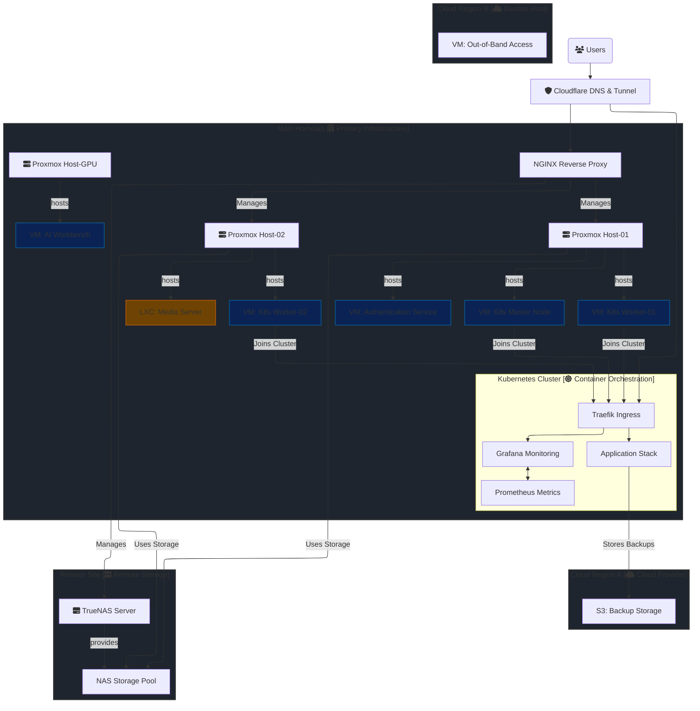

# Solution Architecture

This document provides a high-level overview of the homelab infrastructure architecture. Its purpose is to describe the core components, their interactions, and the guiding principles behind the design. For specific naming patterns of resources, please refer to the [NAMING_CONVENTION.md](./NAMING_CONVENTION.md) file.

## Guiding Principles

1.  **GitOps as the Source of Truth:** This Git repository declaratively defines the desired state of the entire infrastructure. All changes are managed through Git.
2.  **Infrastructure as Code (IaC):** All resources—from physical node configuration to virtual machines and Kubernetes applications—are defined as code using OpenTofu, Ansible, and Kubernetes manifests.
3.  **Separation of Concerns:** Each layer of the stack is managed by a dedicated tool: OpenTofu for infrastructure provisioning, Ansible for server configuration, and Kubernetes for container orchestration.
4.  **Security by Design:** The architecture prioritizes security through network segmentation, tightly controlled external access via Cloudflare Tunnels, and strict secret management with Ansible Vault.
5.  **Local Development Parity:** Developers can run a complete, multi-service application on their local machine using Podman Compose, mirroring production architecture on a single machine.

## Where to Start

### New Here?
- Study the [System Overview](#system-overview) diagram first
- Read [GETTING_STARTED.md](./GETTING_STARTED.md) for setup

### Managing Infrastructure?
- [Infrastructure (OpenTofu)](./layers/tofu.md) — IaC provisioning, state management, CI/CD workflow
- [Networking](./networking/README.md) — topology, subnets, ingress flow
- [Storage](./storage/README.md) — 4-tier model, architecture diagram

### Deploying Applications?
- [App Pattern](./app_pattern/01-directory-structure.md) — directory structure, overlays, lifecycle
- [Kubernetes Architecture](./app_pattern/06-kubernetes-architecture.md) — cluster design, GitOps workflow

### Securing Secrets?
- [Secrets Management](./secrets/01-secrets-management-policy.md) — policy, Sealed Secrets, rotation

### Monitoring & Observability?
- [Monitoring Overview](./monitoring/README.md) — dashboards, SRE runbooks, developer tools

### Backups & Disaster Recovery?
- [Backup Strategy](./backup/ARCHITECTURE.md) — Velero, rclone, recovery procedures

---

## System Overview

The following diagram provides the broadest possible overview of the entire system. It shows all major locations and the most significant components within them, using generic names that describe purpose rather than specific instances. This ensures the diagram remains valid even when infrastructure is renamed or restructured.

*   **Audience:** Everyone, especially new contributors.

```mermaid
---
config:
  layout: elk
---
flowchart TD
    %% --- STYLES ---
    classDef location fill:#1f252e,stroke:#333,stroke-width:2px;
    classDef vm fill:#0b2354,stroke:#0277bd,stroke-width:1px;
    classDef lxc fill:#6e4303,stroke:#ef6c00,stroke-width:1px;
    classDef service fill:#5e0657,stroke:#2e7d32,stroke-width:1px;

    %% --- EXTERNAL & ENTRY ---
    Users(fa:fa-users Users) --> Cloudflare[fa:fa-shield Cloudflare DNS & Tunnel];

    %% --- CLOUD LOCATIONS ---
    subgraph CloudA["Cloud Region A [fa:fa-cloud Cloud Provider]"]
        S3[S3: Backup Storage]
    end
    subgraph CloudB["Cloud Region B [fa:fa-cloud Bastion Host]"]
        OCI_Bastion[VM: Out-of-Band Access]
    end
    class CloudA,CloudB location;

    %% --- ON-PREMISE LOCATIONS ---
    subgraph RemoteSite["Remote Site [fa:fa-server Remote Storage]"]
        TrueNAS["fa:fa-hdd TrueNAS Server"]
        TrueNAS -- provides --> NAS_Storage[NAS Storage Pool]
    end
    class RemoteSite location;

    subgraph MainHomelab["Main Homelab [fa:fa-building Primary Infrastructure]"]
        %% Proxies & Services
        Mgmt_Proxy[NGINX Reverse Proxy];
        
        %% K8s Logical Group
        subgraph K8sCluster["Kubernetes Cluster [fa:fa-dharmachakra Container Orchestration]"]
            Ingress[Traefik Ingress]
            App_A[Application Stack]
            App_B[Grafana Monitoring]
            Prometheus[Prometheus Metrics]
        end
        
        %% Proxmox Hosts (as nodes, not nested subgraphs)
        Host_A[fa:fa-server Proxmox Host-01]
        Host_B[fa:fa-server Proxmox Host-02]
        Host_GPU[fa:fa-server Proxmox Host-GPU]

        %% VMs & LXCs (generic purpose-based names)
        VM_K8s_Master[VM: K8s Master Node]:::vm
        VM_K8s_Worker1[VM: K8s Worker-01]:::vm
        VM_Auth[VM: Authentication Service]:::vm
        VM_K8s_Worker2[VM: K8s Worker-02]:::vm
        LXC_Media[LXC: Media Server]:::lxc
        VM_AI[VM: AI Workbench]:::vm

        %% Show VM/LXC placement on Hosts
        Host_A -- "hosts" --> VM_K8s_Master
        Host_A -- "hosts" --> VM_K8s_Worker1
        Host_A -- "hosts" --> VM_Auth
        
        Host_B -- "hosts" --> VM_K8s_Worker2
        Host_B -- "hosts" --> LXC_Media

        Host_GPU -- "hosts" --> VM_AI

        %% K8s Internal App Flow
        Ingress --> App_A
        Ingress --> App_B
        App_B <--> Prometheus
    end
    class MainHomelab location;
    
    %% --- GLOBAL CONNECTIONS ---
    
    %% External to Internal
    Cloudflare --> Mgmt_Proxy
    Cloudflare --> Ingress

    %% Management Connections
    Mgmt_Proxy -- "Manages" --> Host_A
    Mgmt_Proxy -- "Manages" --> Host_B
    Mgmt_Proxy -- "Manages" --> TrueNAS

    %% Kubernetes Node Membership (connecting to cluster ingress)
    VM_K8s_Master -- "Joins Cluster" --> Ingress
    VM_K8s_Worker1 -- "Joins Cluster" --> Ingress
    VM_K8s_Worker2 -- "Joins Cluster" --> Ingress

    %% Storage Connections
    Host_A -- "Uses Storage" --> NAS_Storage
    Host_B -- "Uses Storage" --> NAS_Storage
    App_A -- "Stores Backups" --> S3
```

---

## Document Structure

| File | Purpose |
|---|---|
| [networking/README.md](./networking/README.md) | Topology diagram, subnet table, ingress flow diagrams |
| [storage/README.md](./storage/README.md) | 4-tier storage model, storage architecture diagram |
| [app_pattern/01-directory-structure.md](./app_pattern/01-directory-structure.md) | App directory layout, naming conventions |
| [app_pattern/06-kubernetes-architecture.md](./app_pattern/06-kubernetes-architecture.md) | K8s cluster architecture, GitOps workflow diagrams |
| [secrets/01-secrets-management-policy.md](./secrets/01-secrets-management-policy.md) | Secrets management policy, Sealed Secrets |
| [monitoring/README.md](./monitoring/README.md) | Monitoring overview, dashboards, runbooks |
| [backup/ARCHITECTURE.md](./backup/ARCHITECTURE.md) | Backup strategy (Velero, rclone, recovery) |
| [GETTING_STARTED.md](./GETTING_STARTED.md) | First-time setup guide |
| [NAMING_CONVENTION.md](./NAMING_CONVENTION.md) | Resource naming standards |
| [CODEBASE.md](../CODEBASE.md) | Repository structure map |
