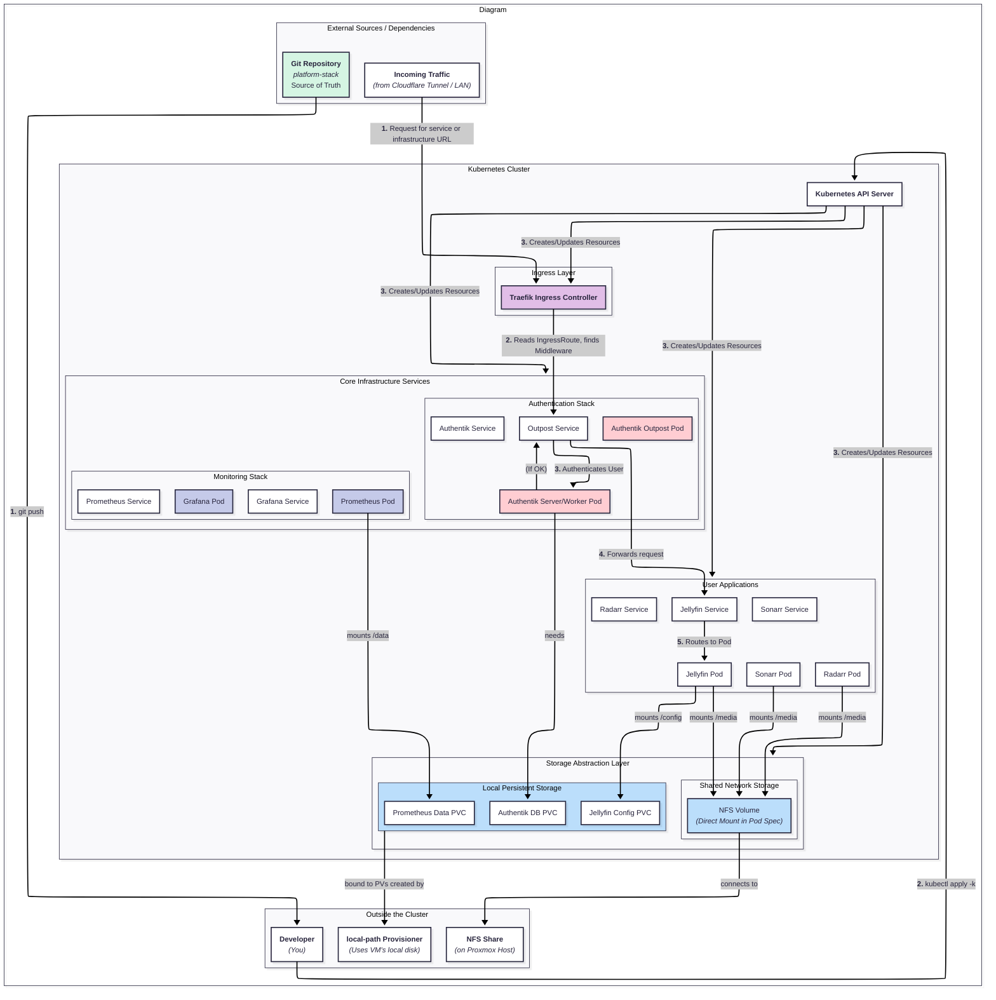

# Kubernetes Architecture

## Cluster Overview

The **`asgard-orion-cluster`** is the primary platform for running containerized applications. It runs on VMs hosted by Proxmox with dedicated control-plane and worker nodes.

### Core Services

-   **Traefik** — Manages all ingress traffic, handling TLS termination and routing to the correct services
-   **Prometheus & Grafana** — Provide a complete monitoring and observability stack
-   **Authentik** — A centralized identity and authentication provider for securing applications

### Applications

The cluster hosts various application stacks, including:

-   `arr-stack` for media management (Radarr, Sonarr, Jellyfin, etc.)
-   Custom websites and services

Each application mounts its configuration via PVCs (local-path provisioner) and media data via NFS shares.

---

## K8s Cluster Architecture Diagram (The "Application Platform View")

*   **Explanation:** This diagram zooms in on the `asgard-orion-cluster`. It treats the underlying VMs as a given and instead focuses on the internal components of the Kubernetes platform itself. It shows the relationship between the **Traefik Ingress Controller**, the **GitOps Controller** (ArgoCD/Flux), core services like **Authentik** and the **Prometheus/Grafana** monitoring stack, and how they interact with a sample user application (e.g., `arr-stack`). It also shows how Persistent Volume Claims (PVCs) get their storage.
*   **Audience:** Developers who are deploying and managing applications inside Kubernetes.

---

## GitOps Workflow Diagram (The "Developer's Journey View")

*   **Explanation:** This is arguably the most important diagram for new developers. It's not a static view of the infrastructure, but a **process flow diagram**. It shows what happens after a developer runs `git push`. It illustrates two key paths:
    1.  **Infrastructure Path (Manual/Gated):** A change to the `tofu/` or `ansible/` directories is pushed, a Pull Request is reviewed, and an administrator must manually run a `task tofu:apply` or `task ansible:playbook` command to enact the change.
    2.  **Application Path (Automated):** A change to the `k8s/` directory is merged, which is automatically detected by the **in-cluster GitOps controller**, which then pulls the change and applies it to the cluster without any manual intervention.
    This diagram explains *how to use this repository* to make changes happen.
*   **Audience:** All developers and contributors.

```mermaid
---
config:
  theme: redux
  look: neo
  layout: dagre
---
flowchart TD
 subgraph Diagram["Diagram"]
        Developer["Developer"]
        GitPlatform["GitPlatform"]
        Production["Production"]
        ManualProcess["ManualProcess"]
        Decision{{"<b>Check Changed Files</b>"}}
  end
 subgraph Developer["Developer's Local Machine"]
        DevPC["<b>Developer</b><br><i>Writes code in<br>VS Code</i>"]
  end
 subgraph GitPlatform["Git Platform (e.g., GitHub)"]
    direction LR
        GitRepo["<b>Git Repository</b><br><i>platform-stack</i>"]
        PR["<b>Pull Request</b><br><i>Code Review &amp; Approval</i>"]
        Merge@{ label: "<b>Merge to <b>main</b> branch</b>" }
  end
 subgraph ProxmoxInfra["Proxmox Infrastructure"]
        Proxmox["<b>Proxmox Hosts</b>"]
  end
 subgraph K8sInfra["Kubernetes Cluster"]
        GitOpsController["<b>GitOps Controller</b><br><i>(ArgoCD / Flux)</i><br>Watches Git Repo"]
        K8sCluster["<b>Kubernetes API</b>"]
  end
 subgraph Production["Production Environments"]
    direction TB
        ProxmoxInfra
        K8sInfra
  end
 subgraph ManualProcess["Manual/Gated Process"]
        Admin["<b>Administrator</b><br><i>(You)</i>"]
  end
    DevPC -- "<b>1.</b> git push" --> GitRepo
    GitRepo -- "<b>2.</b> Open Pull Request" --> PR
    PR -- "<b>3.</b> Code is Reviewed &amp; Approved" --> Merge
    Merge -- "<b>4.</b> TRIGGER" --> Decision
    Decision -- <b>Path A: Infrastructure Change</b><br><i>(files in <b>tofu/</b> or <b>ansible/</b>)</i> --> ManualProcess
    Admin -- "<b>6a.</b> Runs <b>task tofu:apply</b> or <b>task ansible:playbook</b>" --> ProxmoxInfra
    Decision -- <b>Path B: Application Change</b><br><i>(files in <b>k8s/</b>)</i> --> GitOpsController
    GitOpsController -- "<b>5b.</b> Automatically detects change to <b>main</b> branch" --> Merge
    Merge@{ shape: rect}
    style DevPC fill:#BBDEFB
    style GitRepo fill:#C8E6C9

```

---

## Related Documents

*   [app_pattern/01-directory-structure.md](./01-directory-structure.md) — Folder hierarchy and naming conventions
*   [app_pattern/02-base-patches-overlays.md](./02-base-patches-overlays.md) — The composition model and patching decision tree
*   [app_pattern/03-application-lifecycle.md](./03-application-lifecycle.md) — Creating, shutting down, and managing applications
*   [app_pattern/app dependency.md](./app%20dependency.md) — Component version audit and upgrade ordering
