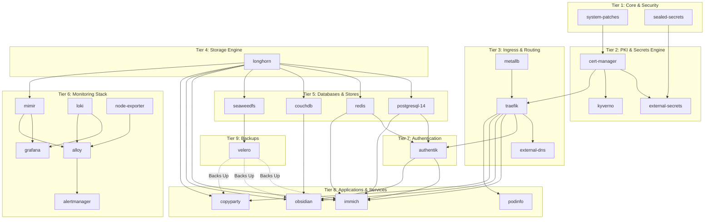

# Kubernetes Component Version & Dependency Audit

This document provides a comprehensive audit of the `kubernetes/` folder structure, detailing current application versions, an analysis of service dependencies (with a recommended upgrade path), and a list of configuration issues where cluster-specific settings are hardcoded inside generic component folders.

---

## 1. Version Locations & Current Versions

Here are all the locations where version specifications (Helm charts, container images, and task tools) are defined.

### Helm Charts (in `kubernetes/apps`)

| App Type | Component Name | Helm Chart Name | Repo URL | Current Version | File Link |
|---|---|---|---|---|---|
| **Infra** | `sealed-secrets` | `sealed-secrets` | `https://bitnami-charts.github.io/bitnami` | `2.18.0` | [kustomization.yaml](file:///home/dev/platform-stack/kubernetes/apps/infrastructure/sealed-secrets/base/kustomization.yaml#L8) |
| **Infra** | `cert-manager` | `cert-manager` | `https://charts.jetstack.io` | `1.19.2` | [kustomization.yaml](file:///home/dev/platform-stack/kubernetes/apps/infrastructure/cert-manager/base/kustomization.yaml#L8) |
| **Infra** | `external-secrets` | `external-secrets` | `https://charts.external-secrets.io` | `0.14.3` | [kustomization.yaml](file:///home/dev/platform-stack/kubernetes/apps/infrastructure/external-secrets/base/kustomization.yaml#L8) |
| **Infra** | `kyverno` | `kyverno` | `https://kyverno.github.io/kyverno/` | `3.6.2` | [kustomization.yaml](file:///home/dev/platform-stack/kubernetes/apps/infrastructure/kyverno/base/kustomization.yaml#L8) |
| **Infra** | `metallb` | `metallb` | `https://metallb.github.io/metallb` | `0.14.8` | [kustomization.yaml](file:///home/dev/platform-stack/kubernetes/apps/infrastructure/metallb/base/kustomization.yaml#L8) |
| **Infra** | `traefik` | `traefik` | `https://traefik.github.io/charts` | `38.0.2` | [kustomization.yaml](file:///home/dev/platform-stack/kubernetes/apps/infrastructure/traefik/base/kustomization.yaml#L11) |
| **Infra** | `external-dns` | `external-dns` | `https://kubernetes-sigs.github.io/external-dns/` | `1.20.0` | [kustomization.yaml](file:///home/dev/platform-stack/kubernetes/apps/infrastructure/external-dns/base/kustomization.yaml#L10) |
| **Infra** | `longhorn` | `longhorn` | `https://charts.longhorn.io` | `1.11.0` | [kustomization.yaml](file:///home/dev/platform-stack/kubernetes/apps/infrastructure/longhorn/base/kustomization.yaml#L8) |
| **Infra** | `redis` | `redis` | `https://ot-container-kit.github.io/helm-charts` | `0.2.14` | [kustomization.yaml](file:///home/dev/platform-stack/kubernetes/apps/infrastructure/redis/base/kustomization.yaml#L10) |
| **Infra** | `couchdb` | `couchdb` | `https://apache.github.io/couchdb-helm` | `4.6.3` | [kustomization.yaml](file:///home/dev/platform-stack/kubernetes/apps/infrastructure/couchdb/base/kustomization.yaml#L10) |
| **Infra** | `seaweedfs` | `seaweedfs` | `https://seaweedfs.github.io/seaweedfs/helm` | `4.0.409` | [kustomization.yaml](file:///home/dev/platform-stack/kubernetes/apps/infrastructure/seaweedfs/base/kustomization.yaml#L10) |
| **Infra** | `authentik` | `authentik` | `https://charts.goauthentik.io` | `2026.2.1` | [kustomization.yaml](file:///home/dev/platform-stack/kubernetes/apps/infrastructure/authentik/base/kustomization.yaml#L10) |
| **Infra** | `mimir` | `mimir-distributed` | `https://grafana.github.io/helm-charts` | `5.3.0` | [kustomization.yaml](file:///home/dev/platform-stack/kubernetes/apps/infrastructure/mimir/base/kustomization.yaml#L8) |
| **Infra** | `loki` | `loki` | `https://grafana.github.io/helm-charts` | `6.52.0` | [kustomization.yaml](file:///home/dev/platform-stack/kubernetes/apps/infrastructure/loki/base/kustomization.yaml#L8) |
| **Infra** | `grafana` | `grafana` | `https://grafana.github.io/helm-charts` | `11.1.0` | [kustomization.yaml](file:///home/dev/platform-stack/kubernetes/apps/infrastructure/grafana/base/kustomization.yaml#L10) |
| **Infra** | `node-exporter` | `prometheus-node-exporter` | `https://prometheus-community.github.io/helm-charts` | `4.51.1` | [kustomization.yaml](file:///home/dev/platform-stack/kubernetes/apps/infrastructure/node-exporter/base/kustomization.yaml#L10) |
| **Infra** | `alloy` | `alloy` | `https://grafana.github.io/helm-charts` | `1.6.0` | [kustomization.yaml](file:///home/dev/platform-stack/kubernetes/apps/infrastructure/alloy/base/kustomization.yaml#L10) |
| **Infra** | `alertmanager` | `alertmanager` | `https://prometheus-community.github.io/helm-charts` | `1.33.0` | [kustomization.yaml](file:///home/dev/platform-stack/kubernetes/apps/infrastructure/alertmanager/base/kustomization.yaml#L10) |
| **Infra** | `velero` | `velero` | `https://vmware-tanzu.github.io/helm-charts` | `12.0.0` | [kustomization.yaml](file:///home/dev/platform-stack/kubernetes/apps/infrastructure/velero/base/kustomization.yaml#L10) |
| **Service**| `immich` | `immich` | `https://immich-app.github.io/immich-charts` | `0.10.3` | [kustomization.yaml](file:///home/dev/platform-stack/kubernetes/apps/services/immich/base/kustomization.yaml#L10) |
| **Service**| `podinfo` | `podinfo` | `https://stefanprodan.github.io/podinfo` | `6.9.4` | [kustomization.yaml](file:///home/dev/platform-stack/kubernetes/apps/services/podinfo/base/kustomization.yaml#L8) |
| **Service**| `copyparty` | `copyparty` | `oci://ghcr.io/ernail/charts` | `2.0.0` | [kustomization.yaml](file:///home/dev/platform-stack/kubernetes/apps/services/copyparty/base/kustomization.yaml#L10) |

### Container Images & Manifest-Defined Versions

| Component Name | Image Name | Target | File Link |
|---|---|---|---|
| `postgresql-14` | `tensorchord/pgvecto-rs:pg14-v0.2.0` | StatefulSet Pod Container | [statefulset.yaml](file:///home/dev/platform-stack/kubernetes/apps/infrastructure/postgresql-14/base/statefulset.yaml#L18) |
| `obsidian` | `lscr.io/linuxserver/obsidian:1.12.7` | Deployment Container | [deployment.yaml](file:///home/dev/platform-stack/kubernetes/apps/services/obsidian/base/deployment.yaml#L18) |
| `authentik` | `postgres:14-alpine` | Init DB Job Container | [init-db-job.yaml](file:///home/dev/platform-stack/kubernetes/apps/infrastructure/authentik/components/init-db/init-db-job.yaml#L21) |
| `authentik` | `postgres:14-alpine` | Backup CronJob Container | [cronjob.yaml](file:///home/dev/platform-stack/kubernetes/apps/infrastructure/authentik/components/backup-job/cronjob.yaml#L23) |
| `immich` | `postgres:14-alpine` | Init DB Job Container | [init-db-job.yaml](file:///home/dev/platform-stack/kubernetes/apps/services/immich/components/init-db/init-db-job.yaml#L15) |
| `immich` | `v1.114.0` | App Version override | [values.yaml](file:///home/dev/platform-stack/kubernetes/apps/services/immich/base/values.yaml#L2) |
| `loki` | `docker.io/grafana/loki:3.6.4` | Backend StatefulSet override | [backend-statefulset.yaml](file:///home/dev/platform-stack/kubernetes/apps/infrastructure/loki/components/enable-backend/backend-statefulset.yaml#L55) |
| `loki` | `docker.io/kiwigrid/k8s-sidecar:1.30.9` | Sidecar Container override | [backend-statefulset.yaml](file:///home/dev/platform-stack/kubernetes/apps/infrastructure/loki/components/enable-backend/backend-statefulset.yaml#L101) |
| `velero` | `velero/velero-plugin-for-aws:v1.13.1` | AWS S3 Plugin override | [values.yaml](file:///home/dev/platform-stack/kubernetes/apps/infrastructure/velero/base/values.yaml#L8) |

### Other Files

- `Taskfile.yml` (Kubernetes automation schema version): `"3"` at [Taskfile.yml](file:///home/dev/platform-stack/kubernetes/Taskfile.yml#L13)

---

## 2. Dependency Graph & Upgrade Progression

Below is the logical dependency mapping of the components. 

* **Direct/Hard Dependencies:** Stateful apps rely on Storage (`longhorn`), and services require Ingress controllers/SSL (`traefik`, `cert-manager`) and databases (`postgresql-14`, `redis`, `couchdb`).
* **Soft/Bootstrapping Dependencies:** Core tools (`sealed-secrets`, `external-secrets`, `system-patches`) must run first to handle namespaces, security parameters, and secrets decryption.

### Logical Dependency Diagram

### Safe Upgrade Ordering (Least-to-Most Dependent)

To upgrade the stack with minimal risk of breaking dependent applications, execute upgrades in this order:

1. **Tier 1 (Core Security):** `sealed-secrets`
2. **Tier 2 (Base Engine):** `cert-manager` → `external-secrets` & `kyverno`
3. **Tier 3 (Routing):** `metallb` → `traefik` → `external-dns`
4. **Tier 4 (Storage):** `longhorn`
5. **Tier 5 (Databases):** `postgresql-14` / `redis` / `couchdb` / `seaweedfs`
6. **Tier 6 (Monitoring):** `mimir` & `loki` → `grafana` → `node-exporter` & `alloy` → `alertmanager`
7. **Tier 7 (Identity):** `authentik`
8. **Tier 8 (User Apps):** `podinfo` → `copyparty` → `immich` & `obsidian`
9. **Tier 9 (Backups):** `velero`

---
