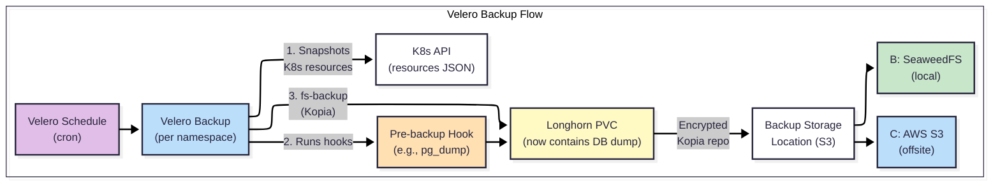

# Backup Architecture

> **Scope:** This document describes the technical architecture of the backup system — how Velero, rclone, and IaC work together to protect each storage tier. For the strategy overview, see [README.md](./README.md). For restore procedures, see [RUNBOOKS.md](./RUNBOOKS.md).

---

## Velero — Tier 2: K8s State & Longhorn PVCs

### How Velero Works in This Stack

Velero is the primary backup tool for Kubernetes-managed data. It backs up both **K8s resource manifests** (Deployments, Secrets, ConfigMaps) and **Longhorn PVC data** (via file-system-level backup using Kopia).



### Global Opt-Out / Per-Schedule Opt-In

Velero is configured with **volume backup disabled globally**. Each schedule explicitly enables it:

```yaml
# Global default (values.yaml)
configuration:
  defaultVolumesToFsBackup: false   # Opt-Out globally

# Per-schedule override (schedule.yaml)
spec:
  template:
    defaultVolumesToFsBackup: true  # Opt-In for this schedule
```

**Why this pattern?** Not all namespaces contain data worth backing up at the PVC level. K8s resources are always captured (from Git/ArgoCD anyway), but PVC data backup is expensive and should only happen for stateful apps that need it.

### Backup Storage Locations (BSL)

| BSL Name | Provider | Destination | Role | Status |
|---|---|---|---|---|
| `default` | SeaweedFS (S3-compatible) | `velero` bucket on `seaweedfs-s3.storage.svc:8333` | **B** — Local fast backup | 🔜 Planned (configured, not targeted by schedules yet) |
| `aws` | AWS S3 | `aritro-homelab-velero-backups` in `ap-south-1` | **C** — Cloud offsite | ✅ Active |

**Current state:** All schedules target `storageLocation: aws` only. The SeaweedFS BSL is configured and ready but not yet used by any schedule.

**Target state:** Schedules will write to **both** BSLs — SeaweedFS for fast local restore, AWS for disaster recovery. The SeaweedFS BSL provides the "B" in ABC.

### S3 Tier Selection (Per-Cluster)

AWS S3 storage tier is chosen **per cluster** based on importance, not as a blanket policy:

| Cluster Importance | S3 Tier | $/GB/month | Restore Latency | Use When |
|---|---|---|---|---|
| Critical | S3 Standard | ~$0.025 | Milliseconds | Cluster hosts irreplaceable data or auth services |
| Important | Glacier Instant Retrieval | ~$0.005 | Milliseconds | Cluster data is important but rarely restored |
| Standard | Glacier Flexible Retrieval | ~$0.004 | 3-5 hours | Lower-priority clusters, cost optimization |
| Archive | Glacier Deep Archive | ~$0.001 | 12 hours | Long-term compliance retention only |

> **⚠️ RTO Impact:** If a cluster uses Glacier Flexible or Deep Archive, the Glacier retrieval time **adds** to the RTO. A 12-hour RTO is not achievable with Glacier Deep Archive unless data is pre-warmed.

### Encryption at Rest

All Velero backup repositories are encrypted using Kopia's built-in encryption. The repository password is stored as a SealedSecret:

```yaml
# Sealed in Git, decrypted at runtime by the SealedSecret controller
apiVersion: bitnami.com/v1alpha1
kind: SealedSecret
metadata:
  name: velero-repo-credentials
  namespace: backup
spec:
  encryptedData:
    repository-password: AgB6tp/...  # Encrypted
```

### Pre-Backup Hook Patterns

Two patterns exist for ensuring database consistency before Velero snapshots a PVC:

#### Pattern 1: Inline Annotation Hook

Velero executes a command inside the app container before snapshotting its PVC. Used when the app container has the necessary tools (e.g., `pg_dump`).

```yaml
# Deployment patch — adds hook annotation
metadata:
  annotations:
    pre.hook.backup.velero.io/container: main
    pre.hook.backup.velero.io/command: >-
      ["/bin/sh", "-c",
       "PGPASSWORD=$DB_PASSWORD pg_dump -h $DB_HOSTNAME
        -U $DB_USERNAME -f /data/backups/<APP>-db.sql
        -c -C -O $DB_DATABASE_NAME"]
```

**When to use:** The app container has the DB client tools. The dump file is written to the same PVC that Velero backs up.

#### Pattern 2: Separate CronJob + PVC

A dedicated CronJob runs the DB dump to a separate PVC. Velero then backs up that PVC. Used when the app container doesn't have the right tools, or when the dump needs to happen in a different namespace.

```yaml
# CronJob — runs BEFORE the Velero schedule
spec:
  schedule: "0 20 * * *"   # 30-60 min before Velero
  jobTemplate:
    spec:
      template:
        spec:
          containers:
            - name: pg-dump
              image: postgres:14-alpine
              command: ["/bin/sh", "-c", "pg_dump ... -f /backup/<APP>-db.sql"]
              volumeMounts:
                - name: backup-volume
                  mountPath: /backup
          volumes:
            - name: backup-volume
              persistentVolumeClaim:
                claimName: <APP>-db-backup   # Dedicated backup PVC
```

**When to use:** The app container lacks DB tools, or the DB is shared (e.g., a centralized PostgreSQL instance serving multiple apps).

### Current Backup Schedules

All schedules use a staggered daily window to avoid I/O contention:

| Schedule Name | Cron (UTC) | IST Equivalent | Namespace | Label Selector | PVC Backup | Retention |
|---|---|---|---|---|---|---|
| `monthly-immich` | `30 20 1 * *` | 02:00 AM (1st) | `personal` | `app.kubernetes.io/instance: immich` | ✅ fs-backup | 30 days |
| `daily-security` | `0 21 * * *` | 02:30 AM | `security` | None (full namespace) | ✅ fs-backup | 30 days |
| `daily-obsidian` | `30 21 * * *` | 03:00 AM | `personal` | `app: obsidian` | ✅ fs-backup | 30 days |
| `daily-ssl-certs` | `30 21 * * *` | 03:00 AM | `networking` | None (full namespace) | ❌ Resources only | 30 days |

> **Adding a new schedule:** Create a new Kustomize component under `velero/components/schedules/<app-name>/` with a `schedule.yaml` and `restore.yaml`. Add the component to the cluster overlay's `kustomization.yaml`.

---

## rclone — Tier 4: NFS User Data

> **Status:** 🟡 Semi-Active (Orchestration & sync are fully active using Longhorn RWX volumes; integration with physical NFS hardware is the final remaining task).

### Why Per-App rclone (Not Whole-NFS)

User data on NFS serves multiple apps with different criticality levels:

| App | NFS Data | Criticality | Backup Need |
|---|---|---|---|
| Photo manager (e.g., Immich) | Photos, videos | 🔴 Critical (irreplaceable) | Monthly, 0 versions |
| Media server (e.g., Jellyfin) | Movies, TV shows | 🟢 Low (re-downloadable) | None or weekly |
| Notes app (e.g., Obsidian) | Markdown vaults | 🟠 High | Daily, many versions |
| Download client | Torrents | 🟢 Low (re-downloadable) | None |

Backing up the *entire* NFS share treats all data equally — wasting cloud storage on re-downloadable movies while under-protecting irreplaceable photos. Per-app rclone solves this.

### Target Architecture

Each app that needs NFS backup runs an **rclone CronJob** in its own namespace:

```
┌─────────────────────────────────────────────────┐
│ App Namespace (e.g., personal)                  │
│                                                 │
│  ┌──────────────┐    ┌──────────────────────┐   │
│  │ App Pod      │    │ rclone CronJob       │   │
│  │ (Immich)     │    │ Schedule: daily      │   │
│  │              │    │ Versions: 7          │   │
│  │ NFS Mount ◄──┼────┤ NFS Mount (same)     │   │
│  │ /data/photos │    │ Cloud: s3:bucket/app │   │
│  └──────────────┘    └──────────────────────┘   │
└─────────────────────────────────────────────────┘
```

**How it works:**

1.  Each app that owns NFS data gets an **rclone Kustomize component** (e.g., `components/rclone-backup/`).
2.  The component contains a CronJob that mounts the **same NFS path** as the app.
3.  rclone syncs the app's NFS subdirectory to a cloud S3 bucket with versioning.
4.  Each app independently defines: schedule, version count, cloud destination, bandwidth limits.
5.  Velero remains responsible for the app's K8s resources and Longhorn PVCs. rclone handles NFS only.

### rclone CronJob Template

```yaml
apiVersion: batch/v1
kind: CronJob
metadata:
  name: <APP>-nfs-backup
spec:
  schedule: "<CRON>"
  jobTemplate:
    spec:
      template:
        spec:
          containers:
            - name: rclone
              image: rclone/rclone:latest
              args:
                - sync
                - /data/<APP>/
                - remote:backup-bucket/<APP>/
                - --transfers=4
                - --checkers=8
                - --bwlimit=10M        # Limit bandwidth during backup
                - --backup-dir=remote:backup-bucket/<APP>-versions/
              volumeMounts:
                - name: nfs-data
                  mountPath: /data/<APP>
                  readOnly: true        # Read-only — backup never modifies source
                - name: rclone-config
                  mountPath: /config/rclone
          volumes:
            - name: nfs-data
              persistentVolumeClaim:
                claimName: <APP>-user-data    # Same PVC the app uses
            - name: rclone-config
              secret:
                secretName: <APP>-rclone-config
          restartPolicy: OnFailure
```

---

## IaC & Observability — Tiers 1 & 3

### Tier 1: Proxmox VMs — IaC Is the Backup

VMs are **never** backed up as disk images. The recovery path is:

```
Git Repository
    └── OpenTofu → Provision VMs on Proxmox
          └── Ansible → Configure OS, install packages, join K8s
                └── kubeadm → Bootstrap Kubernetes cluster
                      └── ArgoCD → Deploy all applications from Git
                            └── Velero → Restore app data from S3
```

**What this means:**
-   The Git repository is the ultimate source of truth.
-   A complete server loss (fire, theft) is recoverable: buy new hardware → run Tofu/Ansible → restore data from AWS S3.
-   VM images are large (10-50GB each) and change frequently. Backing them up would be expensive and redundant given the IaC approach.

### Tier 3: SeaweedFS Observability — Not Backed Up

SeaweedFS stores logs (Loki) and metrics (Mimir). This data is:

-   **Ephemeral** — governed by retention policies (30-365 days depending on tenant).
-   **Replayable** — log collectors (Alloy) re-ingest from application stdout. Metrics are re-scraped by Prometheus.
-   **Non-critical** — losing historical logs/metrics is inconvenient but not catastrophic.

If SeaweedFS data is lost, the observability stack simply starts fresh. Historical data is gone, but current data begins accumulating immediately.

---

## Related Documentation

| Document | Relationship |
|---|---|
| [README.md](./README.md) | Backup overview, ABC strategy, RPO/RTO, coverage matrix |
| [RUNBOOKS.md](./RUNBOOKS.md) | Generic restore procedures for all workload types |
| [MONITORING.md](./MONITORING.md) | Backup verification, alerting, dashboards |
| [CAPACITY_PLANNING.md](./CAPACITY_PLANNING.md) | Backup size estimation, AWS S3 cost model |
