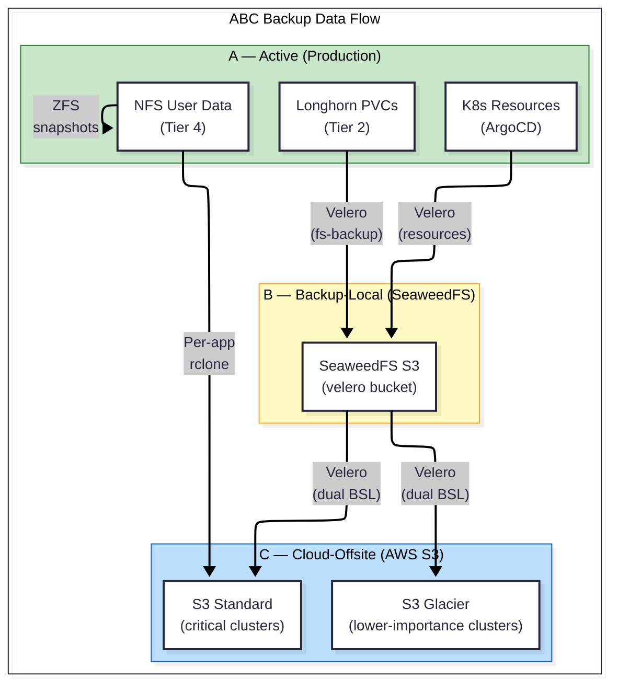

# Backup & Disaster Recovery — Overview

> **Start here.** This document provides an overview of the platform's backup strategy and links to detailed guides for each component.

---

## Design Philosophy

The backup architecture is built on five principles:

1.  **ABC Strategy.** Every piece of critical data exists in three locations: **A**ctive (production), **B**ackup-Local (on-site fast recovery), and **C**loud-Offsite (disaster recovery). No single failure — disk, node, site — results in data loss.
2.  **Per-App Backup Scope.** The unit of backup is the *application*, not the infrastructure. Each app defines what data it owns, how often it's backed up, and how many versions to retain. This allows different apps to have different criticality levels without over-backing-up low-value data.
3.  **IaC Is the VM Backup.** Proxmox VMs are never backed up as disk images. OpenTofu provisions VMs, Ansible configures them, Kubernetes bootstraps the cluster, and ArgoCD deploys workloads. A full rebuild from Git is the recovery path. The Git repository *is* the backup.
4.  **Separation of Backup Planes.** Kubernetes state (resources, PVCs) is backed up by Velero. User data on NFS is backed up by rclone. These are independent backup paths with independent schedules. If Velero fails, NFS backups continue, and vice versa.
5.  **Encryption at Rest.** All backup data — whether on local S3 or cloud — is encrypted. Backup repositories use Kopia encryption. Cloud storage uses server-side encryption. Credentials are managed via SealedSecrets.

---

## The ABC Model

The ABC model maps each storage tier to three protection layers:

```
┌───────────────────────────────────────────────────────────────────────┐
│                        ABC Backup Strategy                            │
│                                                                       │
│  A = Active         Data in production, serving live traffic          │
│  B = Backup-Local   Fast restore from on-site storage (SeaweedFS S3)  │
│  C = Cloud-Offsite  Disaster recovery from cloud (AWS S3)             │
└───────────────────────────────────────────────────────────────────────┘
```

### ABC Coverage by Tier

| Tier | A (Active) | B (Backup-Local) | C (Cloud-Offsite) |
|---|---|---|---|
| **Tier 1** — Proxmox VMs | Running VMs on SSD | ❌ Not applicable | ❌ Not applicable — IaC is the recovery path (Git) |
| **Tier 2** — Longhorn PVCs | Live PVCs on K8s nodes | Velero → SeaweedFS S3 (local) | Velero → AWS S3 |
| **Tier 3** — SeaweedFS | Observability blobs (logs, metrics) | ❌ Not backed up | ❌ Not backed up — ephemeral, replayable from agents |
| **Tier 4** — NFS User Data | ZFS pool on HDD | ZFS snapshots (local) | Per-app rclone → Cloud S3 |
| **K8s Resources** | ArgoCD GitOps (live state) | Velero metadata → SeaweedFS | Velero metadata → AWS S3 |
| **Secrets/Config** | SealedSecrets in Git | Velero captures decoded Secrets | Velero → AWS S3 |
| **Git Repository** | GitHub (remote) | Local clone on dev machine | GitHub (inherently offsite) |

### ABC Data Flow



---

## Recovery Objectives

### Data Classification

| Classification | Meaning | Examples |
|---|---|---|
| 🔴 **Critical** | Irreplaceable data, or service that blocks all other services | User photos/videos, authentication provider |
| 🟠 **High** | Important data that would be painful but not catastrophic to lose | Application databases, user documents |
| 🟡 **Medium** | Data that can be regenerated or re-obtained with moderate effort | SSL certificates (re-issuable), app configs (in Git) |
| 🟢 **Low** | Ephemeral or fully replayable data | Logs, metrics, build caches |

### RPO / RTO Matrix

| Data | Classification | RPO | RTO | Recovery Method |
|---|---|---|---|---|
| Authentication DB (e.g., Authentik) | 🔴 Critical | 24h | 1h | Velero restore (DB dump from PVC) |
| Photo/Video DB metadata (e.g., Immich) | 🟠 High | 24h | 4h | Velero restore (pg_dump hook) |
| Photo/Video files on NFS (e.g., Immich) | 🔴 Critical | 24h | 8h | rclone restore from cloud |
| User document vaults (e.g., Obsidian) | 🟠 High | 24h | 1h | Velero restore (PVC) |
| SSL/TLS Certificates | 🟡 Medium | 24h | 30min | cert-manager re-issues, or Velero restore |
| Observability data (logs, metrics) | 🟢 Low | N/A | N/A | Re-ingested from agents on rebuild |
| K8s manifests & configs | 🟢 Low | N/A | 0 | `git clone` — Git is the source of truth |
| Full cluster rebuild | — | 24h | **12h** | Tofu → Ansible → K8s → ArgoCD → Velero |

> **RPO = 24 hours** for all workloads. All scheduled backups run daily. If the system fails at 01:59 AM and the last backup ran at 02:00 AM the previous day, the maximum data loss is ~24 hours.
>
> **RTO = 12 hours** for a full disaster recovery scenario (complete cluster rebuild from scratch). Individual app restores are significantly faster.

---

## What Gets Backed Up (and What Doesn't)

### Per-App Backup Model

The backup unit is the **application**, not the infrastructure. Each app's backup is composed of two independent planes:

```
┌──────────────────────────────────────────────────────────┐
│ App Backup = Velero (K8s state) + rclone (user data)     │
│                                                          │
│  Velero captures:                                        │
│    • K8s resources (Deployment, Service, Secret, etc.)   │
│    • Longhorn PVCs (databases, configs)                  │
│    • Pre-backup hooks (pg_dump, etc.)                    │
│                                                          │
│  rclone captures (per-app, independent):                 │
│    • NFS user data belonging to THAT app only            │
│    • Independent schedule & version count                │
│    • Independent cloud destination                       │
│                                                          │
│  NOT backed up:                                          │
│    • The entire NFS share (too broad, no granularity)    │
│    • SeaweedFS blobs (ephemeral, replayable)             │
│    • VM disk images (IaC recreates them)                 │
└──────────────────────────────────────────────────────────┘
```

### Backup Coverage Matrix

| Component | Backed Up? | Tool | Destination | Schedule | Retention |
|---|---|---|---|---|---|
| K8s resources (per namespace) | ✅ | Velero | AWS S3 | Daily | 30 days (TTL) |
| Longhorn PVCs (app data) | ✅ Per-schedule opt-in | Velero (fs-backup) | AWS S3 | Daily | 30 days (TTL) |
| Database dumps | ✅ Pre-backup hooks | Velero | AWS S3 | Daily (triggered before Velero) | 30 days |
| NFS user data (per-app) | 🟡 Semi-Active | rclone (CronJob) | Cloud S3 | Per-app policy | Per-app versions (NFS hardware integration pending) |
| ZFS snapshots | ✅ Local | ZFS (automated) | Local HDD pool | Daily | Per retention policy |
| Proxmox VMs | ❌ Intentional | N/A | N/A | N/A | IaC rebuilds |
| SeaweedFS data | ❌ Intentional | N/A | N/A | N/A | Replayable |
| Git repo | ✅ Inherent | Git | GitHub | Every push | Full history |

### Explicit Exclusions

| Exclusion | Rationale |
|---|---|
| VM disk images | OpenTofu + Ansible recreate any VM in minutes. Backing up multi-GB VM images would be wasteful. |
| Observability data (Loki logs, Mimir metrics) | Ephemeral by design. Retention policies auto-expire old data. If lost, agents re-ingest on rebuild. |
| Build caches, `emptyDir` volumes | Ephemeral — explicitly designed to not survive pod restarts. |
| Whole NFS share backup | Too coarse. Per-app rclone allows different criticality, schedule, and version count per application. |

---

## Future Roadmap

| Priority | Item | Status | Depends On |
|---|---|---|---|
| 🔴 P0 | Deploy PrometheusRules for Velero alerting | Not started | Prometheus Operator deployed |
| 🔴 P0 | Define and run first restore drill | Not started | This document (procedure) |
| 🟠 P1 | Implement per-app rclone CronJobs for NFS data | Not started | Cloud S3 bucket + rclone config |
| 🟠 P1 | Activate SeaweedFS BSL (dual-write schedules) | Not started | SSD capacity verification |
| 🟡 P2 | Configure S3 Lifecycle policies (Standard → Glacier) | Not started | Cost analysis approval |
| 🟡 P2 | Build automated restore drill CronJob | Not started | Manual drill validated first |
| 🟢 P3 | Multi-tenant: per-cluster Velero via base+overlay template | Not started | Second cluster provisioned |

---

## Documentation Map

| Document | What It Covers |
|---|---|
| 📐 [ARCHITECTURE.md](./ARCHITECTURE.md) | Velero design, rclone design, BSL config, hook patterns, IaC recovery path |
| 📋 [RUNBOOKS.md](./RUNBOOKS.md) | Generic restore templates (A-E), decision tree, step-by-step procedures |
| 📊 [MONITORING.md](./MONITORING.md) | Periodic restore drills, PrometheusRules, Grafana dashboards |
| 💰 [CAPACITY_PLANNING.md](./CAPACITY_PLANNING.md) | Backup size estimation, AWS S3 cost model, S3 lifecycle policies |

### Related Documentation (Outside This Directory)

| Document | Relationship |
|---|---|
| [`docs/storage/ARCHITECTURE.md`](../storage/ARCHITECTURE.md) | Storage tier model — this backup doc protects those tiers |
| [`docs/storage/LONGHORN.md`](../storage/LONGHORN.md) | Longhorn PVC details — Velero backs these up |
| [`docs/storage/NFS.md`](../storage/NFS.md) | NFS user data — rclone backs this up |
| [`docs/storage/CAPACITY_PLANNING.md`](../storage/CAPACITY_PLANNING.md) | Storage budget — backup adds to the SSD-tier budget |
| [`docs/storage/SEAWEEDFS.md`](../storage/SEAWEEDFS.md) | SeaweedFS — hosts the local BSL for Velero |
| [`docs/secrets/`](../secrets/) | SealedSecrets — Velero repo password, rclone credentials |
| [`docs/ARCHITECTURE.md`](../ARCHITECTURE.md) | Platform architecture — backup is a cross-cutting concern |
