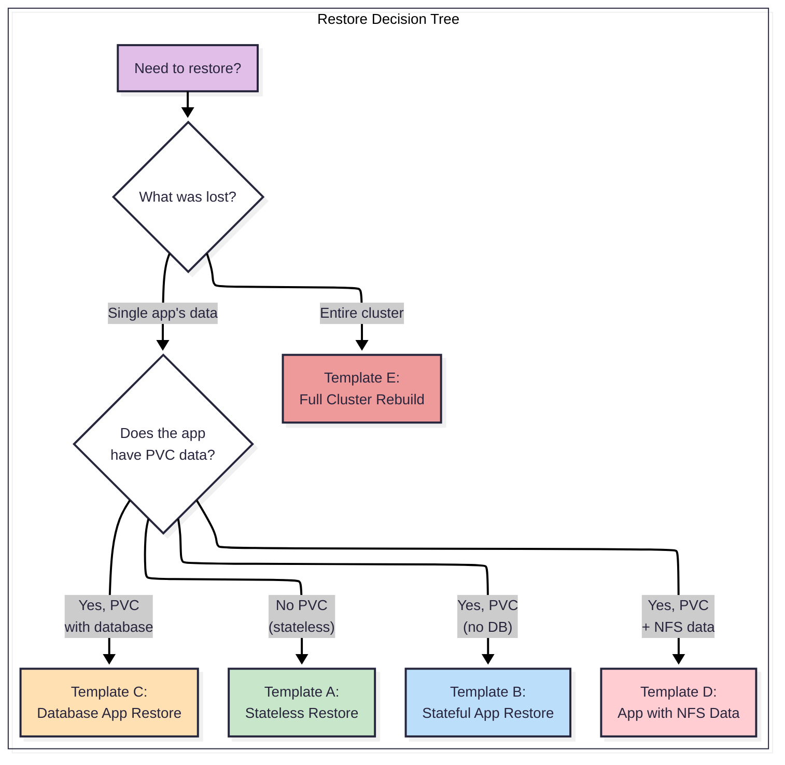

# Restore Runbook Templates

> **Scope:** Generic restore procedures organized by workload type. Any application — current or future — slots into the appropriate template. For backup architecture details, see [ARCHITECTURE.md](./ARCHITECTURE.md).

---

## Restore Strategy

All restores follow a **namespace-mapped** pattern: data is restored into a shared `restore` namespace (which ArgoCD does NOT manage), verified, then migrated to the live namespace. This avoids ArgoCD race conditions and allows safe verification before going live.

### Restore Decision Tree



---

## Common Variables

All templates use these variables. Replace them before executing:

| Variable | Description | How to Find |
|---|---|---|
| `<APP>` | Application name | e.g., `obsidian`, `immich` |
| `<NAMESPACE>` | Source namespace | e.g., `personal`, `security` |
| `<SCHEDULE_NAME>` | Velero schedule name | `kubectl get schedules -n backup` |
| `<BACKUP_NAME>` | Specific backup to restore from | `kubectl get backups -n backup -l velero.io/schedule-name=<SCHEDULE_NAME>` |
| `<PVC_NAME>` | PVC to restore | `kubectl get pvc -n <NAMESPACE> -l app=<APP>` |
| `<BACKUP_PVC_NAME>` | Dedicated backup PVC (Template C) | e.g., `<APP>-db-backup` |
| `<DB_HOSTNAME>` | Database host | Check app's env vars or Secret |
| `<DB_USERNAME>` | Database user | Check app's Secret |
| `<DB_PASSWORD>` | Database password | Check app's Secret |
| `<DB_DATABASE_NAME>` | Database name | Check app's env vars or Secret |

## Common Prerequisites

Before any restore:

1.  Velero is healthy: `kubectl get deployment velero -n backup`
2.  BSL is available: `kubectl get bsl -n backup`
3.  The backup exists and is completed: `kubectl get backup <BACKUP_NAME> -n backup -o jsonpath='{.status.phase}'`
4.  The `restore` namespace does not exist or is empty: `kubectl get ns restore`

---

## Template A: Stateless App Restore

**When to use:** K8s resources only (Deployments, Services, Secrets). No PVC data to restore. The app is fully defined by its manifests.

**Examples:** SSL certificates (cert-manager re-issues), stateless API gateways, CronJobs.

**Estimated time:** 5-10 minutes.

```bash
# 1. Find the backup
kubectl get backups.velero.io -n backup \
  -l velero.io/schedule-name=<SCHEDULE_NAME> \
  --sort-by=.metadata.creationTimestamp

# 2. Create the restore (namespace-mapped)
cat <<EOF | kubectl apply -f -
apiVersion: velero.io/v1
kind: Restore
metadata:
  name: <APP>-restore
  namespace: backup
spec:
  backupName: <BACKUP_NAME>
  includedNamespaces:
    - <NAMESPACE>
  namespaceMapping:
    <NAMESPACE>: restore
  existingResourcePolicy: none
  restorePVs: false
EOF

# 3. Wait for completion
kubectl get restore <APP>-restore -n backup -w

# 4. Verify restored resources
kubectl get all -n restore

# 5. If satisfied, apply to live namespace via ArgoCD sync
#    (ArgoCD manages the live namespace — restoring directly would conflict)

# 6. Cleanup
kubectl delete ns restore
kubectl delete restore <APP>-restore -n backup
```

---

## Template B: Stateful App Restore (Longhorn PVC)

**When to use:** App has a Longhorn PVC with config or data that is NOT a database (no consistency hook needed). Velero backed up the PVC via `defaultVolumesToFsBackup: true`.

**Examples:** Obsidian (config PVC), any app with a `/config` directory on Longhorn.

**Estimated time:** 15-30 minutes.

```bash
# 1. Find the backup
kubectl get backups.velero.io -n backup \
  -l velero.io/schedule-name=<SCHEDULE_NAME> \
  --sort-by=.metadata.creationTimestamp

# 2. Enable maintenance mode (scale app to 0)
#    Option A: Via Git (recommended — ArgoCD-safe)
#      Add/uncomment the maintenance component in the cluster overlay kustomization.yaml:
#        - ../../../apps/services/<APP>/components/maintenance
#      Commit and push. Wait for ArgoCD sync.
#    Option B: Direct (temporary — ArgoCD will revert)
kubectl scale deploy <APP> -n <NAMESPACE> --replicas=0

# 3. Verify app is scaled down
kubectl get deploy <APP> -n <NAMESPACE>
# READY should show 0/0

# 4. Create the restore (namespace-mapped)
cat <<EOF | kubectl apply -f -
apiVersion: velero.io/v1
kind: Restore
metadata:
  name: <APP>-restore
  namespace: backup
spec:
  backupName: <BACKUP_NAME>
  includedNamespaces:
    - <NAMESPACE>
  namespaceMapping:
    <NAMESPACE>: restore
  labelSelector:
    matchLabels:
      app: <APP>
  existingResourcePolicy: none
  restorePVs: true
EOF

# 5. Wait for completion
kubectl get restore <APP>-restore -n backup -w

# 6. Copy data from restored PVC to live PVC
#    a) Mount the live PVC
cat <<'EOF' | kubectl apply -f -
apiVersion: v1
kind: Pod
metadata:
  name: pvc-mount-live
  namespace: <NAMESPACE>
spec:
  containers:
  - name: mount
    image: alpine
    command: ["sleep", "3600"]
    volumeMounts:
    - name: data
      mountPath: /data
  volumes:
  - name: data
    persistentVolumeClaim:
      claimName: <PVC_NAME>
  restartPolicy: Never
EOF

#    b) Mount the restored PVC
cat <<'EOF' | kubectl apply -f -
apiVersion: v1
kind: Pod
metadata:
  name: pvc-mount-restored
  namespace: restore
spec:
  containers:
  - name: mount
    image: alpine
    command: ["sleep", "3600"]
    volumeMounts:
    - name: data
      mountPath: /data
  volumes:
  - name: data
    persistentVolumeClaim:
      claimName: <PVC_NAME>
  restartPolicy: Never
EOF

#    c) Wait for pods
kubectl wait pod/pvc-mount-live -n <NAMESPACE> --for=condition=Ready --timeout=60s
kubectl wait pod/pvc-mount-restored -n restore --for=condition=Ready --timeout=60s

#    d) Copy: restored → local → live
kubectl cp restore/pvc-mount-restored:/data ./restore-data-tmp
kubectl cp ./restore-data-tmp <NAMESPACE>/pvc-mount-live:/data

#    e) Cleanup temp pods
kubectl delete pod pvc-mount-live -n <NAMESPACE>
kubectl delete pod pvc-mount-restored -n restore
rm -rf ./restore-data-tmp

# 7. Disable maintenance mode
#    Revert the Git change (re-comment the maintenance component).
#    Commit and push. ArgoCD scales the app back.

# 8. Verify app is healthy
kubectl get deploy <APP> -n <NAMESPACE>
kubectl get pods -n <NAMESPACE> -l app=<APP>

# 9. Cleanup
kubectl delete ns restore
kubectl delete restore <APP>-restore -n backup
```

---

## Template C: Database App Restore

**When to use:** App has a database that was dumped via a pre-backup hook (inline annotation) or a separate CronJob before Velero ran. The dump file lives on a Longhorn PVC.

**Examples:** Immich (pg_dump inline hook → dump in PVC), Authentik (CronJob → dedicated backup PVC).

**Estimated time:** 30-60 minutes.

```bash
# 1. Find the backup
kubectl get backups.velero.io -n backup \
  -l velero.io/schedule-name=<SCHEDULE_NAME> \
  --sort-by=.metadata.creationTimestamp

# 2. Create the restore (namespace-mapped)
cat <<EOF | kubectl apply -f -
apiVersion: velero.io/v1
kind: Restore
metadata:
  name: <APP>-restore
  namespace: backup
spec:
  backupName: <BACKUP_NAME>
  includedNamespaces:
    - <NAMESPACE>
  namespaceMapping:
    <NAMESPACE>: restore
  existingResourcePolicy: none
  restorePVs: true
EOF

# 3. Wait for completion
kubectl get restore <APP>-restore -n backup -w

# 4. Mount the restored PVC to access the DB dump
cat <<'EOF' | kubectl apply -f -
apiVersion: v1
kind: Pod
metadata:
  name: db-restore
  namespace: restore
spec:
  containers:
  - name: psql
    image: postgres:14-alpine
    command: ["sleep", "3600"]
    volumeMounts:
    - name: backup
      mountPath: /backup
  volumes:
  - name: backup
    persistentVolumeClaim:
      claimName: <BACKUP_PVC_NAME>
  restartPolicy: Never
EOF

kubectl wait pod/db-restore -n restore --for=condition=Ready --timeout=60s

# 5. Restore the database
#    Adjust the connection string to point to the LIVE database host.
kubectl exec -n restore db-restore -- /bin/sh -c \
  "PGPASSWORD=<DB_PASSWORD> psql \
   -h <DB_HOSTNAME> \
   -U <DB_USERNAME> \
   -d <DB_DATABASE_NAME> \
   -f /backup/<APP>-db.sql"

# 6. Verify database integrity
kubectl exec -n restore db-restore -- /bin/sh -c \
  "PGPASSWORD=<DB_PASSWORD> psql \
   -h <DB_HOSTNAME> \
   -U <DB_USERNAME> \
   -d <DB_DATABASE_NAME> \
   -c '\dt'"

# 7. Cleanup
kubectl delete pod db-restore -n restore
kubectl delete ns restore
kubectl delete restore <APP>-restore -n backup
```

---

## Template D: App with NFS User Data

**When to use:** App has both K8s state (Velero) AND user data on NFS (rclone). The restore requires both planes.

**Examples:** Immich (DB on Longhorn + photos on NFS), any app with uploaded user files.

**Estimated time:** 1-8 hours (depends on NFS data volume).

```bash
# Phase 1: Restore K8s state via Velero (same as Template C)
# Follow Template C steps 1-6 to restore the database.

# Phase 2: Restore NFS data via rclone
# Run rclone to pull the app's data from cloud back to NFS.

# 1. Deploy a temporary rclone pod with NFS mount
cat <<'EOF' | kubectl apply -f -
apiVersion: v1
kind: Pod
metadata:
  name: rclone-restore
  namespace: <NAMESPACE>
spec:
  containers:
  - name: rclone
    image: rclone/rclone:latest
    command: ["sleep", "3600"]
    volumeMounts:
    - name: nfs-data
      mountPath: /data/<APP>
    - name: rclone-config
      mountPath: /config/rclone
  volumes:
  - name: nfs-data
    persistentVolumeClaim:
      claimName: <APP>-user-data
  - name: rclone-config
    secret:
      secretName: <APP>-rclone-config
  restartPolicy: Never
EOF

kubectl wait pod/rclone-restore -n <NAMESPACE> --for=condition=Ready --timeout=60s

# 2. Run rclone sync from cloud to NFS
kubectl exec -n <NAMESPACE> rclone-restore -- rclone sync \
  remote:backup-bucket/<APP>/ /data/<APP>/ \
  --transfers=8 \
  --progress

# 3. Verify data
kubectl exec -n <NAMESPACE> rclone-restore -- ls -la /data/<APP>/

# 4. Cleanup
kubectl delete pod rclone-restore -n <NAMESPACE>
```

---

## Template E: Full Cluster Rebuild (Disaster Recovery)

**When to use:** Complete infrastructure loss. Starting from bare metal or a fresh Proxmox install.

**Estimated time:** 8-12 hours (within RTO target).

**Prerequisites:**
-   Access to the Git repository (GitHub)
-   AWS credentials for S3 backup access
-   Proxmox host is operational (fresh install is fine)
-   Network connectivity to AWS S3

```bash
# Phase 1: Provision Infrastructure (2-3 hours)

# 1. Clone the repository
git clone <REPO_URL> platform-stack && cd platform-stack

# 2. Provision VMs with OpenTofu
cd tofu/
tofu init && tofu apply

# 3. Configure VMs with Ansible
cd ../ansible/
ansible-playbook -i inventory site.yml

# 4. Bootstrap Kubernetes
#    (Handled by Ansible roles — kubeadm init + join)

# Phase 2: Deploy Platform (1-2 hours)

# 5. Install ArgoCD
kubectl apply -k kubernetes/bootstrap/<CLUSTER>/

# 6. Wait for ArgoCD to sync all applications
#    ArgoCD will deploy everything from Git.
#    Watch: kubectl get applications -n argocd

# 7. Wait for core infrastructure
#    Longhorn, SeaweedFS, cert-manager, Cloudflare Tunnel
kubectl get pods -A -w

# Phase 3: Restore Data (2-8 hours)

# 8. Install Velero (deployed by ArgoCD, but verify)
kubectl get deploy velero -n backup

# 9. Verify BSL is available
kubectl get bsl -n backup

# 10. Restore critical apps first (priority order)
#     a) Authentication — Template C
#     b) Photo library DB — Template C
#     c) Document vaults — Template B
#     d) SSL certificates — Template A (or wait for cert-manager)

# 11. Restore NFS data via rclone — Template D
#     For each app with NFS data, run the rclone restore.

# Phase 4: Verify (30 minutes)

# 12. Verify all apps are healthy
kubectl get pods -A | grep -v Running | grep -v Completed

# 13. Verify data integrity for critical apps
#     - Log into auth provider, verify SSO
#     - Open photo manager, verify images load
#     - Open notes app, verify vaults sync

# 14. Verify monitoring is collecting data
#     - Check Grafana dashboards
#     - Verify Velero schedules are active
```

---

## Related Documentation

| Document | Relationship |
|---|---|
| [README.md](./README.md) | Backup overview, ABC strategy, RPO/RTO |
| [ARCHITECTURE.md](./ARCHITECTURE.md) | Velero/rclone technical architecture |
| [MONITORING.md](./MONITORING.md) | Periodic restore drills, alerting |
| [CAPACITY_PLANNING.md](./CAPACITY_PLANNING.md) | Backup size estimation, cost model |
