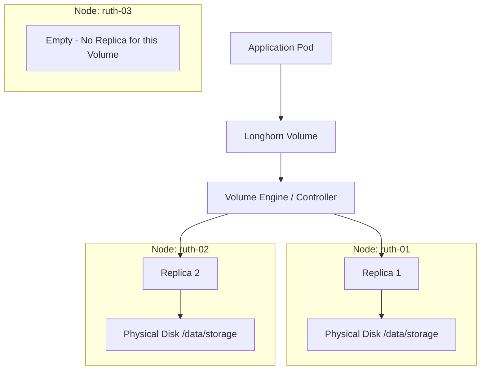

# Longhorn Storage Guide: Distributed Block Storage for Kubernetes

This guide explains how Longhorn works, how it manages your data, and why you see specific numbers in your dashboard. It is designed for the `platform-stack` ecosystem.

---

## 1. What is Longhorn?
Longhorn is **Distributed Block Storage**. 

Normally, a disk (like an SSD) is physically attached to one computer. If that computer dies, the data on that disk is inaccessible. Longhorn takes disks from **all your nodes** (ruth-01, 02, 03) and pools them together into one giant virtual storage system.

---

## 2. Deep Dive: Volumes, Replicas, and Nodes
To understand why your dashboard shows specific replica counts, you need to understand the **Hierarchy**.

### The Relationship Map
A **Volume** is what your application sees (like `/dev/sdb`). However, that volume isn't a single file; it's a distributed object.



### Breakdown:
1.  **Volume**: The high-level object. It has a size (e.g., 10Gi) and a name.
2.  **Engine**: For every volume, Longhorn starts a small "Engine" pod. Its only job is to coordinate writes. When the app writes data, the Engine sends it to **all active Replicas** simultaneously.
3.  **Replica**: A physical folder on a node's disk (located at `/data/storage/longhorn-volumes/` in your case). This folder contains the actual blocks of data.
4.  **Node**: The physical or virtual machine. Longhorn's scheduler ensures that **no two replicas of the same volume live on the same node**. This is why if one node fails, you don't lose all copies of your data.

---

## 3. Where is the Configuration Written?
In your `platform-stack`, configuration exists in three layers:

### Layer A: Global Defaults (GitOps)
**File**: `kubernetes/apps/infrastructure/longhorn/base/values.yaml`
This is your **Source of Truth**. It defines the rules for *all* new volumes.
*   `defaultClassReplicaCount: 2`: Tells Longhorn "By default, every volume created should have 2 replicas."
*   `defaultDataPath: /data/storage`: Tells Longhorn where to physically store the replica files on the nodes.

### Layer B: The StorageClass (Kubernetes)
When you install Longhorn, it creates a `StorageClass` named `longhorn`. This acts as a "menu" for applications.
*   If you look at the `StorageClass` (via `kubectl get sc longhorn -o yaml`), you will see the parameters passed from your `values.yaml`.

### Layer C: Dynamic State (Longhorn CRDs)
When an app actually requests a volume (via a PVC), Longhorn creates several **Custom Resources (CRDs)**:
*   `volumes.longhorn.io`: Holds the status of the volume (Healthy, Degraded, etc.).
*   `replicas.longhorn.io`: Tracks exactly which node each replica is on.
*   **Persistent Storage**: These CRDs are stored in the Kubernetes ETCD database. **You don't edit these manually**; Longhorn manages them based on your `values.yaml`.

> [!TIP]
> **Can I change a volume's config after creation?**
> Yes! In the Longhorn UI, you can click on a Volume and "Update Replica Count" (e.g., change from 2 to 3). Longhorn will immediately start building the 3rd replica on the available node. However, to make this permanent for *new* volumes, you must update the `values.yaml` in your Git repo.

---


## 4. Understanding Your Storage Numbers
In your dashboard, you noticed:
*   **Total Storage (65.8 Gi)**: This is the sum of the physical space allocated to Longhorn across all your nodes.
*   **Reserved (11.7 Gi)**: This is the "Safety Margin". Longhorn reserves a percentage (currently 15% in your `values.yaml`) to ensure the host OS doesn't run out of space for its own operations. It prevents Longhorn from filling the disk to 100%.
*   **Used (586 Mi)**: This is the actual amount of data your applications have written to the volumes so far.

---

## 5. The "Replica Mystery": Why 2 Replicas on 3 Nodes?
You observed that only 2 out of 3 nodes have replicas.

### The Explanation:
In your configuration (`kubernetes/apps/infrastructure/longhorn/base/values.yaml`), the setting `defaultClassReplicaCount` is set to **2**.

**Let's do the Math:**
*   You have **5 Volumes**.
*   Each volume is configured to have **2 Replicas** (copies).
*   Total Replicas in the cluster = **10**.
*   Longhorn distributes these 10 replicas across your nodes.

**Why you see "5 Replicas" on only 2 nodes:**
Longhorn often fills up one node before moving to the next for efficiency, or it might have found that two nodes had more available space. 
*   **Node 1**: 5 Replicas
*   **Node 2**: 5 Replicas
*   **Node 3**: 0 Replicas
*   **Total**: 10 (Matches your 5 volumes x 2 replicas!)

If you increase the count to **3**, you would see **5 Replicas** on **all 3 nodes** (Total 15).


### Do you need Replication?
**Yes.** Replication is what makes your storage "High Availability" (HA). 
*   If **Node 1** dies, the application can restart on **Node 2** and find its data because a replica exists there.
*   If you had **0 replicas** (count of 1), and that single node died, your app would be stuck until the node came back online.

### Why not 3 Replicas?
You can set it to 3, but:
*   It consumes **3x** the space (1GB of data uses 3GB of disk).
*   It adds a small performance hit (data must be written to 3 places before the "write" is confirmed).
*   **2 Replicas** is usually the "Sweet Spot" for home/small labs as it allows 1 node to fail without data loss.

---

## 6. How Logs and Data are Stored
Your cluster uses a layered approach to storage:

### Log Storage (Loki)
1.  **Loki** generates logs.
2.  Instead of writing directly to a local disk, Loki sends them to **SeaweedFS** (Object Storage).
3.  **SeaweedFS** is configured to use **Longhorn** as its backend "Hard Drive".
4.  **Result**: Your logs are distributed across your nodes via Longhorn replicas.

### Data Storage (Images/Videos)
1.  Apps like `arr` stack or `Nextcloud` save images/videos.
2.  They write to a **PVC** (Persistent Volume Claim).
3.  Longhorn creates a volume for that PVC.
4.  The data is broken into blocks and mirrored across your nodes (ruth-01, ruth-02, etc.).

---

## 7. How to Use Longhorn
As a developer, you don't talk to Longhorn directly. You use Kubernetes objects.


### Step 1: Request Storage (The PVC)
You tell Kubernetes: "I need 10GB of space."
```yaml
apiVersion: v1
kind: PersistentVolumeClaim
metadata:
  name: my-data-pvc
spec:
  accessModes:
    - ReadWriteOnce
  resources:
    requests:
      storage: 10Gi
  storageClassName: longhorn # This tells it to use Longhorn
```

### Step 2: Use it in a Pod
You mount that "request" into your container.
```yaml
spec:
  containers:
  - name: my-app
    image: nginx
    volumeMounts:
    - name: data-storage
      mountPath: /data
  volumes:
  - name: data-storage
    persistentVolumeClaim:
      claimName: my-data-pvc
```

### What happens behind the scenes?
1.  **ArgoCD** deploys the YAML.
2.  **Longhorn** sees the PVC and automatically creates a Volume and its Replicas.
3.  Your app starts, and the disk is "virtually" attached to your container.

---

## 6. Summary Checklist
*   **5 Volumes?** These are likely your system apps (Loki, SeaweedFS, ArgoCD etc.) already using storage.
*   **3 Nodes?** All are part of the cluster, but each volume only "lives" on 2 of them by default.
*   **Replication?** Highly recommended. Keep it at 2 for now to save space while staying safe.
