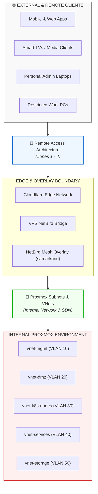

# Homelab Networking Documentation

Welcome to the **Networking Architecture** documentation directory. This directory serves as the central specification hub for both external remote access (CGNAT bypass, overlay VPNs) and internal hypervisor network virtualization (Proxmox SDN, Linux Bridges, VLAN segmentation, and IPAM).

---

## 🗺️ High-Level Network Topology

---

## 📚 Core Specifications

| Document | Primary Scope | Key Concepts Covered |
| :--- | :--- | :--- |
| 🔗 [remote-access-architecture.md](./remote-access-architecture.md) | **External Access & CGNAT Bypass** | Cloudflare Tunnels (Zone 1), VPS NetBird Bridge (Zone 2), NetBird Mesh VPN (Zone 3), NetBird WASM browser sessions (Zone 4), decision matrix. |
| 🔗 [proxmox-subnets-vnet.md](./proxmox-subnets-vnet.md) | **Internal Proxmox VE Networking** | Linux Bridges (`vmbr0`, `vmbr1`), Proxmox SDN Zones, VLAN segmentation, Subnet IPAM, inter-VNet firewall rules, NetBird Subnet Routers. |

---

## 📋 Subnet Summary (IPAM Quick Reference)

| Subnet CIDR | VNet / Network Name | Purpose / Allocated Workloads |
| :--- | :--- | :--- |
| `192.168.10.0/24` | `vnet-mgmt` (VLAN 10) | Proxmox hosts (`atlas`, `prometheus`, `godzilla`), IPMI, core switch |
| `192.168.20.0/24` | `vnet-dmz` (VLAN 20) | `cloudflared` tunnel LXC, VPS NetBird bridge target |
| `192.168.30.0/24` | `vnet-k8s-nodes` (VLAN 30) | Kubernetes Control Plane & Worker VMs (`orion` cluster) |
| `192.168.40.0/24` | `vnet-services` (VLAN 40) | Authentik, Immich, Nextcloud, AdGuard, Arr-stack |
| `192.168.50.0/24` | `vnet-storage` (VLAN 50) | TrueNAS NFS exports, Longhorn volume replication |
| `10.60.0.0/24` | `vnet-isolated` (VLAN 60) | Untrusted IoT, Sandbox VMs |
| `10.244.0.0/16` | Container Overlay | Kubernetes Pod-to-Pod CNI network (Cilium / Flannel) |
| `100.64.0.0/16` | `samarkand` (Overlay) | NetBird Mesh VPN peer network |

---

## 🔗 Related Project Documents

- 📄 [NAMING_CONVENTION.md](../NAMING_CONVENTION.md#6-networking--connectivity) - Naming standards for VLANs, switches, hostnames, and NetBird overlay networks.
- 📄 [ARCHITECTURE.md](../ARCHITECTURE.md) - High-level system architecture and global location topologies (`asgard`, `wano`, `babylon`, `coruscant`).
