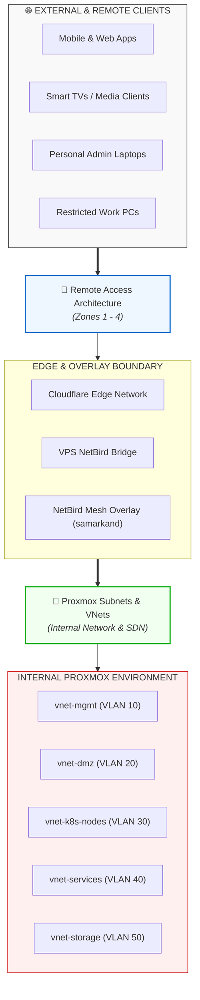

# Homelab Networking Documentation

Welcome to the **Networking Architecture** documentation directory. This directory serves as the central specification hub for both external remote access (CGNAT bypass, overlay VPNs) and internal hypervisor network virtualization (Proxmox SDN, Linux Bridges, VLAN segmentation, and IPAM).

---

## 🗺️ High-Level Network Topology



---

## 📚 Core Specifications

| Document | Primary Scope | Key Concepts Covered |
| :--- | :--- | :--- |
| 🔗 [remote-access-architecture.md](./remote-access-architecture.md) | **External Access & CGNAT Bypass** | Cloudflare Tunnels (Zone 1), VPS NetBird Bridge (Zone 2), NetBird Mesh VPN (Zone 3), NetBird WASM browser sessions (Zone 4), decision matrix. |
| 🔗 [proxmox-subnets-vnet.md](./proxmox-subnets-vnet.md) | **Internal Proxmox VE Networking** | Linux Bridges (`vmbr0`, `vmbr1`), Proxmox SDN Zones, VLAN segmentation, Subnet IPAM, inter-VNet firewall rules, NetBird Subnet Routers. |

---

## 📋 Subnet Summary (IPAM Quick Reference)

| Subnet CIDR | VNet / Network Name | Purpose / Allocated Workloads |
| :--- | :--- | :--- |
| `192.168.10.0/24` | `vnet-mgmt` (VLAN 10) | Proxmox hosts (`atlas`, `prometheus`, `godzilla`), IPMI, core switch |
| `192.168.20.0/24` | `vnet-dmz` (VLAN 20) | `cloudflared` tunnel LXC, VPS NetBird bridge target |
| `192.168.30.0/24` | `vnet-k8s-nodes` (VLAN 30) | Kubernetes Control Plane & Worker VMs (`orion` cluster) |
| `192.168.40.0/24` | `vnet-services` (VLAN 40) | Authentik, Immich, Nextcloud, AdGuard, Arr-stack |
| `192.168.50.0/24` | `vnet-storage` (VLAN 50) | TrueNAS NFS exports, Longhorn volume replication |
| `10.60.0.0/24` | `vnet-isolated` (VLAN 60) | Untrusted IoT, Sandbox VMs |
| `10.244.0.0/16` | Container Overlay | Kubernetes Pod-to-Pod CNI network (Cilium / Flannel) |
| `100.64.0.0/16` | `samarkand` (Overlay) | NetBird Mesh VPN peer network |

---

## 🔗 Related Project Documents

- 📄 [NAMING_CONVENTION.md](../NAMING_CONVENTION.md#6-networking--connectivity) - Naming standards for VLANs, switches, hostnames, and NetBird overlay networks.
- 📄 [ARCHITECTURE.md](../ARCHITECTURE.md) - High-level system architecture and global location topologies (`asgard`, `wano`, `babylon`, `coruscant`).

---

## Logical Network Architecture Diagram (The "Traffic Cop View")

*   **Explanation:** This diagram focuses exclusively on the logical segmentation of your network. It abstracts away the physical hardware and instead illustrates the **VLANs** (or virtual networks) and the flow of traffic between them. It would show which services and machines connect to which network (e.g., `styx-servers-vlan`, `bifrost-iot-vlan`, "Storage Network"). Crucially, it would also show the **firewall** or router at the center, illustrating the rules that govern which networks are allowed to talk to each other. This diagram answers the question: "Who can talk to whom?"
*   **Audience:** Network administrators, security auditors, developers deploying services with specific network requirements.

```mermaid

```

---

## External Access & Ingress Flow Diagram (The "Front Door View")

*   **Explanation:** This diagram details the complete path a user request takes from the public internet to an internal service. It would start with the user, go to Cloudflare DNS, through the Cloudflare Tunnel, and then show the critical split:
    1.  Traffic destined for infrastructure management (Proxmox UI) goes to the **NGINX Reverse Proxy**.
    2.  Traffic destined for applications (Grafana, arr-stack) goes to the **Traefik Ingress Controller** inside Kubernetes.
    This diagram is essential for understanding your security posture and for troubleshooting external connectivity issues.
*   **Audience:** Anyone managing security, DNS, or deploying a new user-facing service.

```mermaid
---
config:
  layout: elk
  theme: redux
  look: neo
---
flowchart TD
 subgraph Diagram["Diagram"]
        Internet["Internet"]
        HomelabNetwork["HomelabNetwork"]
  end
 subgraph Internet["Internet / External World"]
        UserBrowser["User"]
        Cloudflare["<b>Cloudflare</b><br>DNS &amp; Security Proxy"]
  end
 subgraph InfrastructureReverseProxy["Infrastructure Reverse Proxy"]
        NPM_LXC["<b>Nginx Proxy Manager LXC</b>"]
  end
 subgraph ApplicationLayer["Application Services (Pods)"]
        Jellyfin["Jellyfin Service"]
        Grafana["Grafana Service"]
        Arrs["*arr Stack Services"]
  end
 subgraph KubernetesVM["Kubernetes VM"]
        Traefik["<b>Traefik Ingress Controller</b><br><i>(Pod)</i>"]
        ApplicationLayer
  end
 subgraph ProxmoxHost["Proxmox Host"]
        TunnelLXC["<b>Cloudflare Tunnel LXC</b><br>(bananagator-01)<br><i>Receives all traffic from Cloudflare</i>"]
        DNSplit["DNSplit"]
        InfrastructureReverseProxy
        KubernetesVM
        PVE_Service["<b>Proxmox UI Service</b><br><i>(On Host)</i>"]
  end
 subgraph HomelabNetwork["Homelab Network"]
        ProxmoxHost
  end
 subgraph DNSplit["The Critical Split (Inside Tunnel LXC)"]
    direction LR
        Splitter{"<b>Traffic is Forwarded Based on Hostname</b>"}
  end
    UserBrowser -- "<b>1.</b> Request for service or infrastructure URL" --> Cloudflare
    Cloudflare -- "<b>2.</b> Sends request securely via Tunnel" --> TunnelLXC
    TunnelLXC --> Splitter
    Splitter -- "<b>Path A: Application Traffic</b><br><i>If Host is serice</i>" --> Traefik
    Splitter -- "<b>Path B: Infrastructure Traffic</b><br><i>If Host is infrastructure</i>" --> NPM_LXC
    NPM_LXC -- Forwards Request --> PVE_Service
    Traefik -- Uses IngressRoute to find correct service --> ApplicationLayer
    UserBrowser@{ shape: rect}
    style Cloudflare fill:#f38020
    style NPM_LXC fill:#C8E6C9
    style Traefik fill:#E1BEE7
    style TunnelLXC fill:#FFE0B2
    style Splitter fill:#FFCDD2,stroke:#333,stroke-width:2px
    style Diagram fill:transparent

```
