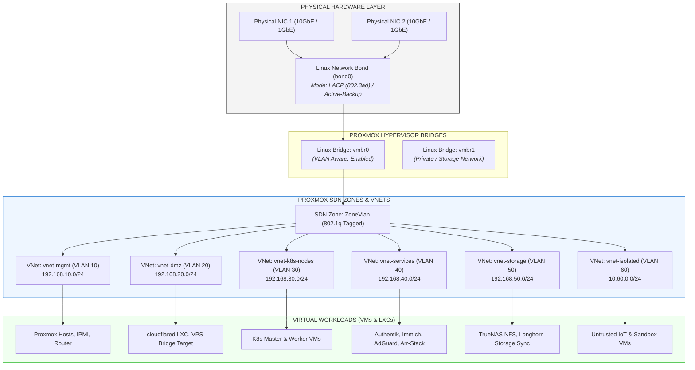
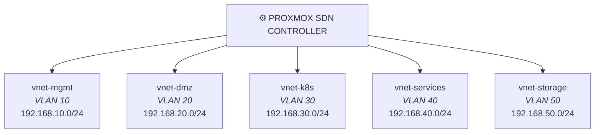
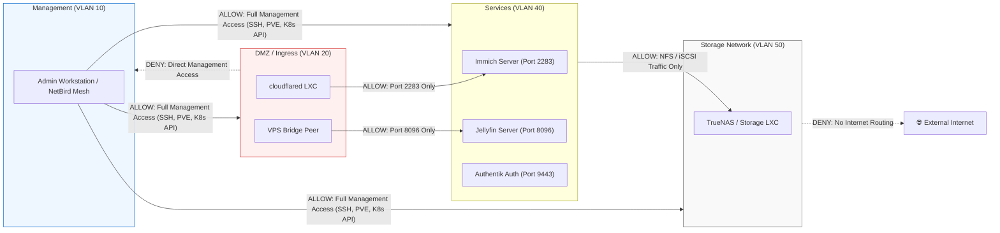
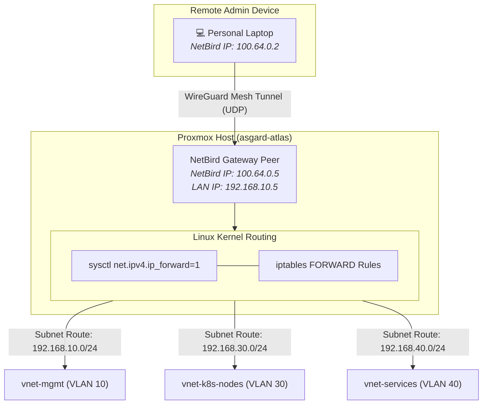

# Proxmox VE SDN, VNets & Subnet Architecture

This document defines the internal network virtualization, subnet segmentation, Software Defined Networking (SDN) design, and IPAM (IP Address Management) scheme for the homelab infrastructure hosted on Proxmox VE.

---

## 📐 Proxmox Network Architecture Overview

The homelab uses a layered network model: physical network interfaces are aggregated into Linux Bridges, which are managed via **Proxmox SDN (Software Defined Networking)** into isolated **Virtual Networks (VNets)** and 802.1q **VLANs**.



---

## 🌐 Proxmox SDN Zones & VNets Configuration

Proxmox VE Software Defined Networking (SDN) allows central management of subnets, virtual interfaces, and routing across multiple hypervisor nodes (`asgard-atlas`, `asgard-prometheus`, `asgard-godzilla`).

### 1. Zone Definitions

| Zone Name | Zone Type | Underlying Bridge | MTU | Description |
| :--- | :--- | :--- | :--- | :--- |
| `ZoneVlan` | **VLAN** | `vmbr0` | 1500 | Main 802.1q VLAN tagged network for inter-subnet routing |
| `ZoneStorage` | **VLAN** | `vmbr1` | 9000 | Dedicated Jumbo Frame storage network for NFS & Longhorn |
| `ZoneSimple` | **Simple** | N/A | 1500 | Isolated single-node NAT network for ephemeral build runners |
| `ZoneOverlay` | **VXLAN / EVPN** | `vmbr0` | 1450 | Multi-node hypervisor overlay mesh for cross-site VM migration |

### 2. VNet & Subnet Mapping



---

## 📊 IP Address Management (IPAM) & Subnet Allocations

Below is the single source of truth for IPv4 address reservations across all Proxmox subnets and overlay networks.

| VNet Name | VLAN Tag | Subnet CIDR | Gateway | DHCP Range | Primary Purpose & Allocated Workloads |
| :--- | :--- | :--- | :--- | :--- | :--- |
| `vnet-mgmt` | `10` | `192.168.10.0/24` | `192.168.10.1` | Static Only | Proxmox hypervisor nodes (`atlas`, `prometheus`, `godzilla`), IPMI/iDRAC, switches, core router. |
| `vnet-dmz` | `20` | `192.168.20.0/24` | `192.168.20.1` | `192.168.20.100-200` | Ingress proxies, `cloudflared` tunnel connectors, VPS NetBird bridge targets, Nginx reverse proxy. |
| `vnet-k8s-nodes`| `30` | `192.168.30.0/24` | `192.168.30.1` | Static Only | Kubernetes control plane and worker VMs (`orion-master-01`, `orion-worker-01..03`). |
| `vnet-services` | `40` | `192.168.40.0/24` | `192.168.40.1` | `192.168.40.100-250` | Core LXC containers and VMs: Authentik, AdGuard Home, Immich, Nextcloud, Arr-stack. |
| `vnet-storage` | `50` | `192.168.50.0/24` | None (No GW) | Static Only | High-performance storage network: TrueNAS NFS exports, Longhorn block sync, SeaweedFS traffic. |
| `vnet-isolated` | `60` | `10.60.0.0/24` | `10.60.0.1` | `10.60.0.100-200` | Untrusted IoT devices, isolated sandbox VMs, security test containers. |
| *(Overlay)* | N/A | `10.244.0.0/16` | Internal CNI | Pod IPs | Kubernetes Pod-to-Pod virtual container overlay network (managed by Cilium / Flannel CNI). |
| `samarkand` | Overlay | `100.64.0.0/16` | NetBird Signal | Dynamic CGNAT | NetBird Mesh VPN overlay for remote administrative devices and inter-site peer bridging. |

---

## 🔀 Inter-VNet Routing & Firewall Rules

All inter-VNet routing is handled at the Proxmox VE Gateway node / firewall level. The default security posture is **STRICT DENY** between internal VNets unless explicitly whitelisted.



### Proxmox VE Firewall Policy Rules

1. **Management VNet (`VLAN 10`)**:
   - Outbound: Allowed to Internet (software updates, NTP).
   - Inbound: Restricted to local LAN and authorized NetBird VPN peers (`100.64.0.0/16`).
2. **DMZ VNet (`VLAN 20`)**:
   - Outbound: Allowed to Cloudflare Edge Network (QUIC/HTTPS outbound) and NetBird Relay servers.
   - Inbound from Internet: Strictly **0 open inbound ports** on home ISP connection.
   - Inbound to Internal VNets: Restricted to specific target IP and port mappings (e.g., `cloudflared` ➔ `192.168.40.50:2283`).
3. **Kubernetes Node VNet (`VLAN 30`)**:
   - Node-to-Node: Unrestricted inside `VLAN 30` for etcd, Kubelet, and BGP/overlay traffic.
   - Access to Storage: Allowed to `VLAN 50` for Longhorn volume sync and NFS mounts.
4. **Storage VNet (`VLAN 50`)**:
   - Routing: **Non-routable subnet** (no default gateway configured). Traffic cannot leave the local switch / bridge layer.

---

## 🌐 NetBird Mesh Integration with Proxmox VNets

NetBird operates as the primary administrative overlay network (`samarkand`). Rather than installing the NetBird client on every lightweight LXC or VM, designated **Proxmox Gateway Peers** act as **Subnet Routers**.



### Subnet Routing Requirements

To enable seamless Layer 3 access into Proxmox subnets from remote NetBird clients:

1. **Kernel IP Forwarding**: Enable IPv4 forwarding on the Proxmox gateway node:
   ```bash
   sysctl -w net.ipv4.ip_forward=1
   echo "net.ipv4.ip_forward=1" >> /etc/sysctl.d/99-netbird.conf
   ```
2. **NetBird Route Advertisement**:
   ```bash
   netbird up --management-url https://netbird.domain.com --network-monitor --advertised-routes 192.168.10.0/24,192.168.30.0/24,192.168.40.0/24
   ```
3. **Access Control Lists (ACLs)**: In the NetBird management dashboard, create ACLs restricting subnet access to admin users only.

---

## 🔒 Best Practices Checklist

1. **Jumbo Frames for Storage:** Enable MTU `9000` on `vmbr1` and `vnet-storage` to maximize throughput and lower CPU overhead for TrueNAS NFS and Longhorn data replication.
2. **VLAN Awareness:** Always check `VLAN Aware: Yes` on `vmbr0` in Proxmox VE UI / OpenTofu configuration so VM interfaces can dynamically assign VLAN tags.
3. **Storage Network Isolation:** Do NOT assign a default gateway to `vnet-storage` (`192.168.50.0/24`). Storage traffic must remain strictly isolated on Layer 2 / internal switch fabric.
4. **Proxmox SDN Backup:** Export SDN configuration files (`/etc/pve/sdn/`) into OpenTofu / GitOps repo for automated environment rebuilds.
