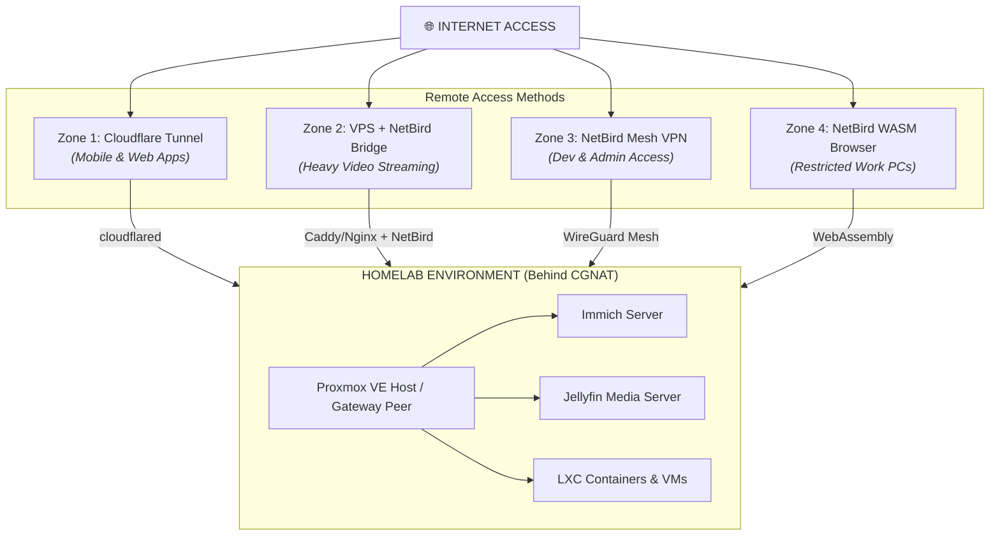
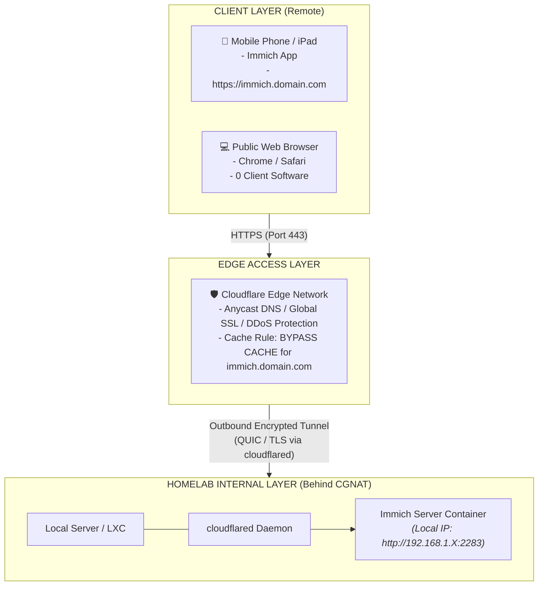
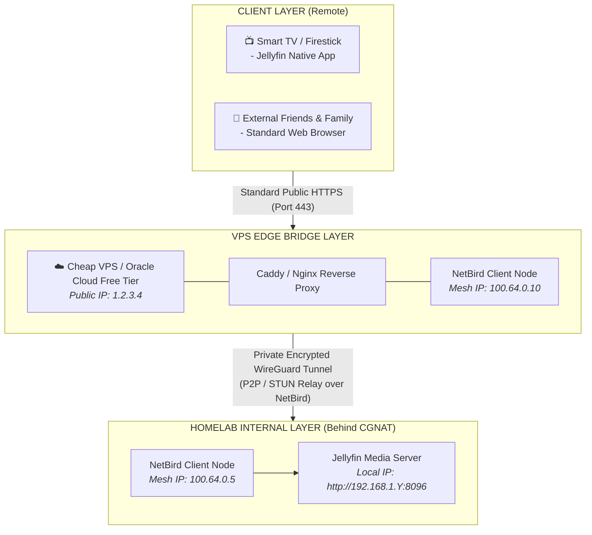
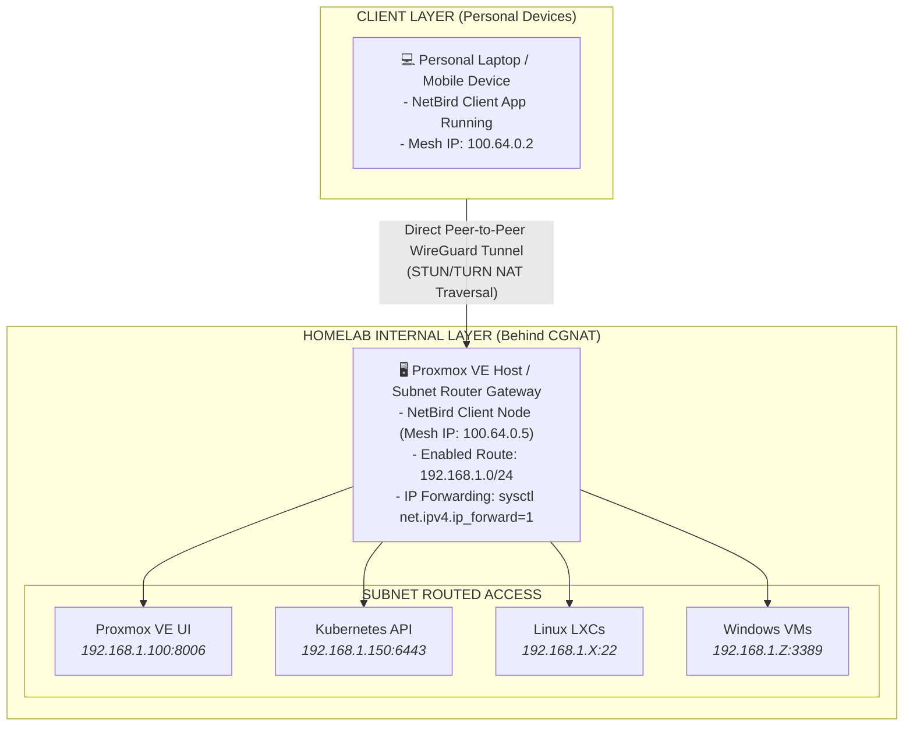
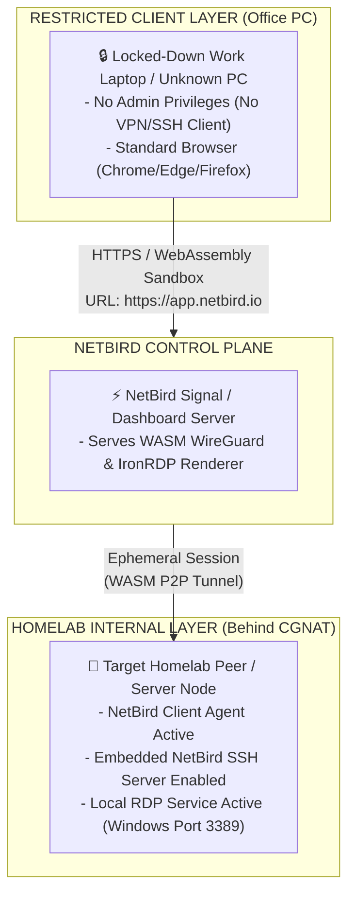

# Homelab Remote Access & Networking Architecture

This specification details the hybrid remote access architecture for the homelab environment. It is designed to bypass **ISP CGNAT (Carrier-Grade NAT)** and **Dynamic IPv4 Addresses** without port forwarding, while catering to different client security constraints (e.g., restricted office PCs, battery-sensitive mobile background sync, and heavy media streaming).

---

## 📐 Overall Architecture Overview

---

## 🟢 Zone 1: Public Web Services & Mobile Sync (Cloudflare Tunnel)

### 🎯 Purpose & Scope
Designed for HTTP/HTTPS web applications and mobile background sync (e.g., **Immich**, **Nextcloud**). Provides continuous connectivity without requiring client VPN software, avoiding mobile battery drain and background process termination by mobile operating systems.

### 🏗️ Technical Diagram

### ⚙️ Technical Specifications
* **Protocol:** HTTPS (Port 443) over QUIC/TLS outbound tunnel.
* **Client Requirements:** 0 Software / Native Mobile App.
* **CGNAT Handling:** Solved via outbound tunnel initiated from inside the homelab to Cloudflare's edge.
* **Configuration Requirement:** Create a Cloudflare **Cache Bypass Rule** (`immich.domain.com`) to avoid caching media streams on Cloudflare CDN edge nodes.

---

## 🟡 Zone 2: Heavy Media & Video Streaming (VPS + NetBird Bridge)

### 🎯 Purpose & Scope
Designed for high-bandwidth video streaming (e.g., **Jellyfin**, **Plex**). Completely bypasses Cloudflare’s CDN Terms of Service and bandwidth caps while giving external clients (Smart TVs, family/friends) direct public HTTPS access without requiring VPN software.

### 🏗️ Technical Diagram

### ⚙️ Technical Specifications
* **Traffic Flow:** Client `(Public HTTPS)` ➔ VPS `(Proxy)` ➔ NetBird Mesh Tunnel ➔ Homelab Jellyfin Server.
* **Client Requirements:** 0 Software installed.
* **CGNAT Handling:** The homelab connects outbound to the NetBird control plane and establishes a WireGuard bridge to the VPS.
* **Bandwidth Cap:** Uncapped (limited only by home ISP upload speed and VPS bandwidth quota).

---

## 🔵 Zone 3: Full Network Administration & Dev (NetBird Mesh VPN)

### 🎯 Purpose & Scope
Designed for administrative access (e.g., **Proxmox VE UI**, **Kubernetes API/kubectl**, **Native SSH/RDP**, **NFS/SMB shares**) from owned personal devices (laptops, personal phones). Provides direct Layer 3 network-level access inside the homelab.

### 🏗️ Technical Diagram

### ⚙️ Technical Specifications
* **Protocol:** WireGuard P2P (UDP) with STUN/TURN relay fallback for CGNAT traversal.
* **Client Requirements:** NetBird Client Application installed.
* **Subnet Routing:** Active on the gateway node to route all local LAN IPs (`192.168.1.0/24`) over the virtual interface without requiring client installation inside individual VMs/containers.

---

## 🔴 Zone 4: Clientless Browser Access for Restricted PCs (NetBird WASM)

### 🎯 Purpose & Scope
Designed for corporate/office machines or restricted computers where software installation, elevated privileges, and VPN clients are blocked by IT policy. Allows in-browser interactive **SSH terminals** and **Windows Remote Desktops (RDP)**.

### 🏗️ Technical Diagram

### ⚙️ Technical Specifications
* **Protocol:** In-Browser WebAssembly (WASM) running an ephemeral `wireguard-go` peer and `IronRDP` canvas renderer.
* **Client Requirements:** Standard web browser only (0 local software installation).
* **Access Method:** Log in to `app.netbird.io` ➔ Navigate to **Peers** ➔ Click **Connect via SSH** or **Connect via RDP**.

---

## 📊 Feature Comparison & Decision Matrix

| Metric / Feature | **Zone 1: CF Tunnel** | **Zone 2: VPS Bridge** | **Zone 3: NetBird Mesh** | **Zone 4: NetBird WASM** |
| :--- | :--- | :--- | :--- | :--- |
| **Primary Use Case** | Immich / Mobile Apps | Jellyfin / 4K Video | Admin / Dev / K8s / Subnet | Work PC Terminal / RDP |
| **Client Installation** | None Required | None Required | NetBird Client App | None (Browser WASM) |
| **CGNAT Handling** | Outbound HTTP Tunnel | VPS Reverse Proxy | STUN/TURN WireGuard | STUN/TURN WireGuard |
| **Public Exposure** | Exposed via Domain | Exposed via Domain | Completely Private | Private via Dashboard |
| **Supported Traffic** | HTTP / HTTPS | HTTP / HTTPS | All L3/L4 Traffic | Interactive SSH & RDP |
| **Bandwidth Limit** | CDN Upload Limits | VPS Allocation Limit | ISP Upload Unlimited | ISP Upload Unlimited |

---

## 🔒 Security Best Practices Checklist

1. **Cloudflare Cache Bypass:** Always create Cache Bypass rules for self-hosted apps handling private media (e.g., Immich, Nextcloud) to prevent private data caching on edge servers.
2. **NetBird Subnet Router Isolation:** Enable Linux Kernel IP forwarding (`sysctl net.ipv4.ip_forward=1`) strictly on the designated gateway peer. Use NetBird Access Control Lists (ACLs) to restrict subnet route privileges to admin users.
3. **VPS Security Hardening:** For Zone 2, configure firewall rules on the VPS (`ufw`) allowing incoming ports `80`/`443` only, blocking all internal management ports from public exposure.
4. **NetBird SSH Authentication:** Require explicit user authorization in the NetBird Control Plane prior to initiating Zone 4 WASM browser sessions.