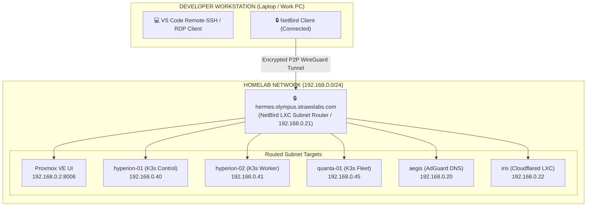

# Remote Developer Setup: VS Code Remote-SSH & Remote Desktop over NetBird Mesh

This guide outlines how developers and administrators can access all homelab virtual machines and LXC containers (`192.168.0.0/24`) from anywhere in the world using **NetBird Subnet Routing (Zone 3 Access)**.

---

## 🏗️ Architecture Overview



---

## 1. Prerequisites

1. Install the NetBird client application on your developer workstation from [https://netbird.io/install](https://netbird.io/install).
2. Log into NetBird using your user credentials.
3. Verify connection status:
   ```bash
   netbird status
   ```
   *Status must show **Management: Connected** and **Signal: Connected**.*

---

## 2. VS Code Remote-SSH Configuration

### Step 1: Install VS Code Remote - SSH Extension
In VS Code, install the official **Remote - SSH** extension (`ms-vscode-remote.remote-ssh`).

### Step 2: Configure `~/.ssh/config`
On your developer workstation, open your SSH config file (`~/.ssh/config` on Linux/macOS or `%USERPROFILE%\.ssh\config` on Windows) and add entry blocks for your homelab targets:

```text
# --- Homelab Kubernetes Cluster Nodes ---
# Example: Using Proxmox as a Jump Host
# (Use this if you are remote and can only reach the Proxmox IP)
# Host vm-remote
#     HostName [IP-Address]
#     User [your-vm-username]
#     ForwardAgent yes
#     ProxyJump [proxmox-node]

Host hyperion-01
    HostName 192.168.0.40
    User dev
    Port 22
    IdentityFile ~/.ssh/id_rsa
    ForwardAgent yes

Host hyperion-02
    HostName 192.168.0.41
    User dev
    Port 22
    IdentityFile ~/.ssh/id_rsa
    ForwardAgent yes

Host quanta-01
    HostName 192.168.0.45
    User dev
    Port 22
    IdentityFile ~/.ssh/id_rsa
    ForwardAgent yes

# --- Homelab Gateway & Service LXCs ---
Host hermes-gateway
    HostName 192.168.0.21
    User dev
    Port 22
    IdentityFile ~/.ssh/id_rsa
    ForwardAgent yes

Host iris-tunnel
    HostName 192.168.0.22
    User dev
    Port 22
    IdentityFile ~/.ssh/id_rsa
    ForwardAgent yes
```

### Step 3: Connect via VS Code
1. Press `Ctrl+Shift+P` (or `Cmd+Shift+P` on macOS) in VS Code.
2. Select **Remote-SSH: Connect to Host...**
3. Pick your desired target (e.g. `hyperion-01`).
4. VS Code opens a remote session directly inside the VM over the encrypted NetBird WireGuard tunnel.

---

## 3. Remote Desktop Access (RDP / VNC / NoMachine)

For graphical desktop environments (e.g., Windows VMs, Ubuntu Desktop VMs):

1. **Enable RDP/VNC**: Ensure Remote Desktop (RDP port `3389` or VNC port `5900`) is enabled on the target VM.
2. **Connect**: Open your preferred Remote Desktop client (e.g., Microsoft Remote Desktop, Remmina, or RealVNC).
3. **Target Address**: Enter the local IP address (e.g., `192.168.0.x`).
4. **Result**: NetBird routes traffic directly P2P without requiring public port forwarding or external cloud proxies.

---

## 4. Troubleshooting & Verification

- **Ping Check**: From your laptop (connected to NetBird), ping any VM IP:
  ```bash
  ping 192.168.0.40
  ```
- **NetBird Route Verification**: Run `netbird status` on your laptop and verify that `192.168.0.0/24` is listed under active Network Routes.
