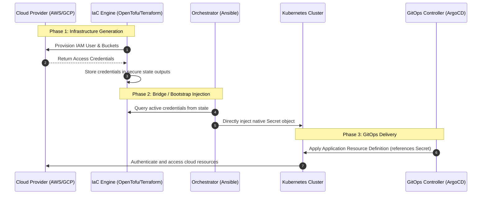

# Conceptual Pattern: Dynamic Key Generation & Lifecycle Provisioning

This architectural guide details the integration pattern for managing and rotating cloud-provider credentials dynamically across **Infrastructure as Code (IaC)**, **Configuration Management**, and **GitOps (Delivery)**.

By utilizing this pattern, you remove all static access keys from your Git repository (avoiding SealedSecrets complexity for dynamic resources) while maintaining a fully automated, self-healing cluster provisioning pipeline.

---

## 1. The Challenge of Dynamic Cloud Secrets

When managing Kubernetes platforms via GitOps, a common dilemma arises for external cloud credentials (e.g., S3 storage backup keys, DNS provider keys, external database credentials):

1. **The Static Trap (SealedSecrets):** Storing credentials in Git via SealedSecrets works well for *static* passwords. However, if keys are dynamically generated by your cloud provider (via IaC), sealing them requires a manual, out-of-band workflow every time a key is created or rotated.
2. **The Bootstrap Paradox:** GitOps engines (like ArgoCD) cannot pull configurations from Git if they depend on credentials that haven't been sealed and committed to Git yet.
3. **Dynamic IaC Lifecycle:** Cloud access keys are managed by Infrastructure as Code. When IaC recreates or rotates an access key, the cluster must ingest the new key immediately without human intervention or Git commits.

To resolve this, we use the **IaC-Orchestration-GitOps Bridge Pattern**.

---

## 2. Architectural Overview

The pattern relies on separating responsibilities into three distinct lifecycle phases:



---

## 3. Implementation Workflow

### Phase 1: Infrastructure Generation
The IaC layer acts as the **Source of Truth** for cloud resource creation. It provisions the cloud provider identities and exposes access credentials as sensitive outputs.

```hcl
# IaC (OpenTofu/Terraform): Expose generated credentials securely as sensitive outputs
resource "aws_iam_access_key" "app" {
  user = aws_iam_user.app_user.name
}

output "app_access_key_id" {
  value     = aws_iam_access_key.app.id
  sensitive = true
}

output "app_secret_access_key" {
  value     = aws_iam_access_key.app.secret
  sensitive = true
}
```

### Phase 2: Bridge/Orchestrator Injection
During the cluster bootstrap phase, the configuration management orchestrator reads the sensitive outputs from the IaC state and creates a native Kubernetes `Secret` directly on the cluster.

```yaml
# Orchestration (Ansible): Query IaC outputs and deploy secret object directly
- name: "Read active credentials from IaC outputs"
  ansible.builtin.shell: |
    tofu output -json
  register: iac_outputs
  delegate_to: localhost
  changed_when: false
  no_log: true

- name: "Create native credentials secret on the cluster"
  kubernetes.core.k8s:
    state: present
    definition:
      apiVersion: v1
      kind: Secret
      metadata:
        name: cloud-provider-creds
        namespace: backup
      type: Opaque
      stringData:
        cloud: |
          [default]
          aws_access_key_id = "{{ (iac_outputs.stdout | from_json).app_access_key_id.value }}"
          aws_secret_access_key = "{{ (iac_outputs.stdout | from_json).app_secret_access_key.value }}"
```

### Phase 3: GitOps Consumer
The GitOps configuration contains the resource definitions that consume the credentials. The static `SealedSecret` is **omitted** from Git, and the resources reference the pre-provisioned secret natively.

```yaml
# kustomization.yaml: Reference components but omit any sealed-secret manifests
apiVersion: kustomize.config.k8s.io/v1alpha1
kind: Component

resources:
  - backup-location.yaml
  # - sealed-secret.yaml <-- Omitted from Git!
```

```yaml
# backup-location.yaml: Natively reference the pre-provisioned Secret
apiVersion: velero.io/v1
kind: BackupStorageLocation
metadata:
  name: cloud-backup
  namespace: backup
spec:
  provider: aws
  credential:
    name: cloud-provider-creds
    key: cloud
```

---

## 4. Key Rotation Lifecycle

This pattern makes key rotation a simple, automated process without requiring Git commits:

1. **Invalidate & Generate:** The operator instructs the IaC engine to destroy the old access key and generate a fresh key pair:
   ```bash
   tofu apply -replace="aws_iam_access_key.app" -auto-approve
   ```
2. **Re-Inject:** The operator runs the orchestrator (e.g. playbook). The orchestrator queries the new keys from the updated state and updates the Kubernetes `Secret` object on the cluster.
3. **Propagation:** Kubernetes automatically updates the mounted secret volumes. Pods utilizing the credentials will start using the new keys upon reload.

---

## 5. Security and Operational Benefits

* **No Secret Leakage:** Access credentials are never committed to Git, even in encrypted form.
* **Self-Healing:** If the Kubernetes cluster is destroyed and redeployed, the bootstrap orchestrator automatically regenerates and re-injects the secret from the IaC state.
* **Separation of Concerns:** Developers define how applications *consume* the secrets, while the platform administrators/orchestrators manage the *generation* and *injection* lifecycle of those secrets.
