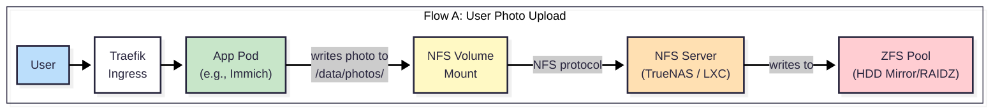
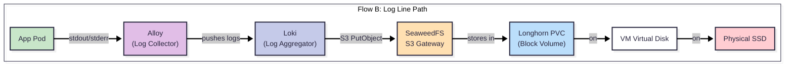
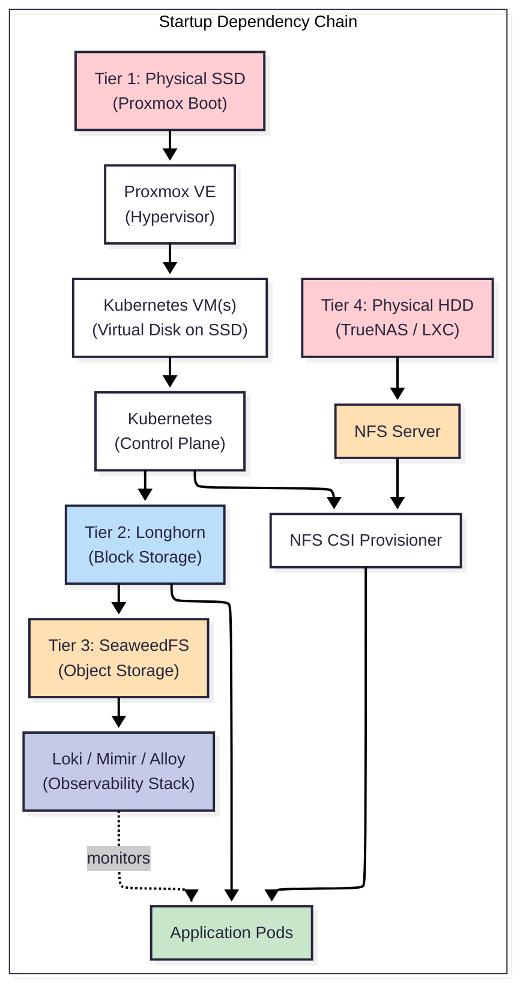
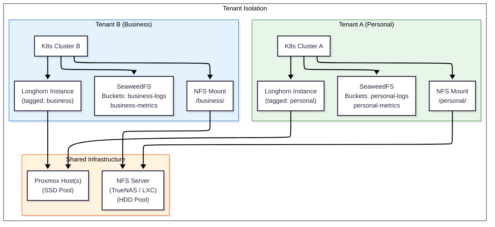

# Storage Architecture

> **Scope:** This document defines the storage layer architecture for the platform. It describes the tiered storage model, data flows, tenant isolation, and technology choices. For backup strategy, recovery objectives, restore runbooks, and cost planning, see [`docs/backup/`](../backup/README.md).

---

## Design Philosophy

The storage architecture is built on four principles:

1.  **Separation of Concerns.** Each storage tier serves a distinct purpose and is managed by a purpose-built technology. No single system tries to do everything.
2.  **Tier Independence.** Tiers can be upgraded, scaled, or replaced independently. Adding HDDs to the data tier does not affect the SSD-tier. Swapping Longhorn for another CSI driver does not touch the NFS layer.
3.  **Horizontal Expandability.** The system is designed around storage *categories*, not fixed sizes. Adding a disk, a node, or even a new physical server should expand available capacity without redesigning the architecture.
4.  **Protection at Every Layer.** Data durability is not the responsibility of a single component. Physical disks are protected by ZFS or RAID. Block storage is protected by Longhorn replication. Object storage inherits protection from the block layer. Each tier's protection can be tuned independently as hardware grows.

---

## The 4-Tier Storage Model

The platform's storage is organized into four logical tiers, each with a distinct backing hardware category, protection mechanism, and access pattern.

```
┌─────────────────────────────────────────────────────────────────┐
│ TIER 4: User Data (NFS)                                         │
│   Images, Videos, Documents — user-visible files                │
│   Backed by: HDD (TrueNAS / LXC-NFS interim)                    │
│   Protection: ZFS (mirror/RAIDZ)                                │
│   Access: NFS mount in pods + file manager UI                   │
├─────────────────────────────────────────────────────────────────┤
│ TIER 3: Object Storage (SeaweedFS)                              │
│   Logs, Metrics blobs, S3-compatible storage                    │
│   Backed by: Longhorn PVCs (Tier 2)                             │
│   Protection: Inherited from Tier 2                             │
│   Access: S3 API (via Loki/Mimir/Alloy)                         │
├─────────────────────────────────────────────────────────────────┤
│ TIER 2: App Block Storage (Longhorn)                            │
│   Database files, app configs, stateful workloads               │
│   Backed by: VM virtual disk (Tier 1)                           │
│   Protection: Longhorn replication (1→N as nodes grow)          │
│   Access: Kubernetes PVCs                                       │
├─────────────────────────────────────────────────────────────────┤
│ TIER 1: Platform OS (Proxmox Local SSD)                         │
│   Proxmox OS, ISOs, VM disks, K8s node OS                       │
│   Backed by: Physical SSD(s)                                    │
│   Protection: RAID (optional, scales with disk count)           │
│   Access: Proxmox storage pools                                 │
└─────────────────────────────────────────────────────────────────┘
```

### Tier 1: Platform OS (SSD-Tier)

**What it stores:** The Proxmox hypervisor OS, ISO images for VM provisioning, VM virtual disks, and the Kubernetes node operating system.

**Hardware:** Physical SSDs installed in the Proxmox host(s). These provide the IOPS needed for VM boot, Kubernetes control-plane operations, and Longhorn's block I/O.

**Protection:** When only one SSD is present, there is no redundancy at this layer — durability is delegated upward to Longhorn replication. When multiple SSDs are available, hardware or software RAID (mdadm RAID1 or ZFS mirror) protects against single-disk failure.

**Key constraint:** This is the most IOPS-sensitive tier. Everything above it — Longhorn, SeaweedFS, and the apps themselves — ultimately bottlenecks on the SSD tier's performance.

> For details, see: [CAPACITY_PLANNING.md](./CAPACITY_PLANNING.md)

### Tier 2: App Block Storage (Longhorn)

**What it stores:** Application configuration databases (PostgreSQL, Redis, CouchDB), app config directories, and any stateful workload that requires a Kubernetes Persistent Volume Claim (PVC).

**How it works:** Longhorn runs a Manager on each Kubernetes node. When a pod requests a PVC, Longhorn allocates a volume from the node's available disk space and presents it as a block device. Data can be replicated across nodes for redundancy.

**Protection:** Longhorn replication. Currently set to 1 replica (no redundancy) for single-node setups. As nodes are added, the replica count can be increased to 2 or 3 without migrating data.

**Key relationship:** SeaweedFS (Tier 3) stores its own data on Longhorn PVCs. This means Longhorn is the durability foundation for both Tier 2 and Tier 3.

> For details, see: [LONGHORN.md](./LONGHORN.md)

### Tier 3: Object Storage (SeaweedFS)

**What it stores:** Observability data — logs (via Loki), metrics (via Mimir), and any S3-compatible blob storage needed by platform services.

**How it works:** SeaweedFS provides an S3-compatible API. Observability tools (Loki, Mimir, Alloy) are configured to use SeaweedFS as their storage backend instead of AWS S3 or local disk. SeaweedFS manages its own internal data distribution across Master, Volume, and Filer components.

**Protection:** Inherited from Tier 2. SeaweedFS's own replication is set to `000` (no replication) because Longhorn handles durability at the block level. This avoids redundant data copies.

**Key relationship:** SeaweedFS does *not* store user-facing data (photos, videos, documents). That is the responsibility of Tier 4 (NFS). SeaweedFS is exclusively for platform-internal data.

> For details, see: [SEAWEEDFS.md](./SEAWEEDFS.md)

### Tier 4: User Data (NFS)

**What it stores:** User-visible files — photos, videos, documents, markdown notes, and any data the end-user expects to browse and manage through a file manager interface.

**How it works:** A dedicated storage server (TrueNAS, or an interim LXC with HDD passthrough) exports directories via NFS. Kubernetes pods mount these NFS shares to read and write user data. Users can also directly access the NFS share via a file manager (SMB/CIFS on Windows, NFS on Linux) for a "desktop-like" experience.

**Protection:** ZFS on the storage server. The HDD pool is configured as a ZFS mirror (2 disks) or RAIDZ (3+ disks), providing checksumming, self-healing, and single-disk failure tolerance. ZFS scrub schedules verify data integrity periodically.

**Key relationship:** This tier is **independent** of the Kubernetes storage stack. NFS does not flow through Longhorn. It is a separate data path, backed by separate hardware (HDDs, not SSDs).

> For details, see: [NFS.md](./NFS.md)

---

## Physical Protection Sub-Layer

Beneath the 4-tier model, a physical protection layer ensures data survives disk failures. This layer is transparent to Kubernetes and the applications — it operates at the hardware/filesystem level.

| Tier | Protection Technology | Mechanism | When It Activates |
|---|---|---|---|
| **Tier 1 (SSD)** | RAID (optional) | mdadm RAID1 or ZFS mirror across multiple SSDs | When ≥2 SSDs are installed in a Proxmox host |
| **Tier 2 (Longhorn)** | Longhorn Replication | Data blocks replicated across K8s nodes | When ≥2 K8s worker nodes exist |
| **Tier 3 (SeaweedFS)** | Inherited from Tier 2 | SeaweedFS PVCs are Longhorn volumes | Automatically via Tier 2 |
| **Tier 4 (HDD)** | ZFS | Mirror (2 disks) or RAIDZ (3+ disks) on TrueNAS | Always active on the HDD pool |

### ZFS (Tier 4 — HDD Pool)

ZFS is the filesystem for the user data tier. It provides:

-   **Checksumming:** Every block is checksummed. Silent data corruption (bit rot) is detected and auto-corrected using redundant copies.
-   **Copy-on-Write:** Data is never overwritten in place. Writes go to a new location, and the pointer is atomically updated. This means a power failure never leaves data in a half-written state.
-   **Snapshots:** Zero-cost, instantaneous snapshots of the entire dataset. Used for point-in-time recovery and backup workflows.
-   **Scrub:** A periodic integrity scan that reads every block and verifies checksums. Recommended schedule: weekly.
-   **Self-Healing:** When a bad block is detected during a scrub or read, ZFS automatically reconstructs it from the mirror/parity copy.

**Pool Layout Guidance:**

| Disk Count | Recommended Layout | Usable Capacity | Fault Tolerance |
|---|---|---|---|
| 2 disks | Mirror (RAID1) | 50% of raw | 1 disk failure |
| 3 disks | RAIDZ1 | ~67% of raw | 1 disk failure |
| 4 disks | RAIDZ2 or 2× Mirror | 50% of raw | 2 disk failures |
| 6+ disks | RAIDZ2 or 3× Mirror | ~67% or 50% | 2 disk failures |

### RAID (Tier 1 — SSD Pool)

For the SSD tier, RAID is optional and depends on the number of physical SSDs available:

-   **1 SSD:** No RAID possible. Durability relies on Longhorn replication (Tier 2) and backups.
-   **2 SSDs:** mdadm RAID1 (software mirror) or ZFS mirror. Provides single-disk failure tolerance.
-   **3+ SSDs:** mdadm RAID5/6 or ZFS RAIDZ. Provides both redundancy and increased usable capacity.

> **Note:** In a single-SSD setup (common for initial homelab builds), the stack is designed to remain operational — Longhorn's replication across nodes provides the primary durability guarantee, and offsite backups (covered in `docs/backup/`) provide the disaster recovery layer.

---

## End-to-End Data Flow

Two primary data flows illustrate how the tiers work together:

### Flow A: User Photo Upload

A user uploads a photo through a web application (e.g., Immich).



**Path:** `User → Traefik → App Pod → NFS Mount → NFS Server → ZFS Pool (HDD)`

**Key point:** This flow **bypasses** Longhorn and SeaweedFS entirely. User data goes directly from the app to the HDD tier via NFS. This is intentional — user data is large (photos, videos) and benefits from HDD-tier capacity, not SSD-tier IOPS.

### Flow B: Application Log Line

An application emits a log line that is collected by the observability stack.



**Path:** `App Pod → Alloy → Loki → SeaweedFS (S3) → Longhorn PVC → VM Disk → SSD`

**Key point:** This flow traverses Tier 3 → Tier 2 → Tier 1. The entire observability data path lives on SSD-tier storage. Retention policies in Loki/Mimir control how long data lives — SeaweedFS itself is retention-unaware.

---

## Dependency Chain & Boot Order

The tiers have a strict dependency chain. If a lower tier is unhealthy, all tiers above it are affected.



**Startup Order:**

1.  **Proxmox boots** from SSD. The hypervisor is available.
2.  **VMs start.** Kubernetes nodes come online.
3.  **Kubernetes control-plane** initializes. API server, scheduler, controllers are ready.
4.  **Longhorn** deploys its Manager daemonset. Block storage is available.
5.  **SeaweedFS** starts. Its PVCs are fulfilled by Longhorn. S3 endpoint becomes available.
6.  **Observability stack** (Loki, Mimir, Alloy) starts. Connects to SeaweedFS for log/metric storage.
7.  **NFS Server** (TrueNAS or LXC) starts independently (runs on HDD, outside K8s). NFS provisioner in K8s connects to it.
8.  **Application pods** start. They consume Longhorn PVCs (for config) and NFS volumes (for user data).

> **Critical insight:** The NFS/HDD path (Tier 4) is **independent** of the SSD path (Tiers 1-3). If Longhorn is down, user data on NFS is still accessible. If NFS is down, app configs on Longhorn are still intact. This is by design — failure domains are isolated.

---

## Tenant Isolation Model

Each tenant (Personal, Business, etc.) gets its own Kubernetes cluster. Storage isolation follows naturally:



### Isolation Mechanisms by Tier

| Tier | Isolation Mechanism | How It Works |
|---|---|---|
| **Tier 2 (Longhorn)** | Disk/Node Tags + StorageClasses | Each tenant cluster's Longhorn uses tagged StorageClasses. Disks are tagged (e.g., `tenant:personal`, `tenant:business`). PVCs are bound only to matching tags. |
| **Tier 3 (SeaweedFS)** | Separate S3 Buckets | Each tenant gets dedicated buckets (e.g., `personal-logs`, `business-logs`). S3 auth keys are tenant-specific. |
| **Tier 4 (NFS)** | Subdirectory Isolation | NFS exports are scoped per tenant: `/data/personal/`, `/data/business/`. The NFS provisioner creates PVCs within the tenant's subtree. |
| **Cross-tier** | Separate K8s Clusters | The strongest isolation — each tenant runs in its own cluster. No shared Kubernetes namespace, no shared RBAC. |

---

## StorageClass Taxonomy

All storage requests in Kubernetes are mediated through StorageClasses. The platform defines the following classes:

| StorageClass Name | Tier | Provisioner | Reclaim Policy | Intended Use | Tags/Selectors |
|---|---|---|---|---|---|
| `longhorn` (default) | Tier 2 | Longhorn | Delete | General app configs, databases | None (default) |
| `longhorn-retain` | Tier 2 | Longhorn | Retain | Critical databases (PostgreSQL, etc.) | None |
| `longhorn-<tenant>` | Tier 2 | Longhorn | Delete | Tenant-specific block storage | `tenant:<name>` disk tag |
| `nfs-user-data` | Tier 4 | NFS CSI | Retain | User-visible files (photos, videos, docs) | N/A |
| `nfs-user-data-<tenant>` | Tier 4 | NFS CSI | Retain | Tenant-scoped user data | Subdirectory: `/<tenant>/` |

> **Note:** SeaweedFS does not expose a Kubernetes StorageClass. Applications access it via the S3 API endpoint, not via PVCs. The SeaweedFS S3 endpoint, bucket names, and credentials are injected into pods via Kubernetes Secrets.

---

## Technology Decision Rationale

### Why Longhorn (not Ceph/Rook, not OpenEBS)?

| Factor | Longhorn | Ceph/Rook | OpenEBS |
|---|---|---|---|
| **Complexity** | Low — single Helm chart, no external dependencies | High — requires dedicated nodes, complex tuning | Medium — multiple engines to choose from |
| **Resource overhead** | ~256MB RAM per node | 2-4GB RAM minimum per OSD | Varies by engine |
| **Minimum nodes** | 1 (scales to many) | 3 (hard minimum for quorum) | 1 |
| **Homelab fit** | Excellent — designed for edge/small clusters | Overkill for <10 nodes | Good, but less mature ecosystem |
| **Upgrade path** | Non-disruptive rolling updates | Complex, version-sensitive upgrades | Engine-dependent |

**Decision:** Longhorn is chosen for its low operational overhead and single-node-capable design. If the platform scales to 10+ nodes with petabyte-scale storage, Ceph becomes a valid migration target. That migration would be a StorageClass swap, not an architecture change.

### Why SeaweedFS (not MinIO, not direct-to-disk)?

| Factor | SeaweedFS | MinIO | Direct-to-Disk |
|---|---|---|---|
| **S3 compatibility** | Full — S3 gateway, Filer, WebDAV | Full — S3 native | N/A |
| **Resource usage** | Low — lightweight components | Medium — JVM-like memory profile | Lowest |
| **Filer (filesystem view)** | Built-in — browse via UI, Filer API | Not available — object-only | N/A |
| **Erasure coding** | Supported (via worker) | Supported | N/A |
| **Log storage fit** | Excellent — S3 backend for Loki/Mimir | Excellent — same capability | Poor — no API, no retention |

**Decision:** SeaweedFS provides both S3 compatibility (for Loki/Mimir) and a Filer interface (for admin browsing), at lower resource cost than MinIO. The built-in admin UI and worker (vacuum, balance) make it operationally simpler for a homelab.

### Why NFS (not iSCSI, not CephFS)?

| Factor | NFS | iSCSI | CephFS |
|---|---|---|---|
| **Multi-pod access (RWX)** | Native — multiple pods read/write simultaneously | Not supported — block device, single writer | Supported but complex |
| **User accessibility** | Mountable as network drive on any OS | Not user-accessible | Not user-accessible |
| **Simplicity** | Standard protocol, zero client config | Requires initiator setup on every node | Requires Ceph cluster |
| **Performance** | Good for sequential I/O (media, documents) | Better for random I/O (databases) | Best for mixed, at scale |
| **File manager experience** | ✅ Users can browse via SMB/NFS mount | ❌ Not browsable | ❌ Not browsable |

**Decision:** NFS is chosen because user data must be simultaneously accessible to Kubernetes pods (for app functionality) and to end-users (via file manager). iSCSI cannot provide the "browse your files like Windows Explorer" experience. NFS is the only protocol that serves both use cases natively.

### Why ZFS (not ext4/XFS for the data tier)?

| Factor | ZFS | ext4 | XFS |
|---|---|---|---|
| **Checksumming** | Every block — detects silent corruption | None | None |
| **Self-healing** | Auto-corrects bad blocks from redundant copies | No | No |
| **Snapshots** | Instantaneous, zero-cost | Not native (requires LVM) | Not native |
| **RAID integration** | Built-in (mirror, RAIDZ) | Requires separate mdadm/hardware RAID | Same as ext4 |
| **Scrub (integrity scan)** | Built-in, schedulable | fsck (offline only) | xfs_repair (offline) |

**Decision:** For a tier that stores irreplaceable user data (photos, videos, documents), ZFS's checksumming and self-healing are non-negotiable. ext4/XFS are excellent filesystems, but they cannot detect silent data corruption — on large HDD pools over years, bit rot is a real risk that only ZFS (or Btrfs) can mitigate.

---

## Related Documentation

| Document | What It Covers |
|---|---|
| [README.md](./README.md) | Storage overview, quick reference, "I need to store X → use Y" |
| [LONGHORN.md](./LONGHORN.md) | Block storage: StorageClasses, disk tagging, replication, expansion |
| [SEAWEEDFS.md](./SEAWEEDFS.md) | Object storage: S3 backend, buckets, retention profiles, architecture |
| [NFS.md](./NFS.md) | User data: TrueNAS ideal, LXC interim, NFS provisioner comparison |
| [CAPACITY_PLANNING.md](./CAPACITY_PLANNING.md) | Storage categories, growth projections, expansion playbooks |
| [`docs/backup/`](../backup/README.md) | Backup strategy, ABC model, restore runbooks, verification, cost planning |
| [`docs/ARCHITECTURE.md`](../ARCHITECTURE.md) | Overall platform architecture (parent document) |
