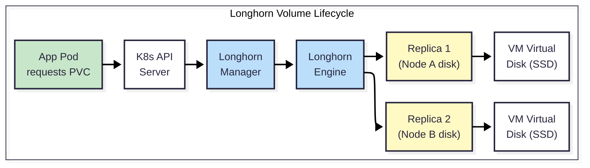

# Longhorn — Block Storage Guide

> **Tier:** Tier 2 — App Block Storage
> **Role:** Provides Kubernetes Persistent Volume Claims (PVCs) for application configurations, databases, and stateful workloads.
> **Backing:** VM virtual disks on Proxmox SSD-tier storage.

---

## What Goes Here vs. Other Tiers

Understanding *what* to store on Longhorn is critical. Misplacing data on the wrong tier wastes resources or degrades performance.

| Data Type | Store On | Why |
|---|---|---|
| PostgreSQL / Redis / CouchDB data | ✅ **Longhorn** | Databases need low-latency random I/O (SSD-backed) |
| App config directories (`/config`) | ✅ **Longhorn** | Small, frequently accessed, must survive pod restarts |
| SeaweedFS internal data | ✅ **Longhorn** | SeaweedFS PVCs are backed by Longhorn (see [ARCHITECTURE.md](./ARCHITECTURE.md)) |
| User photos, videos, documents | ❌ Use **NFS** (Tier 4) | Large files, sequential I/O, must be user-browsable |
| Logs, metrics, observability blobs | ❌ Use **SeaweedFS** (Tier 3) | S3-compatible, retention-managed by Loki/Mimir |
| Proxmox OS, ISOs, VM disks | ❌ **Tier 1** (Proxmox-managed) | Below Longhorn's layer — Longhorn runs *inside* VMs |

---

## How Longhorn Works

Longhorn runs as a set of Kubernetes controllers. Here is the simplified lifecycle of a volume:



1.  **Request:** A pod spec includes a PVC referencing a Longhorn StorageClass.
2.  **Provision:** The Longhorn Manager on the target node allocates disk space and creates a volume.
3.  **Engine:** A Longhorn Engine pod is created to handle I/O for the volume.
4.  **Replicas:** Data is written to the local replica and (if replica count > 1) synchronously replicated to replicas on other nodes.
5.  **Attach:** The volume is mounted into the pod as a block device formatted with ext4 (default).
6.  **Detach:** When the pod terminates, the volume is detached but persists. Data survives pod restarts and rescheduling.

---

## StorageClass Design

### Default StorageClass

The platform's default StorageClass is Longhorn. Any PVC that does not specify a `storageClassName` will be provisioned by Longhorn.

```yaml
# Longhorn default StorageClass (configured via Helm values)
persistence:
  defaultClass: true
  defaultClassReplicaCount: 1  # Single replica — scale as nodes are added
  defaultFsType: ext4
  reclaimPolicy: Delete        # PV is deleted when PVC is removed
```

### Recommended StorageClasses

| Class Name | Replica Count | Reclaim Policy | Use Case |
|---|---|---|---|
| `longhorn` | 1 (default) | Delete | General app configs, non-critical data |
| `longhorn-retain` | 1 | **Retain** | Critical databases — PV survives PVC deletion for manual recovery |
| `longhorn-ha` | 2-3 | Delete | High-availability workloads (when ≥3 nodes exist) |
| `longhorn-<tenant>` | 1 | Delete | Tenant-specific storage (see Disk Tagging below) |

### Creating Additional StorageClasses

Additional StorageClasses are created as Kubernetes manifests. Example for a `longhorn-retain` class:

```yaml
apiVersion: storage.k8s.io/v1
kind: StorageClass
metadata:
  name: longhorn-retain
provisioner: driver.longhorn.io
reclaimPolicy: Retain
volumeBindingMode: Immediate
allowVolumeExpansion: true
parameters:
  numberOfReplicas: "1"
  staleReplicaTimeout: "30"
  fsType: ext4
```

---

## Disk & Node Tagging

Longhorn supports tagging disks and nodes to control where volumes are placed. This is the primary mechanism for **tenant isolation** at the block storage layer.

### How It Works

1.  **Tag a disk** on a Kubernetes node (via Longhorn UI or API):
    ```
    Node: k8s-worker-01
    Disk: /var/lib/longhorn
    Tags: ["ssd", "tenant:personal"]
    ```

2.  **Tag the node** itself:
    ```
    Node: k8s-worker-01
    Tags: ["zone:asgard", "tenant:personal"]
    ```

3.  **Create a StorageClass** that selects these tags:
    ```yaml
    apiVersion: storage.k8s.io/v1
    kind: StorageClass
    metadata:
      name: longhorn-personal
    provisioner: driver.longhorn.io
    parameters:
      numberOfReplicas: "1"
      diskSelector: "tenant:personal"
      nodeSelector: "tenant:personal"
    ```

4.  **Apps request PVCs** using this StorageClass. Longhorn will only place replicas on disks/nodes matching the tags.

### Tagging Strategy

| Tag Category | Example Tags | Purpose |
|---|---|---|
| **Media type** | `ssd`, `nvme`, `hdd` | Route I/O-sensitive workloads to fast disks |
| **Tenant** | `tenant:personal`, `tenant:business-acme` | Enforce data isolation between tenants |
| **Zone** | `zone:asgard`, `zone:wano` | Ensure replicas span physical locations |
| **Role** | `role:database`, `role:general` | Reserve fast storage for databases |

> **Important:** Tags are additive. A StorageClass with `diskSelector: "ssd,tenant:personal"` will only match disks that have *both* tags.

---

## Replication Strategy

### Current State

```yaml
persistence:
  defaultClassReplicaCount: 1
```

With a single Kubernetes node, replication count 1 is the only valid option. Data exists in one copy on one disk.

### Scaling Replication

As nodes are added, increase replication for redundancy:

| Nodes Available | Recommended Replica Count | Effect |
|---|---|---|
| 1 node | 1 | No redundancy. Rely on backups. |
| 2 nodes | 2 | Survives 1 node failure. ~2× storage usage. |
| 3+ nodes | 2 or 3 | Survives 1-2 node failures. Best practice. |

**How to change:**

-   **For new volumes:** Update the `defaultClassReplicaCount` in the Helm values or create a new StorageClass with the desired count.
-   **For existing volumes:** Use the Longhorn UI → Volume → Update Replica Count. Longhorn will schedule additional replicas in the background without downtime.

### Data Locality

Longhorn can keep a replica on the same node as the consuming pod to reduce network latency:

```yaml
defaultSettings:
  defaultDataLocality: best-effort
```

-   `disabled`: Replicas are placed anywhere (default).
-   `best-effort`: Tries to place one replica on the pod's node. Falls back to other nodes if the local disk is full.

> **Recommendation:** Use `best-effort` in production. It improves read performance for databases without sacrificing redundancy.

---

## Monitoring

Longhorn exposes Prometheus metrics for volume health, IOPS, throughput, and latency.

### Enabling ServiceMonitor

```yaml
metrics:
  serviceMonitor:
    enabled: true  # Currently false — enable when Prometheus is deployed
```

### Key Metrics to Monitor

| Metric | What It Tells You | Alert Threshold |
|---|---|---|
| `longhorn_node_storage_capacity_bytes` | Total storage available per node | N/A (informational) |
| `longhorn_node_storage_usage_bytes` | Storage used per node | Alert when > 80% of capacity |
| `longhorn_volume_actual_size_bytes` | Actual disk usage per volume | Alert when volume > 90% of requested size |
| `longhorn_volume_robustness` | Volume health: `healthy`, `degraded`, `faulted` | Alert immediately on `degraded` or `faulted` |
| `longhorn_disk_reservation_bytes` | Reserved (not yet used) space | Watch for overprovisioning |

### Grafana Dashboard

Longhorn provides an official Grafana dashboard (ID: `13032`). Import it to visualize:
-   Per-volume IOPS and throughput
-   Node storage utilization heatmap
-   Replica distribution across nodes
-   Volume health status

---

## Dependency: SeaweedFS on Longhorn

SeaweedFS (Tier 3) stores its data on Longhorn PVCs. This creates a dependency chain:

```
SeaweedFS Pod → Longhorn PVC → VM Disk → Physical SSD
```

### Implications

| Concern | Impact | Mitigation |
|---|---|---|
| **Boot order** | Longhorn must be healthy before SeaweedFS can start | Kubernetes handles this via pod scheduling — SeaweedFS PVCs will wait for Longhorn to be ready |
| **Performance overhead** | ~5-15% latency overhead from the extra abstraction layer | Negligible at homelab scale. Only relevant at >10k IOPS |
| **Replication stacking** | If both Longhorn replicas=2 AND SeaweedFS replicas=001, you'd get 4 data copies | Currently not an issue — SeaweedFS replication is `000`. Longhorn handles all durability. Be aware when scaling. |
| **Snapshot scope** | A Longhorn snapshot of a SeaweedFS PVC captures the entire SeaweedFS dataset on that PVC | Clean — Longhorn handles backup at the block level, SeaweedFS doesn't need its own backup mechanism |

> **Recommendation:** Keep SeaweedFS replication at `000` as long as Longhorn handles replication. Enable SeaweedFS replication only if you need cross-cluster or cross-site replication beyond what Longhorn provides.

---

## Expansion Playbook

### Adding a New Disk to an Existing Node

1.  **Physical:** Install the SSD in the Proxmox host.
2.  **Proxmox:** Create a new storage pool or pass the disk through to the K8s VM.
3.  **VM:** The new disk appears as a block device (e.g., `/dev/sdb`).
4.  **Longhorn:** Open the Longhorn UI → Node → Add Disk → specify the mount path and tags.
5.  **Result:** Longhorn automatically includes the new disk in its scheduling pool. New PVCs will use the expanded capacity. Existing volumes can be rebalanced.

### Adding a New Kubernetes Node

1.  **Provision:** Use OpenTofu to create a new VM. Use Ansible to join it to the K8s cluster.
2.  **Longhorn:** The Longhorn Manager daemonset automatically deploys to the new node.
3.  **Tag:** Apply the appropriate disk and node tags (tenant, zone, media type).
4.  **Result:** New PVCs can be scheduled on the new node. Existing volumes can add replicas on the new node.

### Resizing an Existing Volume

Longhorn supports online volume expansion (no downtime required):

1.  **Update the PVC spec:** Change `spec.resources.requests.storage` to the new size.
2.  **Longhorn expands:** The underlying volume is resized automatically.
3.  **Filesystem expansion:** For ext4, the filesystem is expanded in-place. The pod does not need to restart.

> **Prerequisite:** The StorageClass must have `allowVolumeExpansion: true`.

---

## Related Documentation

| Document | Relationship |
|---|---|
| [ARCHITECTURE.md](./ARCHITECTURE.md) | Longhorn's position in the 4-tier model |
| [SEAWEEDFS.md](./SEAWEEDFS.md) | SeaweedFS depends on Longhorn PVCs |
| [CAPACITY_PLANNING.md](./CAPACITY_PLANNING.md) | SSD-tier budget, Longhorn overhead, overprovisioning |
| [NFS.md](./NFS.md) | User data tier — distinct from Longhorn's scope |
