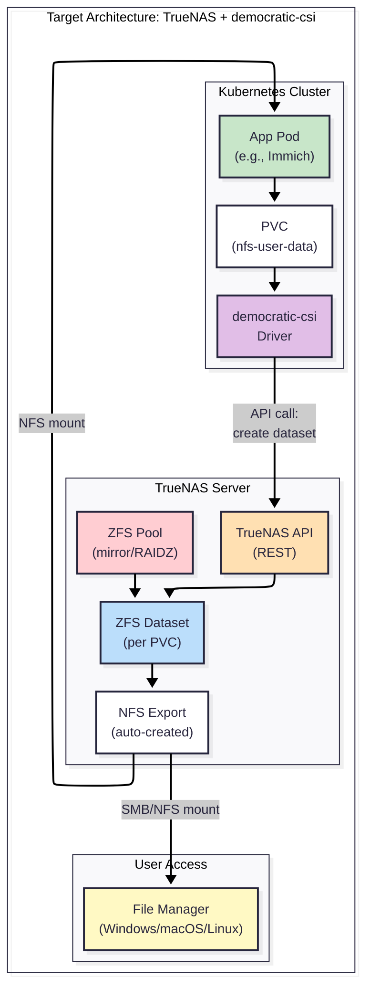
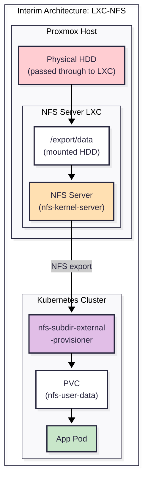
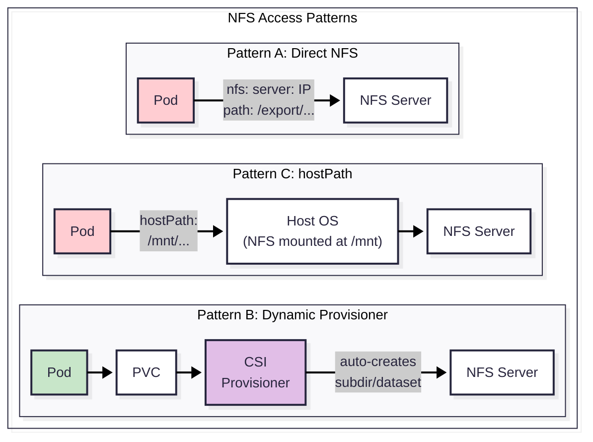

# NFS — User Data Storage Guide

> **Tier:** Tier 4 — User Data
> **Role:** Stores user-visible files (photos, videos, documents, markdown notes) accessible to both Kubernetes pods and end-users via file manager.
> **Backing:** HDD pool (TrueNAS with ZFS, or interim LXC with HDD passthrough).

---

## What Goes Here vs. Other Tiers

NFS is for **user-facing persistent data** — the files a person expects to see, browse, and manage.

| Data Type | Store On | Why |
|---|---|---|
| Photos (Immich library) | ✅ **NFS** | Large files, sequential I/O, user browses via file manager |
| Videos (Jellyfin media) | ✅ **NFS** | Streaming workload, multi-pod access (RWX) needed |
| Documents, markdown notes | ✅ **NFS** | User edits and syncs across devices |
| Downloaded torrents | ✅ **NFS** | Large files, bulk storage, user-accessible |
| App config / databases | ❌ Use **Longhorn** (Tier 2) | Low-latency random I/O, not user-visible |
| Logs, metrics | ❌ Use **SeaweedFS** (Tier 3) | Programmatic access via S3, retention-managed |

---

## The Ideal Architecture (TrueNAS + democratic-csi)

The target-state architecture uses a dedicated TrueNAS server with ZFS for data integrity, connected to Kubernetes via the `democratic-csi` driver.



### How It Works

1.  **App requests PVC** with `storageClassName: nfs-user-data`.
2.  **`democratic-csi`** receives the provisioning request.
3.  **CSI calls TrueNAS API** → creates a dedicated ZFS dataset (e.g., `tank/k8s/pvc-<uuid>`).
4.  **TrueNAS auto-creates** an NFS export for the dataset.
5.  **Pod mounts** the NFS export. The app reads/writes files.
6.  **User can also mount** the same NFS export on their desktop via file manager — seeing the exact same files.

### Why democratic-csi?

`democratic-csi` is the recommended NFS provisioner for TrueNAS because it creates **real ZFS datasets** per PVC:

-   **Visible in TrueNAS UI.** Each PVC appears as a manageable dataset.
-   **ZFS quotas.** Per-dataset size limits enforced at the filesystem level.
-   **ZFS snapshots.** Triggerable from Kubernetes — snapshot a PVC and ZFS creates an instantaneous snapshot.
-   **Protocol flexibility.** Supports NFS, iSCSI, and SMB from the same driver.

---

## ZFS Pool Design

The HDD pool on TrueNAS uses ZFS for data integrity. Pool layout depends on the number of available disks.

### Pool Layout Guidance

| Disk Count | Layout | Usable Capacity | Fault Tolerance | Recommended For |
|---|---|---|---|---|
| 2 disks | Mirror | 50% | 1 disk failure | ✅ Starting setup |
| 3 disks | RAIDZ1 | ~67% | 1 disk failure | Good balance |
| 4 disks | 2× Mirror | 50% | 1 disk per mirror | Best performance |
| 4 disks | RAIDZ2 | 50% | 2 disk failures | Best safety |
| 6+ disks | 3× Mirror or RAIDZ2 | Varies | 2 disk failures | Enterprise |

### ZFS Dataset Structure

TrueNAS organizes data into datasets (analogous to directories with independent settings):

```
tank/                          # Root pool
├── k8s/                       # Kubernetes-managed data
│   ├── personal/              # Tenant: personal
│   │   ├── immich/            # Per-app datasets (created by CSI)
│   │   ├── jellyfin/
│   │   └── obsidian/
│   └── business-acme/         # Tenant: business
│       ├── nextcloud/
│       └── documents/
└── shared/                    # Direct NFS shares (not CSI-managed)
    └── media/                 # Shared media library
```

### Maintenance Schedule

| Task | Frequency | Purpose |
|---|---|---|
| ZFS Scrub | Weekly | Verify data integrity, detect/fix silent corruption |
| Snapshot | Daily (automated) | Point-in-time recovery |
| Snapshot Pruning | Weekly | Delete snapshots older than retention policy |
| S.M.A.R.T. Check | Daily (short), Monthly (long) | Monitor disk health |

---

## Interim Architecture (LXC-NFS)

Until TrueNAS hardware is available, user data is served from a Proxmox LXC container with HDD passthrough.



### Differences from Target Architecture

| Aspect | Interim (LXC-NFS) | Target (TrueNAS) |
|---|---|---|
| **Storage server** | Proxmox LXC | Dedicated TrueNAS appliance |
| **Filesystem** | ext4 or XFS on raw HDD | ZFS with mirror/RAIDZ |
| **Data protection** | None (single disk) or manual mdadm | ZFS checksumming + self-healing |
| **CSI provisioner** | `nfs-subdir-external-provisioner` | `democratic-csi` |
| **Quota support** | ❌ No per-directory quotas | ✅ ZFS dataset quotas |
| **Snapshot support** | ❌ No snapshots | ✅ ZFS snapshots via K8s |
| **TrueNAS UI** | ❌ Not applicable | ✅ Full management via browser |

### LXC Setup Overview

1.  **Create LXC** in Proxmox (via OpenTofu).
2.  **Pass through HDD** to the LXC (Proxmox disk passthrough).
3.  **Mount HDD** at `/export/data` inside the LXC.
4.  **Install NFS server:** `apt install nfs-kernel-server`.
5.  **Export the directory:** Add `/export/data *(rw,sync,no_subtree_check,no_root_squash)` to `/etc/exports`.
6.  **Deploy provisioner** in Kubernetes (see Dynamic Provisioning below).

---

## NFS Provisioner Comparison

Two provisioners are documented: one for the interim LXC setup, one for the target TrueNAS setup.

### nfs-subdir-external-provisioner (Interim)

| Aspect | Details |
|---|---|
| **How it works** | Given a base NFS share, it creates subdirectories per PVC |
| **PVC → Storage** | PVC `my-data` → `/export/data/namespace-my-data-pvc-uuid/` |
| **TrueNAS-aware?** | ❌ No — it just creates directories. TrueNAS doesn't know about PVCs |
| **Quotas** | ❌ No per-PVC quotas (NFS has no directory-level quotas) |
| **Snapshots** | ❌ Not supported |
| **Complexity** | Very low — single Helm chart, minimal config |
| **Best for** | LXC-NFS interim, simple setups, development |

### democratic-csi (Target)

| Aspect | Details |
|---|---|
| **How it works** | Calls TrueNAS REST API to create ZFS datasets and NFS exports per PVC |
| **PVC → Storage** | PVC `my-data` → ZFS dataset `tank/k8s/pvc-uuid` + NFS export |
| **TrueNAS-aware?** | ✅ Yes — full integration. PVCs visible in TrueNAS UI |
| **Quotas** | ✅ ZFS dataset quotas, enforced at filesystem level |
| **Snapshots** | ✅ ZFS snapshots, triggerable from Kubernetes `VolumeSnapshot` |
| **Complexity** | Medium — requires TrueNAS API key, more configuration |
| **Best for** | Production TrueNAS, enterprise setups, tenant isolation |

### Side-by-Side Feature Matrix

| Feature | nfs-subdir | democratic-csi |
|---|---|---|
| Dynamic PVC provisioning | ✅ | ✅ |
| Volume expansion | ❌ | ✅ |
| Volume snapshots | ❌ | ✅ (ZFS) |
| Per-PVC quotas | ❌ | ✅ (ZFS) |
| Visible in storage UI | ❌ | ✅ (TrueNAS) |
| Multi-protocol (NFS + iSCSI + SMB) | ❌ (NFS only) | ✅ |
| External dependencies | NFS server only | TrueNAS + API access |
| Helm chart | `nfs-subdir-external-provisioner` | `democratic-csi` |

---

## NFS Access Patterns — Comparison

Three patterns exist for how Kubernetes pods consume NFS storage. Understanding all three helps choose the right approach and explains legacy code.

### Pattern A: Direct NFS in Pod Spec

```yaml
# Hardcoded NFS mount in deployment YAML
volumes:
  - name: media-data
    nfs:
      server: 192.168.1.100
      path: /export/data/media
```

| Aspect | Details |
|---|---|
| **Pros** | Simplest, no extra components, zero overhead |
| **Cons** | Hardcoded IPs/paths in every deployment YAML. No dynamic provisioning. Tight coupling to NFS server. Changing the server IP requires updating every deployment. |
| **Best for** | Quick prototyping. Legacy apps that existed before a provisioner was deployed. |
| **Current usage** | `k8s/media/jellyfin/`, `k8s/media/jellyseerr/` (legacy) |

### Pattern B: NFS Dynamic Provisioner (Recommended)

```yaml
# App just requests a PVC — provisioner handles the rest
apiVersion: v1
kind: PersistentVolumeClaim
metadata:
  name: immich-photos
spec:
  storageClassName: nfs-user-data
  accessModes:
    - ReadWriteMany
  resources:
    requests:
      storage: 500Gi
```

| Aspect | Details |
|---|---|
| **Pros** | Standard Kubernetes pattern. Apps request PVCs without knowing NFS details. Changing the NFS server requires updating only the provisioner config, not every app. Clean tenant isolation via subdirectories or ZFS datasets. |
| **Cons** | Extra component to deploy and maintain. Slight provisioning latency (~seconds). |
| **Best for** | ✅ **Production.** Enterprise pattern. All new deployments should use this. |
| **Implementation** | Interim: `nfs-subdir-external-provisioner`. Target: `democratic-csi`. |

### Pattern C: Host-level Mount + hostPath

```yaml
# NFS mounted on the Proxmox host → passed to VM → K8s hostPath
volumes:
  - name: media-data
    hostPath:
      path: /mnt/nfs-share/media
```

| Aspect | Details |
|---|---|
| **Pros** | Transparent to Kubernetes. Single mount point on the host. |
| **Cons** | Breaks pod portability (pod must run on the specific node). Requires node affinity. Bypasses Kubernetes storage abstraction entirely. |
| **Best for** | Legacy compatibility only. Avoid for new deployments. |

### Visual Comparison



---

## Directory Structure

Whether using direct NFS or dynamic provisioning, the NFS export follows a consistent directory layout scoped by tenant and application.

### Standard Layout

```
/export/data/                        # NFS root export
├── personal/                        # Tenant: personal
│   ├── immich/                      # App: Immich
│   │   ├── photos/                  # User photos
│   │   └── thumbnails/              # Generated thumbnails
│   ├── jellyfin/                    # App: Jellyfin
│   │   ├── movies/                  # Movie library
│   │   ├── tv-shows/                # TV series
│   │   └── music/                   # Music library
│   ├── obsidian/                    # App: Obsidian
│   │   └── vaults/                  # Markdown vaults
│   └── downloads/                   # Torrent downloads
│       ├── complete/
│       └── incomplete/
├── business-acme/                   # Tenant: business
│   ├── nextcloud/
│   └── documents/
└── shared/                          # Cross-tenant shared data
    └── public-media/                # Shared media library
```

### Access Permissions

| Path | Kubernetes Access | User Access | Permission |
|---|---|---|---|
| `/export/data/personal/` | Pods in personal cluster | Personal user via file manager | `rw` for user, `ro` for pods where appropriate |
| `/export/data/business-acme/` | Pods in business cluster | Business user via file manager | `rw` for user, `ro` for pods where appropriate |
| `/export/data/shared/` | All clusters | All users | `ro` for most, `rw` for admins |

---

## User Experience

One of the key reasons for choosing NFS is that users can browse their data directly — like a network drive on their computer.

### How Users Access Their Files

| OS | Protocol | How to Mount |
|---|---|---|
| **Windows** | SMB/CIFS | File Explorer → Map Network Drive → `\\truenas-ip\data\personal` |
| **macOS** | SMB or NFS | Finder → Go → Connect to Server → `smb://truenas-ip/data/personal` |
| **Linux** | NFS | `mount -t nfs truenas-ip:/export/data/personal /mnt/mydata` |
| **iOS/Android** | WebDAV or SMB | Third-party file manager apps |

> **Note:** SMB/CIFS is the recommended protocol for end-user desktop access. NFS is used for Kubernetes pod mounts. TrueNAS serves both protocols from the same dataset, so a file written by a Kubernetes pod via NFS is instantly visible to a user via SMB.

---

## Migration Path

The migration from LXC-NFS to TrueNAS is designed to be non-disruptive. It happens in two phases.

### Phase 1: Swap NFS Server (Minimal Disruption)

1.  **Set up TrueNAS** with the same export paths as the LXC (e.g., `/export/data/`).
2.  **Rsync data** from LXC to TrueNAS: `rsync -avz /export/data/ truenas:/export/data/`.
3.  **Update the provisioner config** to point at the TrueNAS IP instead of the LXC IP.
4.  **Result:** Existing PVCs continue to work. New PVCs use TrueNAS. Data is now on ZFS.

### Phase 2: Upgrade Provisioner (Full Feature Unlock)

1.  **Install `democratic-csi`** alongside the existing `nfs-subdir-external-provisioner`.
2.  **Create a new StorageClass** (`nfs-user-data-v2`) backed by `democratic-csi`.
3.  **Migrate apps** one by one to the new StorageClass. Each migration creates a proper ZFS dataset.
4.  **Decommission** the old `nfs-subdir-external-provisioner` once all apps are migrated.
5.  **Result:** Full ZFS-native management — quotas, snapshots, TrueNAS UI visibility.

> **Key insight:** Phase 1 is a hot migration — it can happen with minimal downtime (a brief NFS remount). Phase 2 is a gradual, app-by-app migration with zero downtime per app.

---

## Related Documentation

| Document | Relationship |
|---|---|
| [ARCHITECTURE.md](./ARCHITECTURE.md) | NFS's position as Tier 4 in the storage model |
| [LONGHORN.md](./LONGHORN.md) | Block storage — distinct from NFS. NFS does NOT flow through Longhorn |
| [SEAWEEDFS.md](./SEAWEEDFS.md) | Object storage — distinct from NFS. SeaweedFS handles logs, not user data |
| [CAPACITY_PLANNING.md](./CAPACITY_PLANNING.md) | HDD-tier sizing, ZFS overhead, growth projections |
