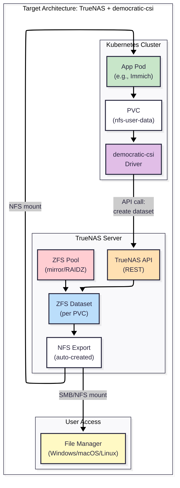
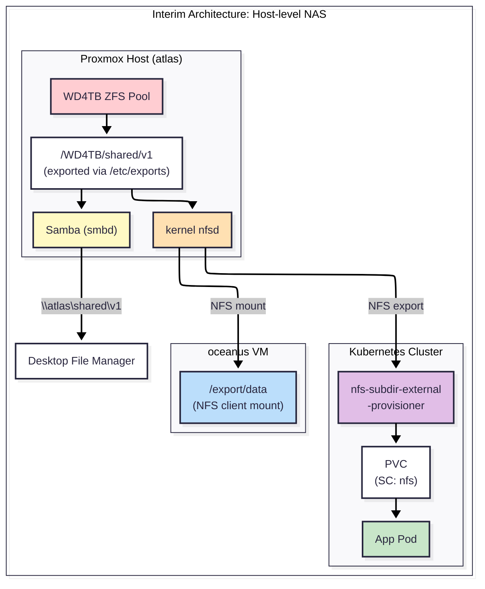
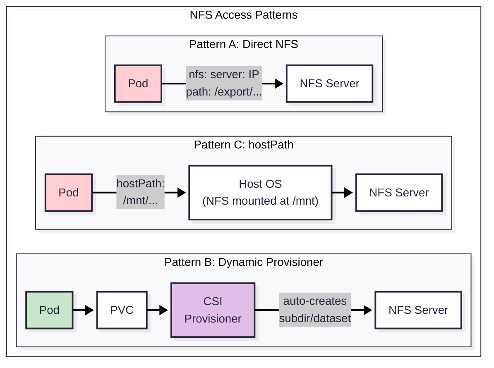

# NFS — User Data Storage Guide

> **Tier:** Tier 4 — User Data
> **Role:** Stores user-visible files (photos, videos, documents, markdown notes) accessible to both Kubernetes pods and end-users via file manager.
> **Backing:** HDD pool (TrueNAS with ZFS, or interim — Proxmox host kernel NFS + Samba on the `WD4TB` pool).

---

## What Goes Here vs. Other Tiers

NFS is for **user-facing persistent data** — the files a person expects to see, browse, and manage.

| Data Type | Store On | Why |
|---|---|---|
| Photos (Immich library) | ✅ **NFS** | Large files, sequential I/O, user browses via file manager |
| Videos (Jellyfin media) | ✅ **NFS** | Streaming workload, multi-pod access (RWX) needed |
| Documents, markdown notes | ✅ **NFS** | User edits and syncs across devices |
| Downloaded torrents | ✅ **NFS** | Large files, bulk storage, user-accessible |
| App config / databases | ❌ Use **Longhorn** (Tier 2) | Low-latency random I/O, not user-visible |
| Logs, metrics | ❌ Use **SeaweedFS** (Tier 3) | Programmatic access via S3, retention-managed |

---

## The Ideal Architecture (TrueNAS + democratic-csi)

The target-state architecture uses a dedicated TrueNAS server with ZFS for data integrity, connected to Kubernetes via the `democratic-csi` driver.


```mermaid
---
config:
  theme: redux
  look: neo
  layout: elk
---
flowchart TD
  subgraph Diagram["Target Architecture: TrueNAS + democratic-csi"]
    subgraph K8s["Kubernetes Cluster"]
      AppPod["App Pod\n(e.g., Immich)"]
      PVC["PVC\n(nfs-user-data)"]
      CSI["democratic-csi\nDriver"]
    end

    subgraph TrueNAS["TrueNAS Server"]
      API["TrueNAS API\n(REST)"]
      ZFS["ZFS Pool\n(mirror/RAIDZ)"]
      Dataset["ZFS Dataset\n(per PVC)"]
      NFSExport["NFS Export\n(auto-created)"]
    end

    subgraph UserAccess["User Access"]
      FileMgr["File Manager\n(Windows/macOS/Linux)"]
    end

    AppPod --> PVC
    PVC --> CSI
    CSI -->|"API call:\ncreate dataset"| API
    API --> Dataset
    Dataset --> NFSExport
    NFSExport -->|"NFS mount"| AppPod
    NFSExport -->|"SMB/NFS mount"| FileMgr
    ZFS --> Dataset
  end

  style AppPod fill:#C8E6C9
  style CSI fill:#E1BEE7
  style API fill:#FFE0B2
  style ZFS fill:#FFCDD2
  style Dataset fill:#BBDEFB
  style FileMgr fill:#FFF9C4
  style Diagram fill:transparent
```

### How It Works

1.  **App requests PVC** with `storageClassName: nfs-user-data`.
2.  **`democratic-csi`** receives the provisioning request.
3.  **CSI calls TrueNAS API** → creates a dedicated ZFS dataset (e.g., `tank/k8s/pvc-<uuid>`).
4.  **TrueNAS auto-creates** an NFS export for the dataset.
5.  **Pod mounts** the NFS export. The app reads/writes files.
6.  **User can also mount** the same NFS export on their desktop via file manager — seeing the exact same files.

### Why democratic-csi?

`democratic-csi` is the recommended NFS provisioner for TrueNAS because it creates **real ZFS datasets** per PVC:

-   **Visible in TrueNAS UI.** Each PVC appears as a manageable dataset.
-   **ZFS quotas.** Per-dataset size limits enforced at the filesystem level.
-   **ZFS snapshots.** Triggerable from Kubernetes — snapshot a PVC and ZFS creates an instantaneous snapshot.
-   **Protocol flexibility.** Supports NFS, iSCSI, and SMB from the same driver.

---

## ZFS Pool Design

The HDD pool on TrueNAS uses ZFS for data integrity. Pool layout depends on the number of available disks.

### Pool Layout Guidance

| Disk Count | Layout | Usable Capacity | Fault Tolerance | Recommended For |
|---|---|---|---|---|
| 2 disks | Mirror | 50% | 1 disk failure | ✅ Starting setup |
| 3 disks | RAIDZ1 | ~67% | 1 disk failure | Good balance |
| 4 disks | 2× Mirror | 50% | 1 disk per mirror | Best performance |
| 4 disks | RAIDZ2 | 50% | 2 disk failures | Best safety |
| 6+ disks | 3× Mirror or RAIDZ2 | Varies | 2 disk failures | Enterprise |

### ZFS Dataset Structure

TrueNAS organizes data into datasets (analogous to directories with independent settings):

```
tank/                          # Root pool
├── k8s/                       # Kubernetes-managed data
│   ├── personal/              # Tenant: personal
│   │   ├── immich/            # Per-app datasets (created by CSI)
│   │   ├── jellyfin/
│   │   └── obsidian/
│   └── business-acme/         # Tenant: business
│       ├── nextcloud/
│       └── documents/
└── shared/                    # Direct NFS shares (not CSI-managed)
    └── media/                 # Shared media library
```

### Maintenance Schedule

| Task | Frequency | Purpose |
|---|---|---|
| ZFS Scrub | Weekly | Verify data integrity, detect/fix silent corruption |
| Snapshot | Daily (automated) | Point-in-time recovery |
| Snapshot Pruning | Weekly | Delete snapshots older than retention policy |
| S.M.A.R.T. Check | Daily (short), Monthly (long) | Monitor disk health |

---

## Interim Architecture (Host-level NAS)

Until TrueNAS hardware is available, user data is served directly from the **Proxmox host** (`atlas`, `192.168.0.2`): the kernel NFS server (`nfs-kernel-server`) and Samba (`smbd`) export `/WD4TB/shared/v1` straight off the `WD4TB` ZFS pool. No NAS VM is involved.


```mermaid
---
config:
  theme: redux
  look: neo
  layout: elk
---
flowchart TD
  subgraph Diagram["Interim Architecture: Host-level NAS"]
    subgraph ProxmoxHost["Proxmox Host (atlas)"]
      ZPool["WD4TB ZFS Pool"]
      Export["/WD4TB/shared/v1\n(exported via /etc/exports)"]
      NFSService["kernel nfsd"]
      SMBService["Samba (smbd)"]
    end

    subgraph K8s["Kubernetes Cluster"]
      Provisioner["nfs-subdir-external\n-provisioner"]
      PVC["PVC\n(SC: nfs)"]
      AppPod["App Pod"]
    end

    subgraph Oceanus["oceanus VM"]
      ClientMount["/export/data\n(NFS client mount)"]
    end

    ZPool --> Export
    Export --> NFSService
    Export --> SMBService
    NFSService -->|"NFS export"| Provisioner
    Provisioner --> PVC
    PVC --> AppPod
    NFSService -->|"NFS mount"| ClientMount
    SMBService -->|"\\atlas\shared\v1"| Desktop["Desktop File Manager"]
  end

  style ZPool fill:#FFCDD2
  style NFSService fill:#FFE0B2
  style Provisioner fill:#E1BEE7
  style AppPod fill:#C8E6C9
  style SMBService fill:#FFF9C4
  style ClientMount fill:#BBDEFB
  style Diagram fill:transparent
```

### Current Setup

| Aspect | Details |
|---|---|
| **NFS server** | Proxmox host `atlas` (192.168.0.2), kernel `nfsd` (NFSv4), export `/WD4TB/shared/v1` via `/etc/exports` |
| **SMB** | Host `smbd` serves the same directory to desktop clients |
| **Data layout version** | `/WD4TB/shared/v1` — the `v1` suffix is a deliberate **layout-versioning convention**: a future rework of the directory structure lives under `v2`, `v3`, … next to the old one, so consumers can migrate in place |
| **Client VMs** | `oceanus` mounts `192.168.0.2:/WD4TB/shared/v1` at `/export/data` (Ansible role `nas`, fstab with `hard,noatime,actimeo=2`) |
| **In Kubernetes** | SC `nfs` → `nfs-subdir-external-provisioner` → one `v1/<namespace>/<PVC-name>` subdir per PVC under `/WD4TB/shared` |
| **Provisioning** | Host config is manual (exports, SMB); `oceanus` is a thin client provisioned by OpenTofu + Ansible |

### Why Not an LXC or a NAS VM?

The original plan ran **NFS-Ganesha inside an LXC container**. It was abandoned after a kernel-level failure:

- Ganesha's `FSAL_VFS` resolves NFS file handles with `name_to_handle_at()` + `open_by_handle_at()`.
- In the kernel (`fs/fhandle.c`), `may_decode_fh()` gates `open_by_handle_at()` on `CAP_DAC_READ_SEARCH` in the **initial user namespace**.
- **Empirically verified on this host:** inside a privileged LXC (initial userns `user:[4026531837]`, full `uid_map`, `CapEff` including `DAC_READ_SEARCH`), `name_to_handle_at` works but `open_by_handle_at` returns `EPERM` on *every* filesystem (`/`, `/etc`, `/usr`, the data disk) — while the identical test on the Proxmox host succeeds on both ext4 and ZFS.
- Result: Ganesha cannot serve NFS from **any** LXC on this host. Kernel `nfsd` doesn't need file-handle decoding at all — and running it directly on the **host** (rather than in a NAS VM) removes the VM overhead and keeps the data on ZFS, which is why the interim design is host-level.

### Differences from Target Architecture

| Aspect | Interim (Host-level NAS) | Target (TrueNAS) |
|---|---|---|
| **Storage server** | Proxmox host (`atlas`) | Dedicated TrueNAS appliance |
| **Filesystem** | ZFS (WD4TB pool, host) | ZFS with mirror/RAIDZ |
| **Data protection** | ZFS snapshots (manual/host-side) | ZFS checksumming + self-healing |
| **CSI provisioner** | `nfs-subdir-external-provisioner` | `democratic-csi` |
| **Quota support** | ❌ No per-directory quotas | ✅ ZFS dataset quotas |
| **Snapshot support** | ❌ No snapshots | ✅ ZFS snapshots via K8s |
| **TrueNAS UI** | ❌ Not applicable | ✅ Full management via browser |

### Host Setup Overview

1.  **Host (`atlas`)**: `WD4TB` ZFS pool → directory `/WD4TB/shared/v1`, exported in `/etc/exports` (`rw,no_subtree_check`), Samba share for desktop access. (Manual — documented here; not in GitOps.)
2.  **Client VMs** (e.g., `oceanus`): Ansible role `nas` installs `nfs-common` and mounts `192.168.0.2:/WD4TB/shared/v1` at `/export/data` via fstab (`hard,noatime,actimeo=2`). The role also purges any stale NFS-server/Samba packages.
3.  **Deploy provisioner** in Kubernetes (see Dynamic Provisioning below).

---

## NFS Provisioner Comparison

Two provisioners are documented: one for the interim NAS VM setup, one for the target TrueNAS setup.

### nfs-subdir-external-provisioner (Interim)

| Aspect | Details |
|---|---|
| **How it works** | Given a base NFS share, it creates subdirectories per PVC |
| **PVC → Storage** | PVC `my-data` → `/WD4TB/shared/v1/namespace-my-data-pvc-uuid/` |
| **TrueNAS-aware?** | ❌ No — it just creates directories. TrueNAS doesn't know about PVCs |
| **Quotas** | ❌ No per-PVC quotas (NFS has no directory-level quotas) |
| **Snapshots** | ❌ Not supported |
| **Complexity** | Very low — Helm chart, one template per path/SC |
| **Best for** | Host-level NAS interim, simple setups, development |

### democratic-csi (Target)

| Aspect | Details |
|---|---|
| **How it works** | Calls TrueNAS REST API to create ZFS datasets and NFS exports per PVC |
| **PVC → Storage** | PVC `my-data` → ZFS dataset `tank/k8s/pvc-uuid` + NFS export |
| **TrueNAS-aware?** | ✅ Yes — full integration. PVCs visible in TrueNAS UI |
| **Quotas** | ✅ ZFS dataset quotas, enforced at filesystem level |
| **Snapshots** | ✅ ZFS snapshots, triggerable from Kubernetes `VolumeSnapshot` |
| **Complexity** | Medium — requires TrueNAS API key, more configuration |
| **Best for** | Production TrueNAS, enterprise setups, tenant isolation |

### Side-by-Side Feature Matrix

| Feature | nfs-subdir | democratic-csi |
|---|---|---|
| Dynamic PVC provisioning | ✅ | ✅ |
| Volume expansion | ❌ | ✅ |
| Volume snapshots | ❌ | ✅ (ZFS) |
| Per-PVC quotas | ❌ | ✅ (ZFS) |
| Visible in storage UI | ❌ | ✅ (TrueNAS) |
| Multi-protocol (NFS + iSCSI + SMB) | ❌ (NFS only) | ✅ |
| External dependencies | NFS server only | TrueNAS + API access |
| Helm chart | `nfs-subdir-external-provisioner` | `democratic-csi` |

---

## Provisioner Structure (GitOps)

The `nfs-subdir-external-provisioner` chart is assembled from reusable **template components**, so multiple provisioner instances (different NFS paths, different StorageClasses) can be mixed and matched without duplicating the chart.

```
apps/infrastructure/nfs-provisioner/
├── base/                          # Namespace + vendored chart + DEFAULT values
│   ├── kustomization.yaml         #   (helmCharts: releaseName nfs-provisioner)
│   └── values.yaml                #   generic defaults (SC name nfs, RWX, mountOptions)
└── components/                    # Template components (reusable, no instance specifics)
    ├── atlas-nas/                 #   sets NFS server/path on Deployment env + root PV
    │                              #     (192.168.0.2:/WD4TB/shared)
    └── sc-nfs/                    #   sets StorageClass semantics (name nfs, Retain, archive,
                                   #     pathPattern -> v1/<namespace>/<PVC-name>)
clusters/hyperion/nfs-provisioner/
└── kustomization.yaml             # actual app = base + components
```

- **The chart renders the provisioner's root PV itself** (with the `nfs-subdir-external-provisioner` label selector + empty `storageClassName`), so nothing extra has to be pre-created — the `atlas-nas` component only fills in the NFS server/path on it.
- **How it works:** the chart's root PVC is bound to that root PV and mounted at `/persistentvolumes`; each dynamic PVC gets a subdirectory under it, advertised as `NFS_PATH + subdir`. The root PV must therefore point at the **base path** (`/WD4TB/shared`, the versionless parent), never a subdirectory.
- **Adding a path:** copy `atlas-nas` → `atlas-nas-v2` (new server/path) — the Deployment env and root PV are patched via the chart-static `app=nfs-subdir-external-provisioner` label, so the template works for any `releaseName`.
- **Adding a StorageClass:** copy `sc-nfs` → `sc-nfs-backup` (e.g., `reclaimPolicy: Delete`), and set `storageClass.name` in the instance's values.
- **Multiple instances:** each needs its own overlay with a unique `helmCharts.releaseName` (`releaseName` cannot be overridden by overlays) and its own root PV — the chart renders one per release with a matching label selector.

### Path Naming Template (all apps)

SC `nfs` carries a `pathPattern` of **`v1/${.PVC.namespace}/${.PVC.name}`** — the provisioner creates every PVC's directory as `v1/<namespace>/<PVC-name>/` instead of the default `<namespace>-<pvc-name>-<pv-uid>`. The leading `v1/` is the layout-version segment, held in the manifest so a version bump (`v1` → `v2`) is a StorageClass `pathPattern` edit rather than a server-side change:

| App (PVC name) | Namespace | Directory on share |
|---|---|---|
| `immich` | `personal` | `v1/personal/immich/` |
| `obsidian` | `personal` | `v1/personal/obsidian/` |
| `projects` | `personal` | `v1/personal/projects/` |
| `shared` | `personal` | `v1/personal/shared/` |

Convention for **all apps** using SC `nfs`:
1. Choose the PVC name to BE the desired folder name (`immich`, not `immich-library`).
2. The namespace determines the top-level tenant folder (`personal/`, `tenant-*/`, …).
3. `v1/<namespace>/<PVC-name>/` is the only layout — no other subdirectories appear at the share root.

> **Renaming** a PVC changes the directory; existing data must be moved by hand (the old directory is never touched by the provisioner — `Retain` + `archiveOnDelete`).

---

## NFS Access Patterns — Comparison

Three patterns exist for how Kubernetes pods consume NFS storage. Understanding all three helps choose the right approach and explains legacy code.

### Pattern A: Direct NFS in Pod Spec

```yaml
# Hardcoded NFS mount in deployment YAML
volumes:
  - name: media-data
    nfs:
      server: 192.168.1.100
      path: /export/data/media
```

| Aspect | Details |
|---|---|
| **Pros** | Simplest, no extra components, zero overhead |
| **Cons** | Hardcoded IPs/paths in every deployment YAML. No dynamic provisioning. Tight coupling to NFS server. Changing the server IP requires updating every deployment. |
| **Best for** | Quick prototyping. Legacy apps that existed before a provisioner was deployed. |
| **Current usage** | `k8s/media/jellyfin/`, `k8s/media/jellyseerr/` (legacy) |

### Pattern B: NFS Dynamic Provisioner (Recommended)

```yaml
# App just requests a PVC — provisioner handles the rest
apiVersion: v1
kind: PersistentVolumeClaim
metadata:
  name: immich-photos
spec:
  storageClassName: nfs-user-data
  accessModes:
    - ReadWriteMany
  resources:
    requests:
      storage: 500Gi
```

| Aspect | Details |
|---|---|
| **Pros** | Standard Kubernetes pattern. Apps request PVCs without knowing NFS details. Changing the NFS server requires updating only the provisioner config, not every app. Clean tenant isolation via subdirectories or ZFS datasets. |
| **Cons** | Extra component to deploy and maintain. Slight provisioning latency (~seconds). |
| **Best for** | ✅ **Production.** Enterprise pattern. All new deployments should use this. |
| **Implementation** | Interim: `nfs-subdir-external-provisioner`. Target: `democratic-csi`. |

### Pattern C: Host-level Mount + hostPath

```yaml
# NFS mounted on the Proxmox host → passed to VM → K8s hostPath
volumes:
  - name: media-data
    hostPath:
      path: /mnt/nfs-share/media
```

| Aspect | Details |
|---|---|
| **Pros** | Transparent to Kubernetes. Single mount point on the host. |
| **Cons** | Breaks pod portability (pod must run on the specific node). Requires node affinity. Bypasses Kubernetes storage abstraction entirely. |
| **Best for** | Legacy compatibility only. Avoid for new deployments. |

### Visual Comparison


```mermaid
---
config:
  theme: redux
  look: neo
  layout: elk
---
flowchart LR
  subgraph Diagram["NFS Access Patterns"]
    subgraph PatternA["Pattern A: Direct NFS"]
      PodA["Pod"] -->|"nfs: server: IP\npath: /export/..."| NFSA["NFS Server"]
    end

    subgraph PatternB["Pattern B: Dynamic Provisioner"]
      PodB["Pod"] --> PVCB["PVC"]
      PVCB --> Provisioner["CSI\nProvisioner"]
      Provisioner -->|"auto-creates\nsubdir/dataset"| NFSB["NFS Server"]
    end

    subgraph PatternC["Pattern C: hostPath"]
      HostMount["Host OS\n(NFS mounted at /mnt)"] --> NFSC["NFS Server"]
      PodC["Pod"] -->|"hostPath:\n/mnt/..."| HostMount
    end
  end

  style PodA fill:#FFCDD2
  style PodB fill:#C8E6C9
  style PodC fill:#FFCDD2
  style Provisioner fill:#E1BEE7
  style Diagram fill:transparent
```

---

## Directory Structure

Whether using direct NFS or dynamic provisioning, the NFS export follows a consistent directory layout scoped by version, tenant and application.

### Standard Layout

```
/WD4TB/shared/v1/                  # NFS root export (versioned: v1, v2, ...)
├── personal/                      # Tenant: personal (namespace)
│   ├── immich/                    # PVC "immich" (namespace/PVC-name convention)
│   ├── obsidian/                  # PVC "obsidian"
│   ├── projects/                  # PVC "projects"
│   ├── media/                     # PVC "media"
│   ├── tenant-.../                # per-tenant PVCs
│   └── shared/                    # PVC "shared"
├── business-acme/                 # Tenant: business (namespace)
└── ...
```

> **Layout versioning:** the top level is `/WD4TB/shared/v1`. A future rework of the directory tree lives in `/WD4TB/shared/v2` next to it; consumers (provisioner, client mounts, Samba share) are re-pointed one by one. The host export covers the whole `/WD4TB/shared` tree, so every version is visible to everyone at all times.

> **Directory naming:** every dynamic PVC lands in `v1/<namespace>/<PVC-name>/` (see [Path Naming Template](#path-naming-template-all-apps)). No other directories are created at the share root by the provisioner.

### Access Permissions

| Path | Kubernetes Access | User Access | Permission |
|---|---|---|---|
| `/WD4TB/shared/v1/personal/` | Pods in personal cluster | Personal user via file manager | `rw` for user, `ro` for pods where appropriate |
| `/WD4TB/shared/v1/business-acme/` | Pods in business cluster | Business user via file manager | `rw` for user, `ro` for pods where appropriate |
| `/WD4TB/shared/v1/shared/` | All clusters | All users | `ro` for most, `rw` for admins |

---

## User Experience

One of the key reasons for choosing NFS is that users can browse their data directly — like a network drive on their computer.

### How Users Access Their Files

| OS | Protocol | How to Mount |
|---|---|---|
| **Windows** | SMB/CIFS | File Explorer → Map Network Drive → `\\192.168.0.2\shared\v1` |
| **macOS** | SMB or NFS | Finder → Go → Connect to Server → `smb://192.168.0.2/shared/v1` |
| **Linux** | NFS | `mount -t nfs 192.168.0.2:/WD4TB/shared/v1 /mnt/mydata` |
| **iOS/Android** | WebDAV or SMB | Third-party file manager apps |

> **Note:** SMB/CIFS is the recommended protocol for end-user desktop access. NFS is used for Kubernetes pod mounts. The host serves both protocols from the same directory, so a file written by a Kubernetes pod via NFS is instantly visible to a user via SMB.

---

## Migration Path

The migration from the interim host-level NAS to TrueNAS is designed to be non-disruptive. It happens in two phases.

### Phase 1: Swap NFS Server (Minimal Disruption)

1.  **Set up TrueNAS** with the same export paths (e.g., `/WD4TB/shared/v1/`).
2.  **Rsync data** from the host: `rsync -avz 192.168.0.2:/WD4TB/shared/v1/ truenas:/WD4TB/shared/v1/`.
3.  **Update the provisioner config** — swap the `atlas-nas` component (or its values) to point at the TrueNAS IP instead of `192.168.0.2`.
4.  **Result:** Existing PVCs continue to work. New PVCs use TrueNAS. Data is now on ZFS.

### Phase 2: Upgrade Provisioner (Full Feature Unlock)

1.  **Install `democratic-csi`** alongside the existing `nfs-subdir-external-provisioner`.
2.  **Create a new StorageClass** (`nfs-user-data-v2`) backed by `democratic-csi`.
3.  **Migrate apps** one by one to the new StorageClass. Each migration creates a proper ZFS dataset.
4.  **Decommission** the old `nfs-subdir-external-provisioner` once all apps are migrated.
5.  **Result:** Full ZFS-native management — quotas, snapshots, TrueNAS UI visibility.

> **Key insight:** Phase 1 is a hot migration — it can happen with minimal downtime (a brief NFS remount). Phase 2 is a gradual, app-by-app migration with zero downtime per app.

---

## Related Documentation

| Document | Relationship |
|---|---|
| [ARCHITECTURE.md](./ARCHITECTURE.md) | NFS's position as Tier 4 in the storage model |
| [LONGHORN.md](./LONGHORN.md) | Block storage — distinct from NFS. NFS does NOT flow through Longhorn |
| [SEAWEEDFS.md](./SEAWEEDFS.md) | Object storage — distinct from NFS. SeaweedFS handles logs, not user data |
| [CAPACITY_PLANNING.md](./CAPACITY_PLANNING.md) | HDD-tier sizing, ZFS overhead, growth projections |
