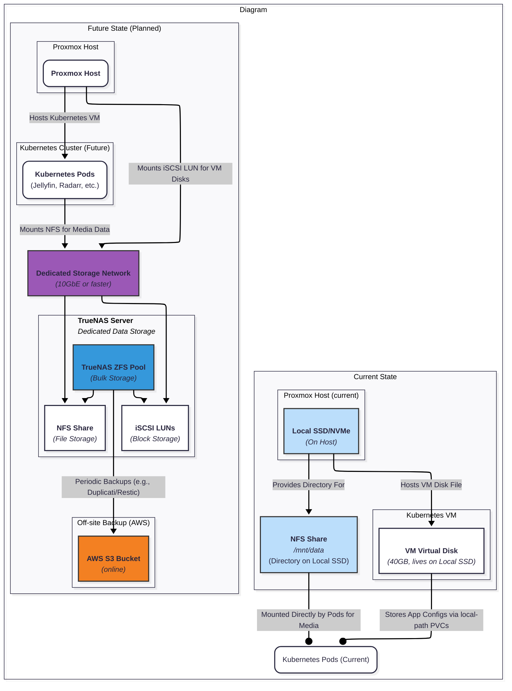

# Storage Layer — Overview

> **Start here.** This document provides an overview of the platform's storage architecture and links to detailed guides for each component.

---

## Why a Layered Storage Model?

Not all data is created equal. A database needs sub-millisecond random I/O on fast SSDs. A 4K movie needs sequential throughput on large HDDs. A log file needs cheap retention with auto-expiry. Serving all three from a single storage system is wasteful, fragile, and unscalable.

The platform uses a **4-tier model** where each tier is optimized for its workload:

| Tier | Technology | Hardware | What It Stores | Protection |
|---|---|---|---|---|
| **Tier 1** — Platform OS | Proxmox local storage | SSD | Proxmox OS, ISOs, VM disks | RAID (optional) |
| **Tier 2** — App Block Storage | [Longhorn](./LONGHORN.md) | SSD (via VM disk) | Databases, app configs, stateful workloads | Longhorn replication |
| **Tier 3** — Object Storage | [SeaweedFS](./SEAWEEDFS.md) | SSD (via Longhorn PVCs) | Logs, metrics, S3-compatible blobs | Inherited from Tier 2 |
| **Tier 4** — User Data | [NFS](./NFS.md) (TrueNAS / host-level NAS) | HDD | Photos, videos, documents, media | ZFS (mirror/RAIDZ) |

> For the data flow diagram (current vs. future state), see [Storage Architecture Diagram](#storage-architecture-diagram-the-data-view).

---

## Physical Protection Sub-Layer

Beneath the 4 tiers, a physical disk protection layer ensures data survives hardware failures:

| Hardware | Protection | Technology | Details |
|---|---|---|---|
| **SSD(s)** | RAID (when ≥2 disks) | mdadm RAID1 or ZFS mirror | Protects Tier 1 + Tier 2 + Tier 3 |
| **HDD(s)** | ZFS pool | Mirror or RAIDZ | Protects Tier 4. Checksumming, self-healing, snapshots |

ZFS provides:
-   **Checksumming** — detects silent data corruption (bit rot)
-   **Self-healing** — auto-corrects bad blocks from redundant copies
-   **Snapshots** — instant, zero-cost point-in-time recovery
-   **Scrub** — periodic integrity verification

> For pool layout guidance (mirror vs. RAIDZ), see [ARCHITECTURE.md → Physical Protection Sub-Layer](./ARCHITECTURE.md#physical-protection-sub-layer).

---

## Quick Reference — "I need to store X"

Use this table to determine which tier to use for any data type:

| I need to store... | Use This Tier | StorageClass / Access | Why |
|---|---|---|---|
| PostgreSQL / Redis data | **Tier 2** (Longhorn) | `longhorn` or `longhorn-retain` PVC | Low-latency random I/O |
| App config directory (`/config`) | **Tier 2** (Longhorn) | `longhorn` PVC | Must survive pod restarts |
| CouchDB database | **Tier 2** (Longhorn) | `longhorn` PVC | Block storage for database engine |
| Application logs | **Tier 3** (SeaweedFS) | S3 API (via Loki) | Retention-managed, auto-expiry |
| Prometheus metrics | **Tier 3** (SeaweedFS) | S3 API (via Mimir) | Long-term metric storage |
| User photos (Immich) | **Tier 4** (NFS) | `nfs-user-data` PVC | Large files, user-browsable |
| Movies / TV shows (Jellyfin) | **Tier 4** (NFS) | `nfs-user-data` PVC | Streaming, multi-pod access (RWX) |
| Markdown vaults (Obsidian) | **Tier 4** (NFS) | `nfs-user-data` PVC | User syncs across devices |
| Torrent downloads | **Tier 4** (NFS) | `nfs-user-data` PVC | Bulk storage, user-accessible |
| Temporary build caches | **None** — use `emptyDir` | Pod spec `emptyDir: {}` | Ephemeral — no persistence needed |

---

## Tenant Isolation

Each tenant (Personal, Business, etc.) runs its own Kubernetes cluster. Storage isolation is enforced at every tier:

| Tier | Isolation Mechanism |
|---|---|
| **Tier 2** (Longhorn) | Disk/node tags + per-tenant StorageClasses |
| **Tier 3** (SeaweedFS) | Per-tenant S3 buckets + separate credentials |
| **Tier 4** (NFS) | Per-tenant subdirectories or ZFS datasets |

> For details, see [ARCHITECTURE.md → Tenant Isolation Model](./ARCHITECTURE.md#tenant-isolation-model).

---

## NFS Provisioner Strategy

The platform uses two NFS provisioners depending on the infrastructure maturity:

| Phase | Provisioner | Storage Backend | Key Capability |
|---|---|---|---|
| **Interim** | `nfs-subdir-external-provisioner` | host-level NAS (kernel NFS) | Simple, subdirectory-based PVCs |
| **Target** | `democratic-csi` | TrueNAS with ZFS | ZFS datasets per PVC, quotas, snapshots, TrueNAS UI visibility |

> For the full comparison, see [NFS.md → NFS Provisioner Comparison](./NFS.md#nfs-provisioner-comparison).

---

## Capacity Planning

Storage budgets are percentage-based, not size-based. The system scales by adding hardware:

| Category | Key Metric | Warning | Critical |
|---|---|---|---|
| **SSD-tier** | Longhorn node storage usage | > 75% | > 85% |
| **HDD-tier** | ZFS pool usage | > 70% | > 80% |
| **Object-tier** | SeaweedFS Volume server free space | < 10% | < 5% |

> For allocation models, expansion playbooks, and monitoring queries, see [CAPACITY_PLANNING.md](./CAPACITY_PLANNING.md).

---

## Storage Architecture Diagram (The "Data View")

*   **Explanation:** This diagram focuses on a single critical resource: data. It would illustrate where all persistent data lives and how it is accessed. It should show both the **current state** (local SSD storage on Proxmox hosts, `atlas-bedrock`) and the **future state**. The future view would detail:
    *   The TrueNAS server.
    *   The "Storage Network" connecting it to the Proxmox hosts.
    *   How Proxmox accesses storage for VM disks (e.g., via iSCSI or NFS).
    *   How Kubernetes applications access storage for Persistent Volumes (e.g., via an NFS client).
    *   The **backup flow**, showing data moving from TrueNAS and Kubernetes to the **AWS S3 bucket** (`babylon`).
*   **Audience:** Infrastructure managers, anyone concerned with data integrity, backups, and disaster recovery.

---

## Documentation Map

| Document | What It Covers |
|---|---|
| 📐 [ARCHITECTURE.md](./ARCHITECTURE.md) | 4-tier model, dependency chain, tenant isolation, technology rationale |
| 💾 [LONGHORN.md](./LONGHORN.md) | Block storage: StorageClasses, disk tagging, replication, monitoring, expansion |
| 🪣 [SEAWEEDFS.md](./SEAWEEDFS.md) | Object storage: S3 backend, buckets, retention profiles, Filer strategy, security |
| 📁 [NFS.md](./NFS.md) | User data: TrueNAS ideal, host-level NAS interim, provisioner comparison, migration path |
| 📊 [CAPACITY_PLANNING.md](./CAPACITY_PLANNING.md) | Storage categories, budget allocation, ZFS sizing, expansion playbooks, alerts |

### Related Documentation (Outside This Directory)

| Document | Relationship |
|---|---|
| [`docs/ARCHITECTURE.md`](../ARCHITECTURE.md) | Overall platform architecture — storage is Section 1.3 |
| [`docs/backup/`](../backup/README.md) | Backup strategy, ABC model, restore runbooks, verification, cost planning |
| [`docs/secrets/`](../secrets/) | Secrets management for S3 credentials, admin passwords |
| [`docs/network/`](../network/) | Network architecture — storage network, NFS traffic routing |
