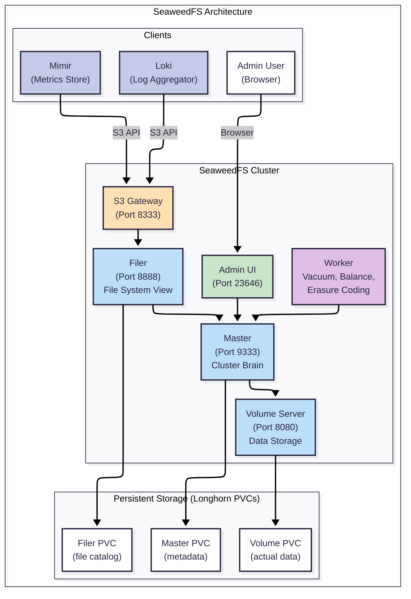

# SeaweedFS — Object Storage Guide

> **Tier:** Tier 3 — Object Storage
> **Role:** Provides S3-compatible storage for the observability stack (Loki, Mimir, Alloy) and any platform service requiring blob storage.
> **Backing:** Longhorn PVCs on SSD-tier storage (Tier 2).

---

## What Goes Here vs. Other Tiers

SeaweedFS serves a specific and narrow role in the storage architecture. It is **not** a general-purpose file system.

| Data Type | Store On | Why |
|---|---|---|
| Loki log chunks | ✅ **SeaweedFS** | Loki's S3-compatible storage backend |
| Mimir metric blocks | ✅ **SeaweedFS** | Mimir's long-term storage backend |
| Platform-internal blobs (e.g., build artifacts) | ✅ **SeaweedFS** | S3 API, programmatic access only |
| User photos, videos, documents | ❌ Use **NFS** (Tier 4) | Users need file-manager access, not S3 API |
| App configs, databases | ❌ Use **Longhorn** (Tier 2) | Block storage, not object storage |
| Temporary build caches | ❌ Use `emptyDir` | Ephemeral — doesn't need persistence |

---

## Architecture

SeaweedFS is composed of multiple specialized components, each running as a separate Kubernetes pod:



### Component Responsibilities

| Component | Role | Replicas | Resource Profile |
|---|---|---|---|
| **Master** | Cluster coordinator. Tracks which Volume server holds which data. Manages topology. | 1 (scale to 3 for HA) | Low CPU, low memory |
| **Volume** | Stores the actual binary data in "volumes" (large files on disk). | 1+ (scale with data) | High memory, high disk I/O |
| **Filer** | Provides a file-system view (directories + filenames) over the blob storage. S3 gateway routes through the Filer. | 1 (scale to 2+ with external DB for HA) | Medium CPU, medium memory |
| **S3 Gateway** | Translates S3 API calls (PutObject, GetObject, ListBucket) into Filer operations. | 1 | Low CPU, low memory |
| **Worker** | Background maintenance: vacuum (reclaim deleted space), balance (even out disk usage), erasure coding. | 1 | Medium CPU during vacuum |
| **Admin UI** | Web dashboard for cluster health, volume status, and manual operations. | 1 | Minimal |

---

## How Observability Uses SeaweedFS

The platform's observability stack (Alloy → Loki → Mimir) uses SeaweedFS as its S3-compatible storage backend. This replaces the need for AWS S3 or local disk storage.

```
App Pod → stdout/stderr → Alloy (collector) → Loki (aggregator) → S3 PutObject → SeaweedFS
App Pod → metrics endpoint → Alloy (scraper) → Mimir (TSDB) → S3 PutObject → SeaweedFS
```

### Loki Configuration

Loki is configured to use SeaweedFS's S3 endpoint:

```yaml
# Loki storage config (conceptual)
storage_config:
  aws:
    s3: http://seaweedfs-s3.seaweedfs.svc.cluster.local:8333
    bucketnames: <tenant>-logs
    access_key_id: <from-secret>
    secret_access_key: <from-secret>
    s3forcepathstyle: true  # Required for non-AWS S3
```

### Mimir Configuration

```yaml
# Mimir storage config (conceptual)
blocks_storage:
  backend: s3
  s3:
    endpoint: seaweedfs-s3.seaweedfs.svc.cluster.local:8333
    bucket_name: <tenant>-metrics
    access_key_id: <from-secret>
    secret_access_key: <from-secret>
```

> **Key insight:** SeaweedFS is **retention-unaware**. It stores whatever Loki/Mimir puts into it. Log and metric expiry is handled by Loki's compactor and Mimir's compactor, which delete old S3 objects according to retention policies. SeaweedFS's Worker then reclaims the freed disk space via its vacuum process.

---

## Bucket Design

Each tenant gets dedicated S3 buckets. This ensures data isolation and allows per-tenant retention policies.

### Naming Convention

```
<tenant>-<data-type>
```

### Standard Buckets

| Bucket Name | Tenant | Data Type | Consumed By | Retention Profile |
|---|---|---|---|---|
| `personal-logs` | Personal | Application logs | Loki | `personal` (30 days) |
| `personal-metrics` | Personal | Prometheus metrics | Mimir | `personal` (90 days) |
| `business-acme-logs` | Business (Acme) | Application logs | Loki | `business-standard` (1 year) |
| `business-acme-metrics` | Business (Acme) | Prometheus metrics | Mimir | `business-standard` (1 year) |
| `business-fin-logs` | Business (Fin) | Application logs | Loki | `business-regulated` (5 years) |

### Creating a Bucket

Buckets are created via the SeaweedFS S3 API or the admin UI:

```bash
# Via AWS CLI (configured to point at SeaweedFS)
aws --endpoint-url http://seaweedfs-s3:8333 s3 mb s3://personal-logs

# Or via the SeaweedFS admin UI at port 23646
```

> **Best Practice:** Bucket creation should be automated as part of tenant onboarding. When a new tenant cluster is provisioned, a job creates the required buckets and generates S3 credentials.

---

## Retention Profiles

Retention is managed by the observability tools (Loki/Mimir), **not** by SeaweedFS. SeaweedFS stores blobs — it doesn't know or care about their age.

### Profile Definitions

| Profile | Log Retention | Metric Retention | Use Case |
|---|---|---|---|
| `personal` | 30 days | 90 days | Home/personal apps — low compliance, cost-sensitive |
| `business-standard` | 1 year | 1 year | Standard business workloads |
| `business-regulated` | 5 years | 5 years | Financial, legal — regulatory compliance |

### How Retention Works End-to-End

1.  **Loki/Mimir write** chunks and blocks to SeaweedFS S3 buckets.
2.  **Loki's compactor** runs on a schedule. It identifies chunks older than the tenant's retention period and deletes them from the S3 bucket.
3.  **Mimir's compactor** does the same for metric blocks.
4.  **SeaweedFS's Worker** periodically runs a `vacuum` job. Vacuum scans Volume servers for deleted data (holes in volume files from deleted S3 objects) and reclaims the disk space.

### Retention Configuration

Retention is configured in Loki/Mimir, **not** in SeaweedFS:

```yaml
# Loki compactor config (conceptual — per-tenant overrides)
compactor:
  retention_enabled: true

limits_config:
  retention_period: 720h  # 30 days (personal profile)
  # Per-tenant overrides via runtime config:
  # tenant "business-acme": retention_period: 8760h (1 year)
  # tenant "business-fin": retention_period: 43800h (5 years)
```

> **Space reclamation flow:** `Loki deletes old chunks → SeaweedFS marks space as free → Worker vacuum reclaims disk → Longhorn reports updated usage`

---

## Underlying Storage

SeaweedFS's persistent data (Master metadata, Volume data, Filer catalog) is stored on Longhorn PVCs.

### The Chain

```
SeaweedFS Component → Longhorn PVC → VM Virtual Disk → Physical SSD
```

### Current PVC Configuration

All SeaweedFS components use `persistentVolumeClaim` for their data and logs:

| Component | Data PVC | Logs PVC | Notes |
|---|---|---|---|
| Master | ✅ PVC | ✅ PVC | Stores cluster metadata |
| Volume | ✅ PVC (data + idx) | ✅ PVC | Stores actual blob data — largest PVC |
| Filer | ✅ PVC | ✅ PVC | Stores file catalog (LevelDB by default) |
| S3 Gateway | No data | hostPath (logs) | Stateless — no persistent data |
| Worker | No data | No data | Uses `/tmp` — no persistence needed |
| Admin | ✅ PVC | ✅ PVC | Admin state |

### Why Not hostPath?

Using `hostPath` would tie SeaweedFS to a specific Kubernetes node. If that node is replaced or rescheduled, data is lost. Longhorn PVCs provide node-independent persistence — the volume follows the pod wherever it's scheduled.

> For a detailed analysis of the Longhorn dependency implications, see [LONGHORN.md → Dependency: SeaweedFS on Longhorn](./LONGHORN.md#dependency-seaweedfs-on-longhorn).

---

## Filer Database Strategy

The Filer maintains a catalog mapping file paths to blob IDs. This catalog is the "index" of all files stored in SeaweedFS.

### Current: LevelDB (Embedded)

```
Filer Pod → LevelDB (on Filer PVC)
```

-   **Pros:** Zero configuration. Fast. No external dependencies.
-   **Cons:** Single-instance only. If the Filer pod dies, the catalog is inaccessible until it restarts. Cannot run multiple Filer replicas for HA.

### Future: External PostgreSQL

```
Filer Pod(s) → PostgreSQL (external database)
```

-   **Pros:** Multiple Filer replicas share the same catalog. True high availability. PostgreSQL can be backed by its own Longhorn PVC with replication.
-   **Cons:** Requires deploying and managing a PostgreSQL instance.

### When to Migrate

Migrate from LevelDB to external PostgreSQL when:
-   SeaweedFS becomes a critical-path dependency (production observability).
-   You need to run multiple Filer replicas for availability.
-   The Filer catalog exceeds what a single-pod restart can tolerate (minutes of downtime during restart).

> **Note:** The platform already has PostgreSQL deployed (`kubernetes/apps/infrastructure/postgresql-14/`). The Filer can be configured to share this instance or use a dedicated one.

---

## Security

### S3 Authentication

S3 authentication is enabled:

```yaml
s3:
  enableAuth: true
```

Clients must provide valid `access_key_id` and `secret_access_key` to access any bucket. Credentials are stored as Kubernetes Secrets and injected into Loki/Mimir pod environments.

### Admin UI Credentials

The Admin UI is protected by basic auth:

```yaml
admin:
  adminUser: "admin"
  adminPassword: "<managed-via-sealed-secret>"
```

> **Action required:** The current values show `adminPassword: "admin"`. This must be replaced with a SealedSecret before production deployment. See [`docs/secrets/`](../secrets/) for the secrets management workflow.

### gRPC TLS (Future)

Internal component communication (Master ↔ Volume ↔ Filer) currently uses unencrypted gRPC. For production hardening:

```yaml
global:
  enableSecurity: true  # Enables mTLS between components
```

This requires generating TLS certificates and distributing them as Kubernetes Secrets.

---

## WebDAV (Future)

SeaweedFS supports WebDAV for browser-based file access, but the current Helm chart does not include a WebDAV component:

```yaml
# From values.yaml:
# Missing: WebDAV (not in chart) add in future
```

### When to Add WebDAV

WebDAV is relevant when:
-   Admin users need browser-based file browsing of SeaweedFS data (beyond the Admin UI).
-   External tools need WebDAV-protocol access to stored blobs.

For **user-facing** file browsing (photos, videos, documents), TrueNAS/NFS with SMB is the intended solution — see [NFS.md](./NFS.md). SeaweedFS WebDAV would be for platform-internal admin use only.

---

## Admin UI Access

The SeaweedFS Admin UI provides a dashboard for cluster health, volume status, and manual operations.

### Accessing the Admin UI

The Admin UI runs on port `23646`. Access methods depend on the ingress configuration:

| Method | URL | When to Use |
|---|---|---|
| **Port-forward** (dev) | `kubectl port-forward svc/seaweedfs-admin 23646:23646 -n seaweedfs` | Quick access during development |
| **Ingress** (configured) | `admin.seaweedfs.local` (as configured in values) | When ingress is set up with DNS |

### What You Can Do in the Admin UI

-   View cluster topology (Master, Volume servers, Filer instances)
-   Browse stored data via the Filer view
-   Monitor disk usage per Volume server
-   Trigger manual vacuum and balance operations
-   View replication status and data placement

---

## Related Documentation

| Document | Relationship |
|---|---|
| [ARCHITECTURE.md](./ARCHITECTURE.md) | SeaweedFS's position as Tier 3 in the storage model |
| [LONGHORN.md](./LONGHORN.md) | SeaweedFS's PVCs are backed by Longhorn |
| [CAPACITY_PLANNING.md](./CAPACITY_PLANNING.md) | Object-tier sizing, retention impact on capacity |
| [NFS.md](./NFS.md) | User data tier — distinct from SeaweedFS's scope |
