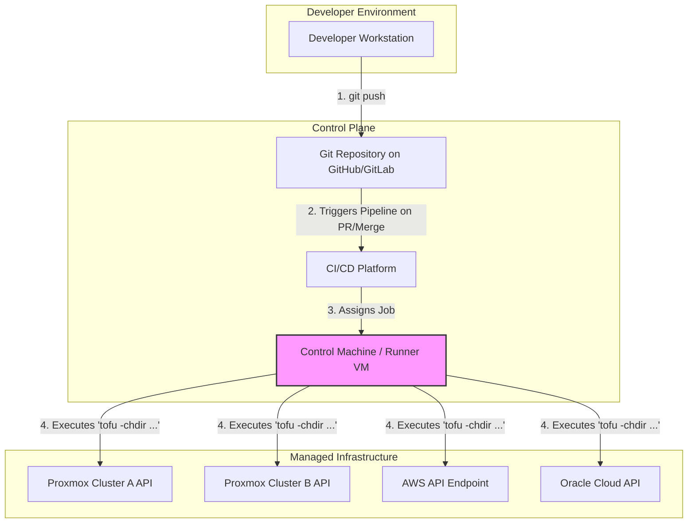

# Proxmox Infrastructure as Code with OpenTofu

This part of the repository contains the Infrastructure as Code (IaC) configuration for managing multiple Proxmox environments using OpenTofu. The workflow uses OpenTofu installed directly on a dedicated control machine.

The project is designed to be highly structured, reusable, and safe, incorporating best practices such as modular components, workspaces for environment separation, and guardrails to prevent accidental changes.

## 1. Summary & System Purpose
### Core Principles
This system is a direct implementation of our core principles, realized through the following key concepts:

*   **Infrastructure as Code (IaC) & GitOps:** The `main` branch of the Git repository is the single source of truth. All infrastructure is defined as code, and changes are introduced exclusively via peer-reviewed pull requests, which trigger automated deployment upon merging.
*   **Stack-Based Isolation (Blast Radius):** The infrastructure is divided into "stacks" (e.g., `proxmox_server_A`, `aws_global`), each in its own directory with an independent state file. This ensures that changes to one part of the infrastructure cannot accidentally impact another.
*   **Modular & Reusable Components:** The logic for creating resources (like QEMU VMs) is encapsulated in self-contained modules within the `modules/` directory. The stack configurations focus on *what* to build, while the modules define *how* to build it.
*   **Automation:** The entire lifecycle, from planning changes to applying them and generating inventory, is fully automated through a CI/CD pipeline.
*   **Declarative, Data-Driven Configuration:** The resources for each stack are defined in `.tfvars` files. The core OpenTofu logic is generic and simply consumes this data, making it easy to add or modify resources without changing the underlying code.
*   **Native Tooling:** All `tofu` commands are run as native executables on a central Control Machine. This simplifies the workflow, enhances performance, and allows for seamless integration with development tools.
*   **Secure Secret Management (Ansible Vault):** Plain-text secrets are never committed to Git. We use Ansible Vault to encrypt sensitive data. For each stack, we maintain two files:
    *   `vms.tfvars` (or similar): Contains non-secret configuration and is committed to Git directly.
    *   `secrets.tfvars`: Contains all sensitive data and is encrypted with Ansible Vault before being committed. We use **Process Substitution** to decrypt secrets in-memory during `plan` and `apply` operations.
*   **CI/CD Change Detection:** The automation pipeline acts as a guardrail. It is configured to detect changes within specific stack directories and will only run `plan` or `apply` against the stack that has been modified, preventing accidental cross-environment operations.


###  Scope
*   **In Scope:** The management of all VMs and containers across Proxmox clusters, AWS EC2 instances, and Oracle Cloud VM. This includes networking and storage definitions where applicable.
*   **Out of Scope:** Kubernetes cluster management, application-level configuration (handled by Ansible), and database administration.

### Prerequisites
Before operating this system, ensure the following are in place:

1.  **A Control Machine:** A dedicated Linux VM that acts as the code runner for all operations. This machine **must have network connectivity** to all Proxmox nodes, as well as outbound internet access to reach the AWS and Oracle Cloud APIs.
2.  **OpenTofu:** Installed directly as a native executable on the Control Machine.
3.  **Ansible:** Required specifically for the `ansible-vault` tool to manage encrypted secrets.
4.  **Git:** Installed and configured with your user information.
5.  **Access & Credentials:**
    *   **Git Repository Access:** Your SSH public key must be authorized to clone the infrastructure repository.
    *   **Proxmox API User:** A dedicated user (e.g., `vmprovisioner@pve`) with appropriate permissions must exist in each Proxmox environment.
6.  **VSCodium (Recommended):** For development, the [Remote - SSH](https://marketplace.visualstudio.com/items?itemName=ms-vscode-remote.remote-ssh) extension is highly recommended for securely editing files on the Control Machine.

---
## 2. System Architecture & Implementation Details

This section provides a technical description of the system's components and their interactions, covering how the configuration is stored, how its state is managed, and how changes are executed.

### Source Control and Repository Structure

The Git repository is the definitive source for all infrastructure configuration. It is a monorepo containing all code required to provision and manage the infrastructure.

*   **Repository Location:** `https://github.com/sinhaaritro/platform-stack`
*   **Directory Structure:**
    *   `stacks/`: This directory contains subdirectories, each representing an isolated infrastructure component (e.g., `proxmox_server_A_gpu`, `aws_global`). Each subdirectory is a self-contained OpenTofu configuration, complete with its own backend configuration, variable definitions, and logic. This structure enforces strict separation between different parts of the infrastructure.
    *   `modules/`: This directory contains reusable, parameterized OpenTofu modules. These modules provide standardized definitions for creating resources (e.g., a QEMU VM). Stacks invoke these modules to ensure consistency and reduce code duplication.

### Remote State Management

OpenTofu uses a state file to map the resources defined in the code to the real-world resources that have been created.

*   **Remote Backend:** The state files are stored remotely in an **AWS S3 bucket**. This provides a centralized, persistent location for the state, accessible by all authorized users and automation, rather than being stored on a local machine.
*   **State Isolation per Stack:** A key architectural feature is that each stack has its own independent state file. This is configured in the `backend.tf` file within each stack's directory. The `key` attribute in the backend configuration block defines a unique object path in the S3 bucket for that stack's state file.
    *   *Example:* The `backend.tf` for `proxmox_server_A_gpu` sets `key = "onprem/proxmox_server_A.tfstate"`.
    *   This strict separation ensures that OpenTofu operations executed against one stack have no knowledge of or ability to impact the resources managed by another stack.
*   **Concurrency Control via State Locking:** To prevent data corruption from simultaneous operations on the same state file, state locking is enabled using an **AWS DynamoDB table**. Before OpenTofu performs any operation that writes to a state file, it creates a lock entry in the DynamoDB table. The lock is removed once the operation is complete, ensuring that only one process can modify a given state file at any time.

### Automation and Execution Workflow

The process of applying infrastructure changes is automated through a CI/CD pipeline that interacts with a dedicated runner.

1.  **CI/CD Platform (Workflow Orchestration):**
    *   The CI/CD service (e.g., GitHub Actions, GitLab CI) monitors the Git repository for events, specifically pull requests and merges to the `main` branch.
    *   Upon detecting a relevant event, it initiates a pre-defined pipeline based on the changes in the commit. The pipeline is configured to identify which stack directory (`stacks/*`) has been modified.

2.  **Control Machine (Job Execution):**
    *   A dedicated Linux VM is configured as the **runner** for the CI/CD platform.
    *   The CI/CD pipeline assigns jobs to this runner. A job consists of specific commands to be executed.
    *   For an infrastructure change, the pipeline sends a command to the runner, such as `tofu -chdir="stacks/onprem/proxmox_server_A_gpu" apply`. The `-chdir` flag instructs OpenTofu to operate within the context of that specific stack directory.
    *   The runner executes the command using its locally installed OpenTofu binary. It authenticates to the target APIs (Proxmox, AWS, etc.) using credentials supplied by the CI/CD platform and applies the planned changes.

## 3. Environment & Change Validation Strategy

This section outlines the formal strategy for introducing, testing, and applying all infrastructure changes. The model is designed for maximum safety and predictability, even without full duplicate hardware environments.

### Model: Pull Request Validation
Given that full hardware duplication for dev/staging is not feasible, we use the **Pull Request (PR) validation model**. This model treats the automated `tofu plan` within a pull request as the primary testing and review stage. The output of the plan is the exact set of changes that will be applied, serving as a high-fidelity preview.

### Workflow Implementation
Every change to the infrastructure, without exception, must follow this GitOps workflow:

1.  **Branching:** To introduce any change (e.g., adding a VM, modifying a network setting), the engineer must create a new feature branch from `main` (e.g., `feature/add-analytics-vm`). Direct commits to `main` are blocked.

2.  **Pull Request & Automated Plan:** A pull request is opened, targeting the `main` branch. The CI/CD system automatically detects which stack directory has been changed and executes a `tofu plan` *only* for that specific stack.

3.  **Review (Primary Safety Check):**
    *   The output of the `tofu plan` is posted as a comment directly within the pull request.
    *   This plan output is the **single source of truth for the review**. The team reviews the exact changes proposed (e.g., "1 to add, 0 to change, 0 to destroy").
    *   Approval of the pull request signifies approval of the plan's execution.

4.  **Merge & Automated Apply:** Once the pull request is approved and merged into the `main` branch, the CI/CD system triggers the deployment stage. It runs `tofu apply` against the same stack, executing the exact changes that were reviewed and approved in the plan.

This structured process ensures that every change is documented, peer-reviewed, and automatically validated before it impacts the production infrastructure.

## 4. Project Structure and Resource Management

The project is organized into a single monorepo that combines a data-driven approach with a logical stack structure.

```
/tofu/
├── modules/
│   ├── proxmox_qemu_vm/       # Standardized module for creating a single Proxmox VM
│   ├── proxmox_lxc_container/ # Standardized module for creating a single LXC container
│   └── aws_ec2_instance/      # Standardized module for creating a single EC2 instance
│
└── stacks/
    ├── onprem/
    │   ├── proxmox_server_A_gpu/    # STACK 1: Manages only Server A (with GPU)
    │   │   ├── main.tf              # Logic to create resources from data (using for_each)
    │   │   ├── variables.tf         # Defines the 'resource_groups' variable structure
    │   │   ├── backend.tf           # S3 backend config for Server A's state file
    │   │   └── vms.tfvars           # DATA file defining all VMs/LXCs on Server A
    │   │
    │   ├── proxmox_server_B_no_gpu/ # STACK 2: Manages only Server B (no GPU)
    │   │   ├── main.tf              # Can be an identical copy of the other main.tf
    │   │   ├── variables.tf         # Identical copy
    │   │   ├── backend.tf           # S3 backend config for Server B's state file
    │   │   └── vms.tfvars           # DATA file defining all VMs/LXCs on Server B
    │
    └── cloud/
        └── aws_global/              # STACK 3: Manages all AWS resources
            ├── main.tf              # Logic to create EC2, S3, etc. from data
            ├── variables.tf
            ├── backend.tf
            └── resources.tfvars     # DATA file defining EC2 instances, S3 buckets, etc.
```


## 5. Operational Guide (How-To Recipes)

This section provides concrete, command-line examples for the most common operational tasks. All commands are expected to be run from the root of the Git repository on the Control Machine.

### Daily Workflow: Adding or Modifying a Resource

This is the standard procedure for making any change to an existing stack.

1.  **Create a Branch:** Always start by creating a new feature branch from the latest `main`.
    ```bash
    git checkout main
    git pull
    git checkout -b feature/add-web-vm-03
    ```

2.  **Edit Configuration Files:** Navigate to the specific stack directory you intend to change.
    *   For **non-sensitive** values (like CPU count, memory, VM name), edit the primary `.tfvars` file directly:
        ```bash
        vim stacks/onprem/proxmox_server_A_gpu/vms.tfvars
        ```
    *   For **sensitive** values (like passwords or API keys), use `ansible-vault` to safely edit the encrypted secrets file:
        ```bash
        ansible-vault edit stacks/onprem/proxmox_server_A_gpu/secrets.tfvars
        ```

3.  **Run a Plan:** From the **repository root**, run `tofu plan` using the `-chdir` flag to target your stack. Use process substitution (`<(...)`) to feed the decrypted secrets to the command in-memory.
    ```bash
    # This command targets the 'proxmox_server_A_gpu' stack
    tofu -chdir="stacks/onprem/proxmox_server_A_gpu" plan \
      -var-file="vms.tfvars" \
      -var-file=<(ansible-vault view secrets.tfvars)
    ```

4.  **Review the Plan:** Carefully inspect the output. Confirm that the proposed changes are exactly what you expect.

5.  **Commit and Open a Pull Request:** Commit your changes and push them to the remote repository. Open a PR and await the automated validation and team review.
    ```bash
    git add .
    git commit -m "feat: Add new web-vm-03 to proxmox server A"
    git push --set-upstream origin feature/add-web-vm-03
    ```
6.  **Merge:** Once the PR is approved, merge it. The CI/CD pipeline will automatically run the corresponding `apply` command to execute the change.

### Structural Workflow: Adding a New Stack

This procedure is for initializing a new, isolated set of resources (e.g., bringing a new Proxmox server under management).

1.  **Copy an Existing Stack:** Duplicate an existing stack directory to use as a template.
    ```bash
    cp -r stacks/onprem/proxmox_server_B_no_gpu/ stacks/onprem/proxmox_server_C_storage/
    ```
2.  **Update Backend Configuration (CRITICAL):** Open the `backend.tf` file in the new directory and change the `key` to a new, unique value. **This step is essential for state isolation.**
    ```terraform
    # In stacks/onprem/proxmox_server_C_storage/backend.tf
    
    terraform {
      backend "s3" {
        bucket = "your-opentofu-state-bucket-name"
        key    = "onprem/proxmox_server_C.tfstate" # <-- CHANGED TO A UNIQUE PATH
        # ... other settings
      }
    }
    ```
3.  **Populate Configuration:** Edit the `.tfvars` and `secrets.tfvars` files in the new directory to define the resources for the new stack.
4.  **Initialize and Apply:** Follow the "Daily Workflow" (steps 3-6) for this new stack directory to initialize, plan, and apply its configuration for the first time.

---

## 6. Network & Architecture Diagram

The following diagram illustrates the data and command flow of the GitOps system, from developer action to infrastructure change.



---

## 7. Module Development & Usage Policy

To ensure consistency, security, and maintainability, all OpenTofu modules must adhere to the following policies.

### Module Usage Rules
*   **Permitted Sources:** Modules may only be sourced from two locations:
    1.  The internal `/modules` directory for company-standard components.
    2.  The official OpenTofu Registry for verified, third-party modules. Sourcing modules directly from other Git repositories is prohibited.
*   **Version Pinning:** All module sources **must** be pinned using the pessimistic version constraint operator (`~>`). This prevents unexpected breaking changes from minor or major version updates.
    ```terraform
    module "standard_vm" {
      source  = "./modules/proxmox_qemu_vm"
      # No version needed for local modules

      # ...
    }

    module "vpc" {
      source  = "terraform-aws-modules/vpc/aws"
      version = "~> 5.1.0" # Version pinning is mandatory
      
      # ...
    }
    ```

### Internal Module Creation Standards
*   **Required Files:** Every new module in the `/modules` directory must include `main.tf`, `variables.tf`, `outputs.tf`, and a `README.md`.
*   **Strict Variable Definitions:** Every variable must include a `description` and an explicit `type`. Default values should be provided where sensible.
*   **Comprehensive Outputs:** Modules must declare outputs for all essential resource attributes (e.g., IP addresses, instance IDs, ARNs) that might be needed by other configurations or for inventory generation.
*   **Documentation (`README.md`):** The README must clearly explain the module's purpose and include auto-generated or manually created tables detailing all input variables and outputs.

---

## 8. Maintenance & Lifecycle Management

This section outlines procedures for keeping the IaC system and its dependencies current and healthy.

### Dependency Management
*   **Provider Versioning:** Like modules, all providers defined in the `terraform` block of each stack must have their versions pinned with `~>`.
*   **Quarterly Upgrade Review:** On a quarterly basis, the team will review all providers and modules for available minor updates. These updates often contain important security patches and bug fixes and should be applied proactively through the standard PR workflow.
*   **Major Version Upgrades:** Major version upgrades (e.g., from `5.x.x` to `6.0.0`) are treated as a planned project. They must be tested in a non-critical stack first, as they often contain breaking changes that require code modifications.

### State File Maintenance
Direct manipulation of the state file is high-risk and should be avoided. These commands are a last resort and require peer review.
